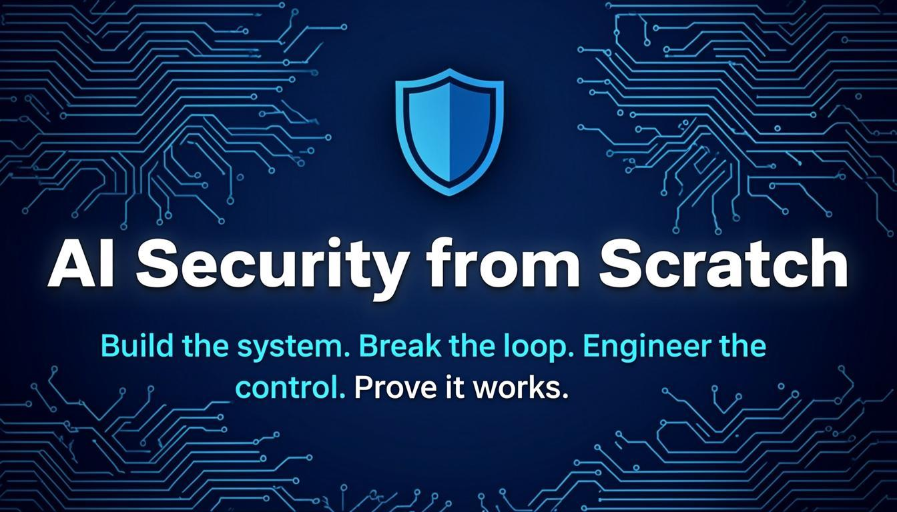
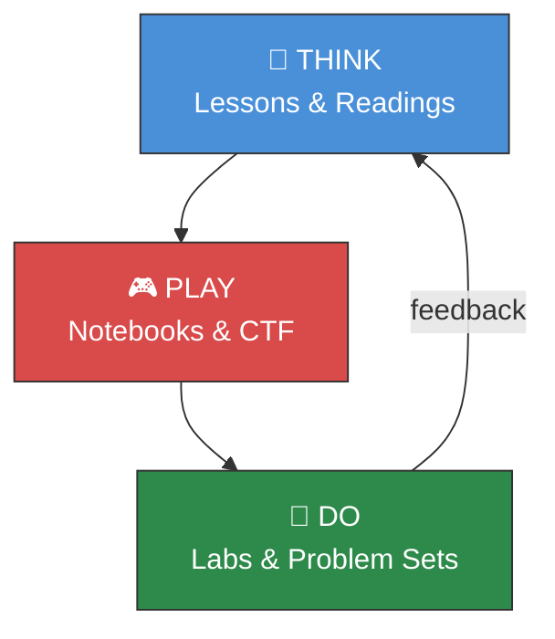
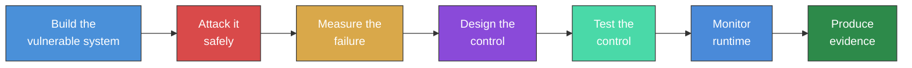

<div align="center">



# AI Security from Scratch

### Think. Play. Do. — MIT-style AI security engineering with a control-theoretic foundation

[](LICENSE)
[](ROADMAP.md)
[](ROADMAP.md)
[](ctf/)
[](psets/)
[](ROADMAP.md)
[](requirements.txt)
[](CONTRIBUTING.md)

</div>

---

> **AI security is not prompt filtering. It is the control of intelligent behavior under adversarial conditions.**
>
> 92% of organizations are deploying AI. Less than 24% have security controls for it. This curriculum closes that gap — not with checklists, but with engineered, tested, monitored controls you build from scratch.

---

## What Makes This Different

Most AI security content is a recycling of the same three ideas: "sanitize inputs," "add a guardrail," and "monitor outputs." That is not engineering. That is hoping.

This course starts from a different premise. Seven things make it different from every other AI security repo on the internet:

| # | What | Why It Matters |
|---|------|---------------|
| 1 | **Control-theoretic framework** | Security is not a checklist — it is a control problem. Every vulnerability is a control-loop failure. Every defense is a supervisory control. This mental model scales from chatbots to multi-agent systems. |
| 2 | **Think / Play / Do pedagogy** | Borrowed from MIT 6.5950 (Secure Hardware Design). Lessons build frameworks. CTFs build intuition. Labs build skill. All three are necessary. None is optional. |
| 3 | **Jupyter Notebooks for every class** | Not screenshots. Not code snippets. Interactive notebooks with a simulated LLM that you run, modify, and break — no API keys, no cloud, no cost. |
| 4 | **CTF Challenges with real flags** | Capture-the-flag exercises where each flag maps to a specific control-loop gap. `AISec{0b53rv4t10n_g4p_f0und}` is not a toy — it teaches you that observation channels are attack surfaces. |
| 5 | **Problem Sets with mathematical proofs** | MIT tradition: prove defense-in-depth is exponentially effective. Formalize safety bounds. Derive undecidability results. If you cannot prove it, you do not understand it. |
| 6 | **Curated Reading Lists with focus questions** | Not "read this paper." "Read §4, focus on how cache-set conflicts create observation channels, and be prepared to trace a concrete cache-timing attack." Purpose-driven reading. |
| 7 | **Build → Attack → Defend → Test → Monitor → Assure labs** | Every attack is paired with a defense. Every defense is paired with a regression test. Every test produces evidence. No orphaned knowledge. |

---

## The Three Pillars



### 🧠 Think — Lectures, Lessons, and Readings

Each class opens with a **lesson** that develops the conceptual framework. Lessons are opinionated — they take positions, argue against common wisdom, and explain *why* the conventional approach is wrong. We don't hedge. We don't present every viewpoint equally. We present the control-theoretic viewpoint and show why it works.

Lessons include concept checks, common mistakes, and war stories from real incidents (Chevrolet bot, Samsung leak, Air Canada ruling). Curated reading lists with focus questions and control-theory connections prepare you before each class.

### 🎮 Play — Notebooks and CTF Challenges

Every class has an **interactive Jupyter Notebook** where you run code, break things, and learn by doing. Notebooks use a simulated LLM so they work without API keys — but the attack behaviors match what real LLMs do in production.

Each phase has a **CTF challenge** with hidden flags (`AISec{...}`). Flags are competitive, fun, and pedagogically precise — each one teaches a specific control-loop concept. Scoring ranges from 100 points (Easy) to 500 (Expert), with a hint penalty system that rewards persistence.

### 🔧 Do — Labs and Problem Sets

Labs follow the **Build → Attack → Defend → Test → Monitor → Assure** workflow on real, running systems. No simulations of attacks — you build the vulnerable app, you attack it, you watch it fail, you add the defense, you verify the fix.

Problem sets follow the MIT tradition: mathematical analysis (prove defense-in-depth is exponentially more effective), design problems (design a complete security architecture for a given AI system), and short-answer questions (refute common misconceptions using control-theoretic reasoning).

> **Without Play, Think is abstract. Without Do, Play is shallow. Without Think, Do is blind. All three are necessary.**

---

## Quick Start

Three paths in. Pick the one that matches how you learn.

### 📖 Path 1: Follow the Curriculum

Start at Phase 1, Class 01. Work through lessons, notebooks, and labs in order. This is the designed path — each class builds on the last.

```bash
git clone https://github.com/benottom/ai-security-from-scratch.git
cd ai-security-from-scratch
pip install -r requirements.txt

# Start with Class 01
cd phases/phase-01-foundations/class-01-ai-security-as-control/
# Read: lesson.md (Think)
# Run:  notebook.ipynb (Play)
# Do:   lab.md (Do)
```

### 💻 Path 2: Jump to Hands-On

Skip the reading. Open a notebook and start breaking things. Come back to the lessons when you want to understand *why* your attacks worked.

```bash
git clone https://github.com/benottom/ai-security-from-scratch.git
cd ai-security-from-scratch
pip install -r requirements.txt

# Launch the first notebook
jupyter notebook phases/phase-01-foundations/class-01-ai-security-as-control/notebook.ipynb
```

### 🏴 Path 3: Compete

Go straight to the CTF challenges. Race against the clock, capture flags, and learn by exploiting control-loop gaps.

```bash
git clone https://github.com/benottom/ai-security-from-scratch.git
cd ai-security-from-scratch

# Start the first CTF challenge
cd ctf/challenge-01-control-loop-basics/
make setup && make run

# Capture flags through the running API
# Track your progress: ctf/SCOREBOARD.md
```

**Prerequisites:** Python 3.11+, basic ML literacy, comfort with the command line. No prior security experience required. **No API keys required — everything runs locally.**

---

## Directory Structure

```
ai-security-from-scratch/
├── framework/              # 🧠 Control-theoretic AI security theory (7 documents)
├── phases/                 # 📚 12 phases, 76 classes
│   └── phase-XX-name/
│       └── class-XX-topic/
│           ├── README.md              # Overview + learning objectives
│           ├── lesson.md              # 🧠 THINK: Conceptual framework
│           ├── notebook.ipynb         # 🎮 PLAY: Interactive Jupyter notebook
│           ├── lab.md                 # 🔧 DO: Build/attack/defend lab
│           ├── assignment.md          # Take-home design/analysis problem
│           ├── control-loop-analysis.md
│           └── threat-model.md
├── ctf/                    # 🏴 Capture-the-flag challenges
│   ├── README.md                      # CTF framework & scoring rules
│   ├── SCOREBOARD.md                  # Track your flags & reflections
│   ├── challenge-01-control-loop-basics/
│   │   ├── app.py                     # Vulnerable FastAPI app
│   │   ├── Dockerfile
│   │   └── Makefile
│   └── challenge-07-prompt-injection/
│       ├── app.py
│       ├── Dockerfile
│       └── Makefile
├── psets/                  # 📝 Problem sets (MIT tradition)
│   ├── README.md                      # PSet program & grading philosophy
│   └── pset-01-foundations/
│       ├── README.md                  # 6 problems, 120 points
│       └── SOLUTIONS.md              # Complete solutions with proofs
├── readings/               # 📖 Curated reading lists
│   ├── README.md                      # Reading methodology
│   ├── phase-01-readings.md           # 8 readings: Wiener, Carlini, OWASP...
│   └── phase-02-readings.md           # 6 readings: Liu, Wei, Hines...
├── labs/                   # 🧪 Vulnerable applications
│   ├── vulnerable-chatbot/
│   ├── vulnerable-rag/
│   ├── vulnerable-agent/
│   ├── vulnerable-memory-assistant/
│   └── enterprise-ai-assistant/
├── attacks/                # ⚔️ Attack scenarios with control-loop analysis
├── defenses/               # 🛡️ 7 defense implementations with Python & tests
├── evals/                  # 📊 AI security eval harness
├── patterns/               # 🏗️ 9 secure architecture patterns
├── observability/          # 📡 Control ledger, event schema, monitoring
├── assurance/              # 📋 ISO 27001, NIST AI RMF, OWASP mappings
├── templates/              # 📄 Class, lab, threat model, report templates
├── tools/                  # 🔧 AI content agents, lab validator, generators
├── ci/                     # ⚙️ GitHub Actions workflows
├── scripts/                # 🛠️ Scaffold and utility scripts
└── assets/                 # 🎨 Banner and images
```

---

## Curriculum Overview

```mermaid
graph LR
    P1["Phase 1<br/>Foundations"] --> P2["Phase 2<br/>Prompt Injection"]
    P2 --> P3["Phase 3<br/>RAG Security"]
    P3 --> P4["Phase 4<br/>Agent & Tool Security"]
    P4 --> P5["Phase 5<br/>Memory & Feedback"]
    P5 --> P6["Phase 6<br/>Data & Privacy"]
    P6 --> P7["Phase 7<br/>Supply Chain"]
    P7 --> P8["Phase 8<br/>Defensive Controls"]
    P8 --> P9["Phase 9<br/>Security Testing"]
    P9 --> P10["Phase 10<br/>Observability"]
    P10 --> P11["Phase 11<br/>Governance"]
    P11 --> P12["Phase 12<br/>Capstone"]

    style P1 fill:#4a90d9,stroke:#333,color:#fff
    style P2 fill:#d94a4a,stroke:#333,color:#fff
    style P3 fill:#d9a84a,stroke:#333,color:#fff
    style P4 fill:#8a4ad9,stroke:#333,color:#fff
    style P5 fill:#4ad9a8,stroke:#333,color:#fff
    style P6 fill:#d94a8a,stroke:#333,color:#fff
    style P7 fill:#8ad94a,stroke:#333,color:#fff
    style P8 fill:#4a8ad9,stroke:#333,color:#fff
    style P9 fill:#d9d94a,stroke:#333,color:#fff
    style P10 fill:#4ad9d9,stroke:#333,color:#fff
    style P11 fill:#d94ad9,stroke:#333,color:#fff
    style P12 fill:#2d8a4a,stroke:#333,color:#fff
```



| Phase | Classes | CTF Challenge | Problem Set |
|-------|---------|--------------|-------------|
| **1 — Foundations** | 01–06 | `01-control-loop-basics` (5 flags) | PSet 01: Control-Loop Security Architecture |
| **2 — Prompt Injection** | 07–12 | `07-prompt-injection` (4 flags) | PSet 02: Injection as Control-Loop Failure |
| **3 — RAG Security** | 13–19 | *13-rag-poisoning* (coming soon) | PSet 03: Observation-Channel Security |
| **4 — Agent & Tool Security** | 20–26 | *19-tool-abuse* (coming soon) | PSet 04: Actuation-Channel Security |
| **5 — Memory & Feedback** | 27–32 | *25-memory-poisoning* (coming soon) | PSet 05: Feedback-Channel Security |
| **6 — Data & Privacy** | 33–38 | — | PSet 06: Data-Flow Security |
| **7 — Supply Chain** | 39–44 | — | PSet 07: Supply-Chain Security |
| **8 — Defensive Controls** | 45–50 | *37-circuit-breaker* (coming soon) | PSet 08: Composing Layered Defenses |
| **9 — Security Testing** | 51–56 | — | PSet 09: Validation & Verification |
| **10 — Observability & IR** | 57–62 | — | PSet 10: Monitoring the Control Loop |
| **11 — Governance & Assurance** | 63–69 | — | PSet 11: Building the Assurance Case |
| **12 — Capstone** | 70–76 | — | PSet 12: End-to-End Secure AI System |

<details>
<summary><strong>📖 Full Class Listing by Phase</strong></summary>

### Phase 1: Foundations `6 classes`

> Establish the mental models. Learn threat modeling for AI. Build your first vulnerable system. Understand the control-loop framework.

| # | Class | Focus |
|---|---|---|
| 01 | AI Security as an Engineering Discipline | Why AI security is a control problem |
| 02 | Control Theory for AI Security | Controllers, feedback, disturbances, supervisory control |
| 03 | AI Systems as Adversarial Control Loops | Decomposing chatbot, RAG, agent into loops |
| 04 | Threat Modeling AI Systems | STRIDE-AI, attack trees, trust boundaries |
| 05 | Anatomy of LLM Applications | Prompts, context, retrieval, tools, memory, APIs |
| 06 | Build Your First Vulnerable AI Assistant | Hands-on: a chatbot with no security controls |

### Phase 2: Prompt Injection `6 classes`

> Attack and defend instruction-channel failures. Every attack is paired with a tested defense.

| # | Class | Focus |
|---|---|---|
| 07 | Direct Prompt Injection | Controller hijacking through user input |
| 08 | System Prompt Leakage | Extracting system instructions |
| 09 | Indirect Prompt Injection | Injection through external data sources |
| 10 | Jailbreaks and Instruction Conflicts | Role-playing, multi-turn, instruction hierarchy |
| 11 | Prompt Injection Defense Patterns | Context separation, hierarchy, validation, filtering |
| 12 | Prompt Security Regression Testing | Converting attacks into automated tests |

### Phase 3: RAG Security `7 classes`

> Attack retrieval systems with corpus poisoning, citation fabrication, and access-control bypasses.

| # | Class | Focus |
|---|---|---|
| 13 | Build a Basic RAG System | Document ingestion, chunking, retrieval, answer generation |
| 14 | RAG as an Observation System | Understanding RAG through the control-loop lens |
| 15 | Document Poisoning | Injecting malicious content into the retrieval corpus |
| 16 | Citation Spoofing | Fabricating source references |
| 17 | Unauthorized Retrieval | Accessing documents beyond user authorization |
| 18 | Permission-Aware RAG | Enforcing document ACL at the retrieval layer |
| 19 | Secure RAG Evaluation | Testing RAG security controls end-to-end |

### Phase 4: Agent and Tool Security `7 classes`

> Hijack tool use, redirect agent goals, and exploit excessive agency.

| # | Class | Focus |
|---|---|---|
| 20 | Build a Tool-Using Agent | Mock tools, agent loop, no security |
| 21 | Tool Abuse and Excessive Agency | Unrestricted tool calls and parameter injection |
| 22 | Command Injection Through Tools | Exploiting tool parameters for code execution |
| 23 | Secure Tool Gateway | Risk classification, allowlists, approval gates |
| 24 | Human Approval Gates | Requiring confirmation for high-risk actions |
| 25 | Agent Sandboxing | Isolating agent actions with boundaries |
| 26 | Agent Security Testing | Automated testing for agent vulnerabilities |

### Phase 5: Memory and Feedback Security `6 classes`

> Memory is a feedback path. Attack it, protect it, monitor it.

| # | Class | Focus |
|---|---|---|
| 27 | Conversation Memory Risks | Context-window manipulation and session hijacking |
| 28 | Long-Term Memory Poisoning | Injecting persistent malicious memories |
| 29 | Cross-User Memory Leakage | Information bleeding between user sessions |
| 30 | Memory Trust Scoring | Rating memory reliability before use |
| 31 | Memory Quarantine | Isolating and validating new memories |
| 32 | Feedback Loop Security | Protecting the feedback channels in AI systems |

### Phase 6: Data, Privacy, and Leakage `6 classes`

> Identify and reduce sensitive-data exposure across AI pipelines.

| # | Class | Focus |
|---|---|---|
| 33 | Sensitive Data Exposure in AI Apps | How AI systems leak confidential information |
| 34 | Secrets Leakage | API keys, tokens, and credentials in model outputs |
| 35 | PII Detection and Redaction | Identifying and masking personally identifiable information |
| 36 | Embedding Privacy | Privacy risks in vector embeddings |
| 37 | Vector Database Access Control | Securing access to embedding stores |
| 38 | Privacy-Preserving AI Logging | Logging without exposing sensitive data |

### Phase 7: Model and Supply Chain Security `6 classes`

> Assess model, dataset, dependency, and provider risks.

| # | Class | Focus |
|---|---|---|
| 39 | Model Supply Chain Risks | Third-party model trust and verification |
| 40 | Unsafe Model Loading | Risks in loading untrusted model files |
| 41 | Dataset Poisoning Concepts | Training data manipulation and its effects |
| 42 | Fine-Tuning Risks | Security implications of model adaptation |
| 43 | Model Extraction Concepts | Stealing model capabilities through queries |
| 44 | AI Bill of Materials | Documenting every component in your AI system |

### Phase 8: Defensive Controls `6 classes`

> Build layered supervisory controls from scratch.

| # | Class | Focus |
|---|---|---|
| 45 | Guardrails from Scratch | Building input/output safety filters |
| 46 | Policy-as-Code for AI Systems | Versioned, testable behavior policies |
| 47 | Output Validation | Verifying model outputs against safety requirements |
| 48 | Context Firewalls | Separating system instructions from user input |
| 49 | AI Security Gateway | Centralized control point for AI interactions |
| 50 | Circuit Breakers and Kill Switches | Detecting and stopping runaway AI behavior |

### Phase 9: AI Security Testing and CI/CD `6 classes`

> Continuously test AI controls in engineering pipelines.

| # | Class | Focus |
|---|---|---|
| 51 | AI Security Test Design | Structuring effective security test suites |
| 52 | Evaluation Harness from Scratch | Building the automated test runner |
| 53 | Attack Datasets | Curating representative attack corpora |
| 54 | Security Scoring | Measuring and comparing defense effectiveness |
| 55 | GitHub Actions for AI Security | CI/CD integration for security regression |
| 56 | Regression Testing AI Controls | Preventing security controls from degrading |

### Phase 10: Observability and Incident Response `6 classes`

> Monitor AI systems and respond to failures.

| # | Class | Focus |
|---|---|---|
| 57 | AI Security Logging | What to log and how to structure it |
| 58 | Control Ledger | Immutable record of security decisions |
| 59 | Runtime Risk Scoring | Real-time assessment of AI behavior risk |
| 60 | AI Incident Response | Playbooks for AI security incidents |
| 61 | RAG Poisoning Incident | Walkthrough: detecting and responding to corpus attacks |
| 62 | Agent Tool-Abuse Incident | Walkthrough: detecting and stopping unauthorized tool use |

### Phase 11: Governance and Assurance `7 classes`

> Produce evidence for security leadership and audits.

| # | Class | Focus |
|---|---|---|
| 63 | AI Security Governance | Frameworks and organizational structures |
| 64 | AI Risk Register | Systematic risk tracking and management |
| 65 | Assurance Cases | Structured security arguments with evidence |
| 66 | ISO 27001 Mapping | Mapping AI controls to ISO 27001 |
| 67 | NIST AI RMF Mapping | Mapping AI controls to NIST AI Risk Management Framework |
| 68 | OWASP LLM Top 10 Mapping | Mapping AI controls to OWASP LLM vulnerability list |
| 69 | Executive Reporting | Communicating AI security posture to leadership |

### Phase 12: Capstone `7 classes`

> Complete a full AI security engineering lifecycle.

| # | Class | Focus |
|---|---|---|
| 70 | Build a Vulnerable Enterprise AI Assistant | Full-featured RAG + agent with vulnerabilities |
| 71 | Red-Team the Assistant | Systematic attack campaign |
| 72 | Harden the Assistant | Implement layered supervisory controls |
| 73 | Add Security Regression Tests | Automated test suite proving controls work |
| 74 | Add Runtime Monitoring | Control ledger and dashboard |
| 75 | Produce Assurance Evidence | Complete audit package |
| 76 | Present the Final Security Report | Portfolio-quality security assessment |

</details>

---

## The Shape of a Class



Every class produces **7 deliverables** — no orphaned knowledge:

| Deliverable | What It Is |
|---|---|
| Vulnerable app | A working AI application with a known security flaw |
| Attack transcript | A safe, local exploit demonstrating the vulnerability |
| Control-loop analysis | Root cause mapped to the control-theoretic model |
| Patched app | The application with supervisory controls implemented |
| Security regression tests | Automated pytest suite that proves the defense works |
| Observability events | Control ledger entries showing runtime monitoring |
| Assurance evidence | Audit-ready documentation mapped to governance frameworks |

---

## The Control-Loop Framework

Every AI system in this curriculum is modeled as a control loop. This is the mental model that makes this course different:

| Element | Role in AI Security | Example |
|---|---|---|
| **Objective** | The security property the system must maintain | "Never expose confidential documents" |
| **Controller** | The component that decides how to act | LLM + orchestration logic |
| **Observations** | Signals the controller can see | User prompt, retrieved docs, tool results |
| **Actions** | What the controller can do | Generate answer, call tool, block request |
| **Feedback** | Information about whether actions achieved the objective | User follow-up, logs, ratings |
| **Disturbances** | Adversarial inputs that disrupt the control loop | Prompt injection, poisoned documents |
| **Unsafe states** | Conditions that violate the security objective | Data leakage, unauthorized actions |
| **Supervisory controls** | Higher-level controls that monitor and adjust | Policy engine, guardrails, approval gates |
| **Monitoring** | Continuous observation of control effectiveness | Control ledger, event logs |
| **Recovery** | Procedures for restoring safe operation | Quarantine, reset, revoke access |

A normal tutorial says: *"Here is a prompt injection attack."*

This course says: *"This is a controller-instruction hijack through an untrusted observation channel. Here is the vulnerable app, the attack, the failed control, the hardened design, the regression test, and the evidence package."*

That is the difference.

---

## The Manifesto

Most AI security content teaches you to break things. That is the easy part. Breaking is cheap, spectacular, and misleading. It teaches you that attacks are everywhere but gives you no architecture for defense.

This project starts from a different premise: **security is not the absence of attacks. It is the presence of control.** An AI system is secure when you can characterize what it should do, measure whether it is doing that, correct it when it deviates, and prove that your corrections work — even when someone is actively trying to make it fail.

That is a control problem. Not a checklist. Not a threat model you file away. Not a compliance badge. A live, continuous, engineered control loop that runs from design through deployment through operation.

Every class in this curriculum follows one loop: **build the thing, break the thing, analyze the failure, design the control, test the control, monitor the control, assure the control works.** You will never study an attack without building the system it targets. You will never implement a defense without testing that it stops the attack. You will never ship a control without monitoring that it holds under drift.

This is not a survey course. It is a workshop. You will write code, break code, fix code, and prove your fixes hold. If you complete this curriculum, you will not just know about AI security. You will have practiced it — across chatbots, RAG systems, autonomous agents, and multi-model pipelines — with the same rigor expected of engineers who sign off on systems that real people depend on.

---

## Tech Stack

| Component | Choice | Why |
|---|---|---|
| Language | Python 3.11+ | Industry standard for AI/ML |
| Web apps | FastAPI | Fast, typed, async-first |
| Testing | pytest | Industry standard, great fixtures |
| Notebooks | Jupyter | Interactive, standard in ML education |
| Vector DB | ChromaDB (local) | Zero-config, runs offline |
| Policy engine | Python + YAML | Simple, auditable, version-controllable |
| Observability | JSONL event logs | Portable, grep-friendly, no infra needed |
| CI | GitHub Actions | Native GitHub integration |
| CTF apps | FastAPI + Docker | Self-contained, reproducible |
| Diagrams | Mermaid | Renders natively on GitHub |

**Every lab runs locally with mock data. No API keys required.**

---

## Comparison

| Aspect | This Course | Traditional AI Security | Reference Repo (ai-engineering-from-scratch) |
|--------|-------------|------------------------|----------------------------------------------|
| **Framework** | Control-theoretic model | Ad hoc checklists | Software engineering best practices |
| **Pedagogy** | Think / Play / Do | Watch lectures | Read + Build |
| **Hands-on** | Build → Attack → Defend → Test → Monitor → Assure | Read about attacks | Build production systems |
| **Interaction** | Jupyter notebooks + CTF challenges | Multiple choice quizzes | Code exercises |
| **Assessment** | Real defenses + mathematical proofs | Recall-based questions | Working code |
| **Output** | "I can build a system that resists prompt injection and prove it" | "I know about prompt injection" | "I can build an AI system" |
| **Theory** | Formal control theory + provable bounds | "Best practices" | Applied engineering |
| **CTF** | 4–5 flags per challenge, control-loop mapped | None | None |
| **Problem Sets** | MIT-style with proofs and design problems | Homework worksheets | None |
| **Readings** | Curated with focus questions & control-theory connections | "Read this paper" | None |

---

## Standard Lab Flow

Every lab follows the same pattern with consistent commands:

```bash
make setup           # Install dependencies
make run-vulnerable  # Start the vulnerable application
make attack          # Run the attack against the vulnerable app
make run-patched     # Start the hardened application
make test-security   # Run security regression tests
make evidence        # Generate assurance evidence report
```

---

## By the End of This Course

You will be able to:

- [ ] Threat model LLM, RAG, and agentic AI systems using control-loop analysis
- [ ] Identify control-loop failures in AI applications
- [ ] Exploit prompt injection, RAG poisoning, tool abuse, and memory poisoning in safe labs
- [ ] Design supervisory controls for AI systems
- [ ] Build permission-aware RAG that respects document access controls
- [ ] Build secure tool gateways for AI agents
- [ ] Write AI security regression tests
- [ ] Integrate AI security checks into CI/CD pipelines
- [ ] Monitor AI systems at runtime with a control ledger
- [ ] Produce assurance evidence for governance and audits
- [ ] Prove defense-in-depth properties mathematically
- [ ] Capture CTF flags by exploiting specific control-loop gaps

---

## Who This Is For

| Audience | Why They Need This |
|---|---|
| AI engineers | Secure LLM applications you are building |
| Cybersecurity engineers | Learn the AI attack surface |
| AppSec teams | Review AI features with proper threat modeling |
| CISOs and security architects | Adopt GenAI with defensible controls |
| Red and blue teamers | Apply your skills to AI systems |
| Students | Structured, hands-on path into AI security |
| Auditors | Evaluate whether AI controls actually work |
| Instructors | Ready-made MIT-style curriculum with CTF and psets |

---

## AI-Assisted Development

This project is built with help from AI agents, but all technical content is **human-reviewed and validated** before release. AI agents help draft lessons, build labs, create attacks, write tests, and generate reports. Humans review, execute, correct, and approve every pull request.

AI assistance accelerates our work. It does not replace our judgment.

See [`tools/ai_content_agents/`](tools/ai_content_agents/) for the full agent pipeline.

---

## Contributing

We welcome contributions. See [CONTRIBUTING.md](CONTRIBUTING.md) for:

- Quality gates (content, code, security, assurance, editorial)
- The 13-step class generation workflow
- PR template and review checklist
- Style guide and conventions

---

## License

This project is licensed under the MIT License. See [LICENSE](LICENSE) for details.

Copyright 2026 AI Security from Scratch Contributors

---

## ⚠️ Responsible Use

This curriculum teaches offensive techniques in a controlled, educational context. Attacks are demonstrated against **intentionally vulnerable lab systems only** — never against production services or third-party systems.

**Do not use this material to attack systems you do not own or have explicit authorization to test.**

Every offensive demonstration exists to teach defensive engineering. Each attack is paired with a mitigation, regression test, and evidence artifact.

See [RESPONSIBLE_USE.md](RESPONSIBLE_USE.md) for the full policy.

---

<div align="center">

*Build the system. Break the loop. Engineer the control. Prove it works.*

**Think. Play. Do.**

</div>
