# Roadmap

Status tracker for every phase and class. The status glyphs in this file are machine-parseable — do not change their shape.

**Legend:** ✅ Complete  ·  🚧 In Progress  ·  ⬚ Planned

**Total estimated time: ~250 hours, at your own pace.**

---

## Progress at a Glance

```mermaid
graph LR
    P1["Phase 1<br/>🚧 0/6"] --> P2["Phase 2<br/>🚧 0/6"]
    P2 --> P3["Phase 3<br/>⬚ 0/7"]
    P3 --> P4["Phase 4<br/>⬚ 0/7"]
    P4 --> P5["Phase 5<br/>⬚ 0/6"]
    P5 --> P6["Phase 6<br/>⬚ 0/6"]
    P6 --> P7["Phase 7<br/>⬚ 0/6"]
    P7 --> P8["Phase 8<br/>⬚ 0/6"]
    P8 --> P9["Phase 9<br/>⬚ 0/6"]
    P9 --> P10["Phase 10<br/>⬚ 0/6"]
    P10 --> P11["Phase 11<br/>⬚ 0/7"]
    P11 --> P12["Phase 12<br/>⬚ 0/7"]

    style P1 fill:#f6ad55,stroke:#333,color:#000
    style P2 fill:#f6ad55,stroke:#333,color:#000
    style P3 fill:#e2e8f0,stroke:#333,color:#000
    style P4 fill:#e2e8f0,stroke:#333,color:#000
    style P5 fill:#e2e8f0,stroke:#333,color:#000
    style P6 fill:#e2e8f0,stroke:#333,color:#000
    style P7 fill:#e2e8f0,stroke:#333,color:#000
    style P8 fill:#e2e8f0,stroke:#333,color:#000
    style P9 fill:#e2e8f0,stroke:#333,color:#000
    style P10 fill:#e2e8f0,stroke:#333,color:#000
    style P11 fill:#e2e8f0,stroke:#333,color:#000
    style P12 fill:#e2e8f0,stroke:#333,color:#000
```

| Phase | Topic | Classes | Status | Time |
|-------|-------|---------|--------|------|
| 1 | Foundations | 01–06 | 🚧 | ~18h |
| 2 | Prompt Injection | 07–12 | 🚧 | ~18h |
| 3 | RAG Security | 13–19 | ⬚ | ~21h |
| 4 | Agent & Tool Security | 20–26 | ⬚ | ~21h |
| 5 | Memory & Feedback | 27–32 | ⬚ | ~18h |
| 6 | Data & Privacy | 33–38 | ⬚ | ~18h |
| 7 | Supply Chain | 39–44 | ⬚ | ~18h |
| 8 | Defensive Controls | 45–50 | ⬚ | ~18h |
| 9 | Security Testing | 51–56 | ⬚ | ~18h |
| 10 | Observability & IR | 57–62 | ⬚ | ~18h |
| 11 | Governance & Assurance | 63–69 | ⬚ | ~21h |
| 12 | Capstone | 70–76 | ⬚ | ~21h |

---

## Phase 1: Foundations — 🚧 (~18 hours)

> Establish the mental models. Learn threat modeling for AI. Build your first vulnerable system. Understand the control-loop framework that structures everything that follows.

| # | Class | Status | Est. |
|---|-------|--------|------|
| 01 | [AI Security as an Engineering Discipline](phases/phase-01-foundations/class-01-ai-security-as-control/) | 🚧 | ~120 min |
| 02 | [Control Theory for AI Security](phases/phase-01-foundations/class-02-control-theory-for-ai-security/) | 🚧 | ~120 min |
| 03 | [AI Systems as Adversarial Control Loops](phases/phase-01-foundations/class-03-ai-systems-as-adversarial-control-loops/) | 🚧 | ~180 min |
| 04 | [Threat Modeling AI Systems](phases/phase-01-foundations/class-04-threat-modeling-ai-systems/) | 🚧 | ~180 min |
| 05 | [Anatomy of LLM Applications](phases/phase-01-foundations/class-05-anatomy-of-llm-applications/) | 🚧 | ~120 min |
| 06 | [Build Your First Vulnerable AI Assistant](phases/phase-01-foundations/class-06-build-your-first-vulnerable-ai-assistant/) | 🚧 | ~240 min |

**Main outcome:** Learner understands AI apps as control systems and can build a vulnerable assistant.

---

## Phase 2: Prompt Injection — 🚧 (~18 hours)

> Attack and defend instruction-channel failures. Every attack is paired with a tested defense.

| # | Class | Status | Est. |
|---|-------|--------|------|
| 07 | [Direct Prompt Injection](phases/phase-02-prompt-injection/class-07-direct-prompt-injection/) | 🚧 | ~120 min |
| 08 | [System Prompt Leakage](phases/phase-02-prompt-injection/class-08-system-prompt-leakage/) | 🚧 | ~120 min |
| 09 | [Indirect Prompt Injection](phases/phase-02-prompt-injection/class-09-indirect-prompt-injection/) | 🚧 | ~180 min |
| 10 | [Jailbreaks and Instruction Conflicts](phases/phase-02-prompt-injection/class-10-jailbreaks-and-instruction-conflicts/) | 🚧 | ~180 min |
| 11 | [Prompt Injection Defense Patterns](phases/phase-02-prompt-injection/class-11-prompt-injection-defense-patterns/) | 🚧 | ~240 min |
| 12 | [Prompt Security Regression Testing](phases/phase-02-prompt-injection/class-12-prompt-security-regression-testing/) | 🚧 | ~240 min |

**Main outcome:** Learner can exploit and defend instruction-channel failures.

---

## Phase 3: RAG Security — ⬚ (~21 hours)

> Attack retrieval systems with corpus poisoning, citation fabrication, and access-control bypasses. Build retrieval-level and output-level controls.

| # | Class | Status | Est. |
|---|-------|--------|------|
| 13 | Build a Basic RAG System | ⬚ | ~180 min |
| 14 | RAG as an Observation System | ⬚ | ~120 min |
| 15 | Document Poisoning | ⬚ | ~180 min |
| 16 | Citation Spoofing | ⬚ | ~120 min |
| 17 | Unauthorized Retrieval | ⬚ | ~180 min |
| 18 | Permission-Aware RAG | ⬚ | ~240 min |
| 19 | Secure RAG Evaluation | ⬚ | ~180 min |

**Main outcome:** Learner can build RAG that respects source trust, permissions, and evidence.

---

## Phase 4: Agent and Tool Security — ⬚ (~21 hours)

> Hijack tool use, redirect agent goals, and exploit excessive agency. Design agent architectures with security boundaries.

| # | Class | Status | Est. |
|---|-------|--------|------|
| 20 | Build a Tool-Using Agent | ⬚ | ~180 min |
| 21 | Tool Abuse and Excessive Agency | ⬚ | ~180 min |
| 22 | Command Injection Through Tools | ⬚ | ~120 min |
| 23 | Secure Tool Gateway | ⬚ | ~240 min |
| 24 | Human Approval Gates | ⬚ | ~120 min |
| 25 | Agent Sandboxing | ⬚ | ~180 min |
| 26 | Agent Security Testing | ⬚ | ~180 min |

**Main outcome:** Learner can constrain AI actions through mediated capabilities and policy gates.

---

## Phase 5: Memory and Feedback Security — ⬚ (~18 hours)

> Memory is a feedback path. Attack it, protect it, monitor it.

| # | Class | Status | Est. |
|---|-------|--------|------|
| 27 | Conversation Memory Risks | ⬚ | ~120 min |
| 28 | Long-Term Memory Poisoning | ⬚ | ~180 min |
| 29 | Cross-User Memory Leakage | ⬚ | ~180 min |
| 30 | Memory Trust Scoring | ⬚ | ~120 min |
| 31 | Memory Quarantine | ⬚ | ~180 min |
| 32 | Feedback Loop Security | ⬚ | ~180 min |

**Main outcome:** Learner understands memory as a feedback path and can protect it.

---

## Phase 6: Data, Privacy, and Leakage — ⬚ (~18 hours)

> Identify and reduce sensitive-data exposure across AI pipelines.

| # | Class | Status | Est. |
|---|-------|--------|------|
| 33 | Sensitive Data Exposure in AI Apps | ⬚ | ~180 min |
| 34 | Secrets Leakage | ⬚ | ~120 min |
| 35 | PII Detection and Redaction | ⬚ | ~180 min |
| 36 | Embedding Privacy | ⬚ | ~120 min |
| 37 | Vector Database Access Control | ⬚ | ~180 min |
| 38 | Privacy-Preserving AI Logging | ⬚ | ~180 min |

**Main outcome:** Learner can identify and reduce sensitive-data exposure across AI pipelines.

---

## Phase 7: Model and Supply Chain Security — ⬚ (~18 hours)

> Assess model, dataset, dependency, and provider risks.

| # | Class | Status | Est. |
|---|-------|--------|------|
| 39 | Model Supply Chain Risks | ⬚ | ~180 min |
| 40 | Unsafe Model Loading | ⬚ | ~120 min |
| 41 | Dataset Poisoning Concepts | ⬚ | ~180 min |
| 42 | Fine-Tuning Risks | ⬚ | ~120 min |
| 43 | Model Extraction Concepts | ⬚ | ~180 min |
| 44 | AI Bill of Materials | ⬚ | ~180 min |

**Main outcome:** Learner can assess model, dataset, dependency, and provider risks.

---

## Phase 8: Defensive Controls — ⬚ (~18 hours)

> Build layered supervisory controls from scratch.

| # | Class | Status | Est. |
|---|-------|--------|------|
| 45 | Guardrails from Scratch | ⬚ | ~180 min |
| 46 | Policy-as-Code for AI Systems | ⬚ | ~240 min |
| 47 | Output Validation | ⬚ | ~120 min |
| 48 | Context Firewalls | ⬚ | ~180 min |
| 49 | AI Security Gateway | ⬚ | ~240 min |
| 50 | Circuit Breakers and Kill Switches | ⬚ | ~120 min |

**Main outcome:** Learner can design layered supervisory controls.

---

## Phase 9: AI Security Testing and CI/CD — ⬚ (~18 hours)

> Continuously test AI controls in engineering pipelines.

| # | Class | Status | Est. |
|---|-------|--------|------|
| 51 | AI Security Test Design | ⬚ | ~180 min |
| 52 | Evaluation Harness from Scratch | ⬚ | ~240 min |
| 53 | Attack Datasets | ⬚ | ~120 min |
| 54 | Security Scoring | ⬚ | ~120 min |
| 55 | GitHub Actions for AI Security | ⬚ | ~180 min |
| 56 | Regression Testing AI Controls | ⬚ | ~180 min |

**Main outcome:** Learner can continuously test AI controls in engineering pipelines.

---

## Phase 10: Observability and Incident Response — ⬚ (~18 hours)

> Monitor AI systems and respond to failures.

| # | Class | Status | Est. |
|---|-------|--------|------|
| 57 | AI Security Logging | ⬚ | ~120 min |
| 58 | Control Ledger | ⬚ | ~180 min |
| 59 | Runtime Risk Scoring | ⬚ | ~180 min |
| 60 | AI Incident Response | ⬚ | ~180 min |
| 61 | RAG Poisoning Incident | ⬚ | ~180 min |
| 62 | Agent Tool-Abuse Incident | ⬚ | ~180 min |

**Main outcome:** Learner can monitor AI systems and respond to failures.

---

## Phase 11: Governance and Assurance — ⬚ (~21 hours)

> Produce evidence for security leadership and audits.

| # | Class | Status | Est. |
|---|-------|--------|------|
| 63 | AI Security Governance | ⬚ | ~180 min |
| 64 | AI Risk Register | ⬚ | ~120 min |
| 65 | Assurance Cases | ⬚ | ~240 min |
| 66 | ISO 27001 Mapping | ⬚ | ~180 min |
| 67 | NIST AI RMF Mapping | ⬚ | ~180 min |
| 68 | OWASP LLM Top 10 Mapping | ⬚ | ~120 min |
| 69 | Executive Reporting | ⬚ | ~180 min |

**Main outcome:** Learner can produce evidence for security leadership and audits.

---

## Phase 12: Capstone — ⬚ (~21 hours)

> Complete a full AI security engineering lifecycle.

| # | Class | Status | Est. |
|---|-------|--------|------|
| 70 | Build a Vulnerable Enterprise AI Assistant | ⬚ | ~240 min |
| 71 | Red-Team the Assistant | ⬚ | ~180 min |
| 72 | Harden the Assistant | ⬚ | ~240 min |
| 73 | Add Security Regression Tests | ⬚ | ~180 min |
| 74 | Add Runtime Monitoring | ⬚ | ~180 min |
| 75 | Produce Assurance Evidence | ⬚ | ~120 min |
| 76 | Present the Final Security Report | ⬚ | ~120 min |

**Main outcome:** Learner completes a full AI security engineering lifecycle.

---

## Release Milestones

| Version | Scope | Target | Status |
|---------|-------|--------|--------|
| **v0.1** | Phases 1–2 (Classes 01–12) | Q2 2026 | 🚧 In Progress |
| **v0.2** | Phases 3–4 (Classes 13–26) | Q3 2026 | ⬚ Planned |
| **v0.3** | Phases 5–7 (Classes 27–44) | Q4 2026 | ⬚ Planned |
| **v0.4** | Phases 8–9 (Classes 45–56) | Q1 2027 | ⬚ Planned |
| **v1.0** | Phases 10–12 (Classes 57–76) | Q2 2027 | ⬚ Planned |

---

**Total: 12 phases, 76 classes | 0 complete | ~250 hours estimated**

Want to help? Pick any ⬚ class and submit a PR. See [CONTRIBUTING.md](CONTRIBUTING.md).
