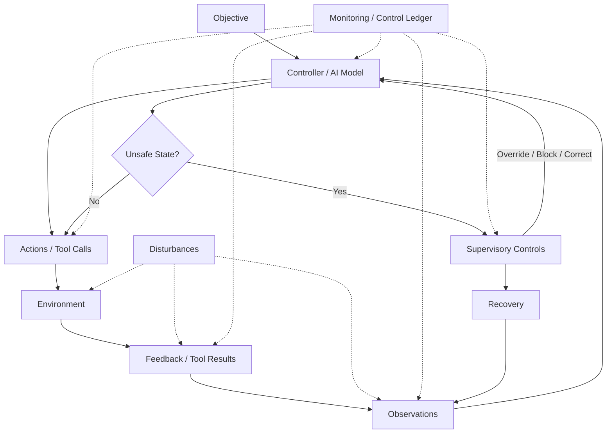

# Framework Overview: AI Systems as Adversarial Control Loops

## Why Control Theory?

Most AI security guidance today reads like a list of hygiene tips: sanitize your inputs, don't put secrets in prompts, use a content filter. These are not wrong, but they are incomplete. They treat AI security as a perimeter problem — build a wall, patch a hole, block a keyword. The moment your AI system takes an action in the world — calls an API, writes to a database, sends an email — the perimeter dissolves. You are no longer filtering text; you are controlling behavior.

Control theory gives us the right mental model. A control system maintains a desired behavior in the presence of disturbances by continuously observing its environment, computing corrective actions, and actuating those actions through a plant. An AI system that retrieves documents, reasons over them, calls tools, and produces outputs is doing exactly this — it is a control loop. The question is not whether your AI system is a control loop, but whether you are designing it as one or pretending it is just a chatbot.

When you frame AI security as a control problem, several things become clear that are invisible under the "prompt filtering" framing:

1. **Disturbances are structural, not exceptional.** Adversarial inputs, poisoned documents, and manipulated feedback are not edge cases to be patched; they are the normal operating environment of any system exposed to the internet or to untrusted data.
2. **The loop must close.** If you cannot observe what the system did, you cannot correct it. If you cannot actuate a correction, observing the problem is useless. Security requires the full loop: observe → decide → act → observe.
3. **Supervisory control is mandatory.** No industrial control system runs without a supervisory layer that can override the primary controller. No AI system should either.
4. **Unsafe states must be enumerated and prevented.** In control theory, you define the states the system must never enter and design constraints to keep it out of them. This is more rigorous than hoping your prompt is clever enough to prevent misuse.

## The Complete Control-Loop Model

An AI system operating under adversarial conditions can be decomposed into the following elements:

- **Objective**: The goal the system is trying to achieve (e.g., "answer user questions accurately using approved knowledge").
- **Controller**: The AI model itself, which takes observations and computes actions. This includes the system prompt, the reasoning chain, and any planning logic.
- **Observations**: The information the controller receives — user messages, retrieved documents, tool results, conversation history, memory.
- **Actions**: The outputs the controller produces — text responses, tool calls, API invocations, database writes.
- **Environment**: Everything outside the controller that it interacts with — the knowledge base, external APIs, user devices, other agents.
- **Feedback**: Information about the effect of actions — tool return values, user responses, reward signals, memory updates.
- **Disturbances**: Anything that disrupts the control loop — adversarial prompts, poisoned data, manipulated tool results, compromised memory.
- **Unsafe States**: System states that violate security or safety requirements (e.g., data exfiltration, unauthorized execution).
- **Supervisory Controls**: Override mechanisms that constrain the controller — guardrails, approval gates, policy engines, circuit breakers.
- **Monitoring**: The observability layer that makes the control loop's behavior visible for detection, debugging, and assurance.
- **Recovery**: Procedures for returning the system to a safe state after a violation.

## Application to Different AI Architectures

### LLM Applications (Chatbots, Assistants)

A chatbot is the simplest control loop: the user message is the observation, the LLM is the controller, the text response is the action, and the conversation history is the feedback. Disturbances include prompt injection through user messages. The supervisory control is typically an input/output content filter. The unsafe state is the model producing harmful or policy-violating content.

### RAG Systems

A RAG system adds an observation pipeline: the user query triggers document retrieval, and the retrieved documents become observations alongside the user message. This introduces a new attack surface — the knowledge base. A poisoned document is a corrupted observation that can steer the controller toward unsafe actions (e.g., instructing the model to exfiltrate data through markdown links). The supervisory control must extend to the retrieval pipeline, not just the input and output.

### Agents

An agent extends the action space: instead of just producing text, the controller can invoke tools — search the web, execute code, send emails, modify files. Each tool invocation is an actuation in the environment, and the tool's return value is feedback. The action space is now vast, and the unsafe states are severe (unauthorized file deletion, data exfiltration, financial transactions). Supervisory controls must include tool call mediation — the agent cannot execute a tool without passing an approval gate.

### Multi-Agent Systems

In a multi-agent system, the control loop is nested: one agent's action becomes another agent's observation, creating chains of influence. A compromise in one agent can propagate through the entire system. Supervisory controls must operate at the inter-agent communication layer, not just at individual agent boundaries. Monitoring must track the provenance of information across agents.

## How This Differs from Traditional Cybersecurity Threat Modeling

Traditional cybersecurity threat modeling (STRIDE, DREAD, attack trees) was designed for deterministic systems with well-defined trust boundaries. AI systems are probabilistic, and their trust boundaries are porous — a single user input can influence retrieval, reasoning, and action selection simultaneously. The control-loop model accounts for this by treating every stage of the loop as a potential point of compromise and requiring supervisory controls at every stage.

| Traditional Threat Modeling | Control-Loop Threat Modeling |
|---|---|
| Trust boundaries are network perimeters | Trust boundaries are control-loop stages |
| Attacks exploit software vulnerabilities | Attacks exploit reasoning vulnerabilities |
| Defense is access control and patching | Defense is supervisory control and monitoring |
| Threats are enumerated per asset | Threats are enumerated per loop component |
| Testing is penetration testing | Testing is adversarial simulation of the full loop |

## Why "AI Security as Control" Beats "AI Security as Prompt Filtering"

Prompt filtering treats the symptom: a bad input produced a bad output, so block the input. This is brittle. An adversarial input that bypasses the filter has no further obstacle. The control-loop approach treats the structure: every stage of the loop is a potential failure point, and every stage has a supervisory control. If the input filter fails, the retrieval validator catches the poisoned document. If the retrieval validator fails, the tool call gate catches the unauthorized action. If the tool call gate fails, the output redactor catches the data leak. If all else fails, the monitoring system detects the anomaly and triggers recovery.

This is defense in depth, but organized around the control loop rather than around network layers. It is more precise, more testable, and more auditable. It also scales: as the AI system grows from a chatbot to a RAG system to an agent to a multi-agent system, the control loop gets more stages, and each stage gets its own supervisory control. You do not need a new mental model for each architecture; you need the same model applied more thoroughly.

The rest of this framework document series will walk through each element of the control loop in detail, providing concrete threat models, supervisory control patterns, unsafe state definitions, observability designs, and assurance evidence templates. The goal is not abstract theory — it is a practical, hands-on methodology for building AI systems that remain secure even when the world is adversarial.
