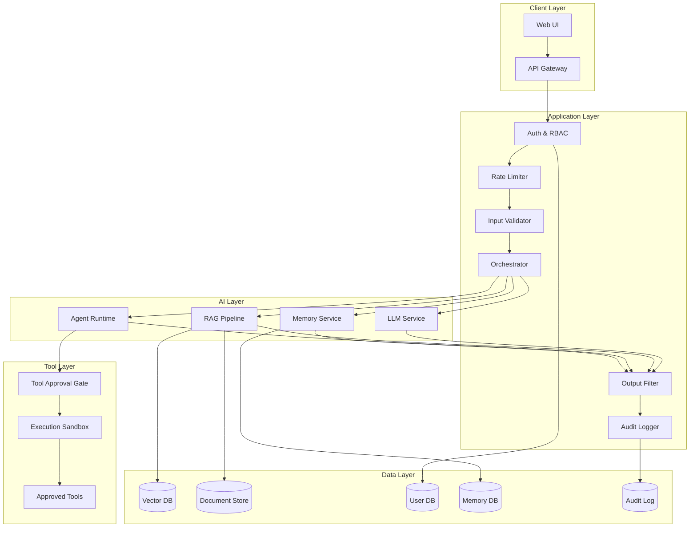

# Enterprise AI Assistant — Capstone Project

> **Status: Placeholder** — This directory contains the architecture and requirements for the capstone project that learners will build as the culmination of the "AI Security from Scratch" curriculum.

## Overview

The Enterprise AI Assistant is the capstone project where learners apply all defensive controls learned throughout the course. Starting from a deliberately insecure base (similar to the other labs), learners incrementally harden the system until it meets enterprise security requirements.

## What Learners Will Build

A multi-tenant AI assistant that:

- Accepts natural-language queries from authenticated users
- Retrieves relevant documents from a permission-aware RAG pipeline
- Can invoke approved tools with human-in-the-loop confirmation
- Maintains per-user memory with proper isolation
- Applies input validation, output filtering, and rate limiting at every layer
- Logs all interactions for audit and incident response
- Detects and mitigates prompt-injection attempts in real time

## Architecture Overview



## Defensive Controls (Progressive Implementation)

Learners implement controls in phases, each corresponding to a module in the curriculum:

### Phase 1: Input Validation
- Schema validation for all API inputs
- Prompt-length limits
- Character-set restrictions
- Injection-pattern detection (regex-based)

### Phase 2: Output Filtering
- Secret/PII detection in LLM outputs
- Response-length limits
- Content-classification gate
- Confidence threshold enforcement

### Phase 3: Access Control
- Per-user authentication (JWT)
- Role-based access control (RBAC)
- Document-level permissions in RAG
- Memory isolation between users

### Phase 4: Tool Safety
- Tool-approval workflow (human-in-the-loop)
- Parameter validation and sanitisation
- Execution sandboxing
- Scope restriction per user role

### Phase 5: Memory Security
- User-scoped memory namespaces
- Memory content validation
- TTL-based memory expiry
- Memory sanitisation on retrieval

### Phase 6: Monitoring & Response
- Comprehensive audit logging
- Anomaly detection on query patterns
- Rate limiting per user/IP
- Incident-response playbooks

## Technology Stack

| Component | Technology |
|-----------|-----------|
| API Framework | FastAPI |
| LLM | OpenAI API / local model |
| Vector DB | ChromaDB |
| Document Store | SQLite + filesystem |
| User DB | SQLite (Prisma ORM) |
| Memory DB | SQLite |
| Audit Log | SQLite + JSON files |
| Auth | JWT tokens |
| Rate Limiting | Token-bucket algorithm |

## Project Structure

```
enterprise-ai-assistant/
├── README.md               # This file
├── requirements.txt        # Combined dependencies
├── config/                 # Configuration files
│   └── .gitkeep
├── src/                    # Source code
│   └── .gitkeep
├── data/                   # Sample data and documents
│   └── .gitkeep
├── tests/                  # Security test suite
│   └── .gitkeep
└── docs/                   # Architecture and design docs
    └── .gitkeep
```

## Success Criteria

The capstone is complete when the system can:

1. ✅ Resist direct prompt injection (secrets not extractable)
2. ✅ Enforce document-level access control in RAG
3. ✅ Require approval for dangerous tool calls
4. ✅ Isolate memories between users
5. ✅ Detect and block injection payloads at the input layer
6. ✅ Filter sensitive information from outputs
7. ✅ Rate-limit requests to prevent abuse
8. ✅ Produce complete audit trails for all interactions
9. ✅ Pass an automated security-test suite with 100% pass rate
10. ✅ Document all controls with control-loop diagrams

## Assessment

Learners will be assessed through:

- **Automated test suite** — Security tests that probe each vulnerability
- **Peer review** — Other learners attempt to break your defences
- **Documentation** — Control-loop analysis for every defensive control
- **Red team exercise** — Instructors attempt novel attacks
