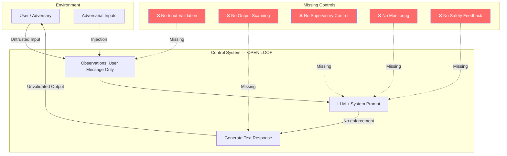

# Control-Loop Analysis: AI System Under Adversarial Conditions

> **Version:** 1.0 | **Date:** 2025-03-01 | **Analyst:** Curriculum Team | **System Version:** Generic AI Chatbot (Baseline)

---

## System Name and Description

**System Name:** Generic AI Chatbot (No Supervisory Controls)

**Description:**

A basic AI chatbot that receives user messages, processes them through a large language model with a system prompt, and returns text responses. The system has no input validation, no output filtering, no tool access, and no monitoring. It represents the simplest AI system deployment and serves as the baseline for understanding what happens when a control loop operates without supervisory controls.

The chatbot consists of a web API endpoint that accepts user messages, an LLM inference service that generates responses, and a response delivery mechanism. The system prompt defines the chatbot's persona and behavioral constraints, but there is no enforcement mechanism beyond the model's tendency to follow instructions.

**System Boundary:**
- **In scope:** User input processing, LLM inference, output delivery, system prompt management
- **Out of scope:** Infrastructure security, network security, authentication (assumed handled upstream)

---

## Objective Definition

The primary safety objective that the control loop must maintain:

> **Objective:** Ensure that AI-generated outputs comply with safety policies, never reveal internal system instructions, and do not produce harmful, illegal, or deceptive content — even when subjected to adversarial input.

**Formal specification:**

```
∀ input ∈ UserInput:
  ∀ output ∈ SystemOutput(input):
    Safe(output) ∧ NoInstructionLeak(output) ∧ NoHarmfulContent(output)
```

**Objective decomposition:**

| Sub-objective | Description | Priority |
|---|---|---|
| SO-01 | Output contains no system prompt fragments | CRITICAL |
| SO-02 | Output contains no harmful or illegal content | CRITICAL |
| SO-03 | Output does not execute or suggest dangerous actions | HIGH |
| SO-04 | Output does not expose PII from training data | HIGH |
| SO-05 | Output is factually grounded and not deceptive | MEDIUM |

---

## Controller Identification

The component(s) responsible for making decisions to maintain the objective:

| Controller ID | Name | Type | Location | Authority |
|---|---|---|---|---|
| CTRL-01 | LLM + System Prompt | SOFTWARE | Inference service | CAN_GENERATE (no block authority) |

**Controller hierarchy:**

```
[No supervisory controller exists]
    └── LLM + System Prompt (sole controller)
            └── System prompt (soft constraints only)
```

**Critical observation:** There is only one controller, and it has no authority to block or modify its own outputs. The system prompt provides soft guidance but no hard enforcement. This is an open-loop design with respect to the safety objective.

---

## Observations Enumeration

What the controllers can perceive about the system state:

| Obs ID | Observation | Source | Type | Frequency | Latency |
|---|---|---|---|---|---|
| OBS-01 | User message content | API request | Synchronous | Per request | < 10ms |
| OBS-02 | System prompt content | Configuration | Synchronous | Per request | < 1ms |
| OBS-03 | Conversation history | Session store | Synchronous | Per request | < 10ms |

**Observation gaps (blind spots):**

| Gap ID | What Cannot Be Observed | Risk | Mitigation |
|---|---|---|---|
| GAP-01 | Whether user input contains injection patterns | Adversarial input reaches model unfiltered | Input classifier |
| GAP-02 | Whether output violates safety policies before delivery | Harmful content reaches user | Output scanner |
| GAP-03 | Whether system prompt is being leaked | Internal logic exposed to attacker | Leakage detector |
| GAP-04 | Behavioral anomalies across conversation turns | Multi-turn attacks go undetected | Behavioral monitor |
| GAP-05 | Rate of policy violations across sessions | Systemic issues invisible | Control ledger |

---

## Actions Enumeration

What the controllers can do to influence the system:

| Action ID | Action | Effect | Preconditions | Reversibility | Risk |
|---|---|---|---|---|---|
| ACT-01 | Generate text response | Output delivered to user | None (always available) | Irreversible | Output may be harmful |
| ACT-02 | Follow system prompt guidance | Constrained output | Model chooses to comply | Reversible | Compliance not guaranteed |

**Critical gap:** The controller cannot block its own output, cannot escalate to a human, cannot redact content, and cannot halt processing. It can only generate text and hope that the text is safe.

---

## Environment Description

The external context in which the system operates:

| Factor | Description | Impact on Control Loop |
|---|---|---|
| User population | General public, including potential adversaries | High disturbance probability |
| Network environment | Internet-facing API | No perimeter protection for inputs |
| Threat landscape | Active prompt injection research and tooling | Constantly evolving attack patterns |
| Regulatory context | Varies by jurisdiction; GDPR, AI Act emerging | Compliance requirements unenforceable without controls |
| Operational tempo | Variable; may spike during incidents | Load can mask attacks |
| Data sensitivity | System prompts may contain proprietary logic | High value target for extraction |

---

## Feedback Paths

How the controllers learn whether their actions achieved the objective:

| Feedback ID | From | To | Signal | Delay | Reliability |
|---|---|---|---|---|---|
| FB-01 | User follow-up message | LLM context | Implicit user satisfaction signal | Seconds-minutes | LOW |

**Feedback loop dynamics:**
- **Time constant:** Uncontrolled — no feedback path exists for the safety objective
- **Damping:** None — violations produce no corrective signal
- **Stability:** UNSTABLE — the system has no mechanism to return to safe state after violation

The only feedback is the user's next message, which is untrusted input and cannot serve as a safety feedback signal. There is no closed loop around the safety objective.

---

## Disturbance Sources

External factors that can push the system away from the objective:

| Dist ID | Disturbance | Source | Magnitude | Frequency | Predictability | Current Mitigation |
|---|---|---|---|---|---|---|
| D-01 | Direct prompt injection | External user | High (can override all constraints) | Frequent | Predictable patterns exist | None |
| D-02 | Multi-turn manipulation | External user | Medium (gradual influence) | Common | Unpredictable | None |
| D-03 | Context overflow | External user | High (drowns system prompt) | Occasional | Predictable | None |
| D-04 | Encoding tricks | External user | Medium (bypasses text filters) | Occasional | Unpredictable | None |
| D-05 | Social engineering of model | External user | Medium (manipulates reasoning) | Common | Unpredictable | None |

---

## Unsafe States

States in which the system violates its safety objective:

| State ID | Unsafe State | Trigger Condition | Time to Unsafe State | Consequence | Reversibility |
|---|---|---|---|---|---|
| US-01 | System prompt fully leaked | Successful prompt extraction attack | Seconds | Proprietary logic exposed; enables further attacks | Irreversible |
| US-02 | Harmful content generated | Successful jailbreak | Seconds | User harm; legal liability; reputational damage | Irreversible (once delivered) |
| US-03 | Model follows attacker instructions | Successful prompt injection | Seconds | Any action the model can take is now under attacker control | Reversible with session reset |
| US-04 | Misinformation produced | Hallucination + adversarial steering | Seconds | User makes bad decisions based on false information | Irreversible (once consumed) |
| US-05 | Session state poisoned | Multi-turn manipulation | Minutes | Subsequent interactions compromised | Reversible with session reset |

---

## Supervisory Controls

Higher-level controls that monitor and override the primary controllers:

| Sup ID | Supervisory Control | Monitors | Override Capability | Activation Condition |
|---|---|---|---|---|
| — | **None** | — | — | — |

**This is the critical finding.** The system has no supervisory controls. The LLM operates as the sole controller with no external oversight, no override mechanism, and no safety net. This is the open-loop configuration that every subsequent class will address.

---

## Monitoring Points

Ongoing observability for the control loop:

| Monitor ID | Metric | Collection Method | Threshold (Warning) | Threshold (Critical) | Alert Channel |
|---|---|---|---|---|---|
| — | **None** | — | — | — | — |

No monitoring exists. Violations are invisible unless manually discovered.

---

## Recovery Procedures

Steps to restore the system to a safe state after an objective violation:

### Procedure R-01: Manual Session Reset

**Trigger:** User report or manual review
**Severity:** CRITICAL (but unmonitored)
**Time objective:** No RTO defined

| Step | Action | Responsible | Verification |
|---|---|---|---|
| 1 | User reports harmful output | End user | Report received |
| 2 | Operator manually reviews logs | Operator | Logs found and reviewed |
| 3 | Operator resets session state | Operator | Session cleared |
| 4 | Operator updates system prompt if needed | Operator | New prompt deployed |
| 5 | No systematic verification performed | — | — |

This procedure is entirely manual, reactive, and unreliable. There is no automated detection, no guaranteed response time, and no verification that the recovery was effective.

---

## Control-Loop Diagram



---

## Analysis Summary

| Category | Finding | Severity |
|---|---|---|
| Observability | No safety observations; system is blind to adversarial inputs and policy violations | CRITICAL |
| Control Authority | Controller cannot block, modify, or halt its own outputs | CRITICAL |
| Feedback | No safety feedback path exists; the loop is open | CRITICAL |
| Disturbances | Five disturbance categories with zero mitigations | CRITICAL |
| Unsafe States | Five identified unsafe states with no prevention or detection | CRITICAL |
| Recovery | Manual-only recovery with no automated detection trigger | HIGH |
| Supervisory Controls | None exist | CRITICAL |

**Overall assessment:** This system operates as an open-loop controller with respect to the safety objective. It has no mechanism to detect, prevent, or recover from violations. It is unsafe by design — not because the model is unaligned, but because the control loop is incomplete.

---

*Control-Loop Analysis 01 | AI Security from Scratch | Phase 1 — Foundations*
