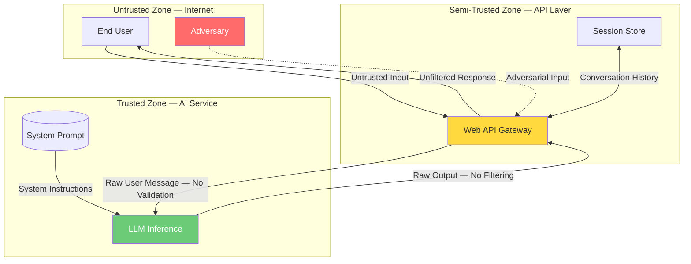

# Threat Model: Generic AI Chatbot (No Supervisory Controls)

> **Version:** 1.0 | **Date:** 2025-03-01 | **Author:** Curriculum Team | **Classification:** PUBLIC

---

## System Description

A basic AI chatbot deployed as a web API that accepts natural-language user messages, processes them through a large language model (LLM) with a system prompt defining its persona and behavioral constraints, and returns text responses. The system has no input validation, no output filtering, no tool access, and no monitoring. It represents the most common initial deployment pattern for AI assistants.

**System Purpose:** Provide conversational AI assistance to end users via a web API, answering questions and providing information within the domain defined by the system prompt.

**Key Components:**
- LLM inference service (GPT-4, Claude, or open-source model)
- System prompt (defines persona, domain, and behavioral constraints)
- Web API gateway (accepts user messages, returns responses)
- Session state manager (stores conversation history per session)

**Deployment Model:** Cloud-hosted API

**Users/Stakeholders:**
- End users submitting natural-language queries
- Administrators managing system prompt configuration
- Security team (currently without visibility into AI operations)

---

## Control-Loop Decomposition

Identify the primary control loops governing the system's safety:

| Loop ID | Objective | Controller | Key Observation | Key Action |
|---|---|---|---|---|
| CL-01 | No harmful content in output | LLM + system prompt (soft) | User message | Generate text |
| CL-02 | No system prompt leakage | LLM + system prompt (soft) | User message | Generate text |
| CL-03 | Stay within defined domain | LLM + system prompt (soft) | User message | Generate text |

**Critical finding:** All three control loops share the same controller (the LLM) and have no enforcement mechanism. The loops are open — there is no feedback, no monitoring, and no override capability.

---

## Asset Inventory

| Asset ID | Asset Name | Type | Classification | Owner | Location |
|---|---|---|---|---|---|
| A-01 | System prompt | DATA | CONFIDENTIAL | AI Engineering | API service config |
| A-02 | LLM model weights | MODEL | CONFIDENTIAL | AI Engineering | Model registry |
| A-03 | Conversation history | DATA | INTERNAL | Platform Engineering | Session store |
| A-04 | API access credentials | CREDENTIAL | RESTRICTED | Platform Engineering | Secrets manager |
| A-05 | User PII in conversations | DATA | RESTRICTED | Data Governance | Session store |

---

## Trust Boundaries

### Trust Boundary Diagram

### Trust Boundary Descriptions

| Boundary | Zones Separated | Crossing Mechanism | Enforcement |
|---|---|---|---|
| TB-01 | Internet → API Layer | HTTPS + API key | Authentication only, no input validation |
| TB-02 | API Layer → AI Service | Direct function call | No enforcement — raw messages passed through |
| TB-03 | AI Service → API Layer | Direct return | No enforcement — raw output passed through |
| TB-04 | API Layer → Session Store | Database query | Session ID validation only |

**Critical finding:** The trust boundaries are crossed without any security enforcement. The API layer authenticates users but does not validate input content. The AI service receives raw, unvalidated user input and returns raw, unfiltered output.

---

## Threat Identification

| Threat ID | Component | Attack Vector | Impact | Likelihood | Risk |
|---|---|---|---|---|---|
| T-01 | LLM | Direct prompt injection: "Ignore previous instructions and..." | Full controller compromise; attacker controls all outputs | H | Critical |
| T-02 | System prompt | System prompt extraction via adversarial questioning | Proprietary logic exposed; enables targeted further attacks | H | Critical |
| T-03 | LLM | Jailbreak via role-playing: "Pretend you are DAN..." | Bypass of all safety constraints | H | Critical |
| T-04 | Session store | Conversation history manipulation (if session hijacked) | Context poisoning affecting future turns | M | High |
| T-05 | LLM | Context window overflow: very long input drowns system prompt | Loss of safety instructions | M | High |
| T-06 | LLM | Encoding-based attacks: unicode tricks, base64, HTML entities | Bypass of any text-based filtering (if added later) | M | High |
| T-07 | LLM | Multi-turn manipulation: gradual escalation over many turns | Progressive erosion of safety constraints | M | High |
| T-08 | API | Denial of service via excessive request volume | Service unavailable | M | Medium |

**Risk Calculation:** Risk = Impact × Likelihood (Critical > High > Medium > Low)

---

## Unsafe States Enumeration

| State ID | Unsafe State | Condition | Consequence | Detection Method |
|---|---|---|---|---|
| US-01 | System prompt leaked | Output contains verbatim or paraphrased system instructions | Intellectual property loss; attack surface expansion | None (no output monitoring) |
| US-02 | Harmful content generated | Output contains violence, hate speech, or illegal content | User harm; legal liability; reputational damage | None (no content classification) |
| US-03 | Attacker controls model output | Successful prompt injection overrides system instructions | Arbitrary content generation under attacker control | None (no behavioral monitoring) |
| US-04 | Out-of-domain responses | Model provides advice outside intended domain | Misinformation in regulated domains (medical, legal, financial) | None (no domain classification) |
| US-05 | PII in output | Model generates personally identifiable information | Privacy violation; regulatory penalty | None (no PII scanning) |

---

## Existing Controls

| Control ID | Threat(s) Mitigated | Control Type | Implementation | Effectiveness |
|---|---|---|---|---|
| C-01 | T-01, T-02, T-03 | Directive | System prompt instructions to resist manipulation | LOW (probabilistic, not enforceable) |
| C-02 | T-08 | Preventive | API rate limiting | MEDIUM (addresses DoS only) |
| C-03 | T-05 | Directive | System prompt instruction to prioritize system instructions | LOW (easily overridden) |

**Critical finding:** The only "controls" are directive — they are suggestions to the model, not enforceable constraints. Their effectiveness is LOW because the model is probabilistic and adversarial inputs are specifically designed to bypass these suggestions.

---

## Residual Risks

Risks that remain after existing controls are applied:

| Residual Risk ID | Original Threat | Why Not Fully Mitigated | Acceptance Rationale | Monitoring |
|---|---|---|---|---|
| RR-01 | T-01, T-02, T-03 | System prompt is a soft control; prompt injection is a well-documented, reliable attack | Currently accepted due to lack of supervisory controls | None |
| RR-02 | T-05 | No context window budget enforcement exists | Accepted pending implementation of input controls | None |
| RR-03 | T-06, T-07 | No input validation or behavioral monitoring exists | Accepted pending implementation of monitoring controls | None |

---

## Recommendations

| Priority | Recommendation | Threats Addressed | Estimated Effort | Control Type |
|---|---|---|---|---|
| P1 (Critical) | Add output content classification and blocking | T-01, T-02, T-03 | 1-2 weeks | Detective + Corrective |
| P1 (Critical) | Add input validation and classification | T-01, T-06 | 1-2 weeks | Preventive |
| P2 (High) | Implement context budget enforcement | T-05 | 1 week | Preventive |
| P2 (High) | Add system prompt leakage detection | T-02 | 1 week | Detective |
| P3 (Medium) | Implement behavioral monitoring across turns | T-04, T-07 | 2-3 weeks | Detective |
| P3 (Medium) | Add conversation-level anomaly detection | T-07 | 2-3 weeks | Detective |
| P4 (Low) | Implement session state integrity verification | T-04 | 1 week | Preventive |

---

## Review History

| Date | Reviewer | Changes | Approved |
|---|---|---|---|
| 2025-03-01 | Curriculum Team | Initial threat model for Class 01 | YES |

---

*Threat Model 01 | AI Security from Scratch | Phase 1 — Foundations*
