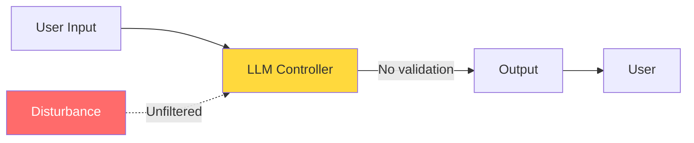
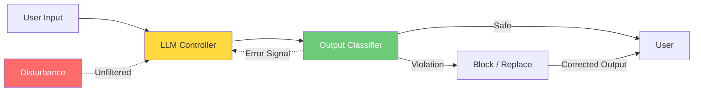
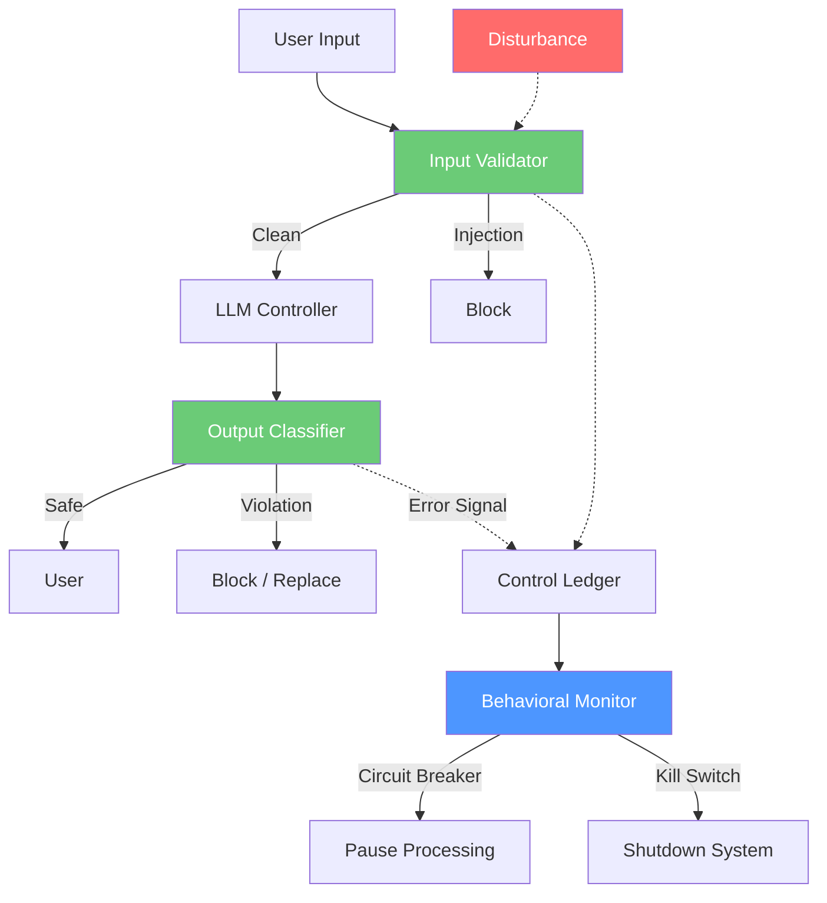

# Control-Loop Analysis: Open-Loop vs. Closed-Loop AI System

> **Version:** 1.0 | **Date:** 2025-03-01 | **Analyst:** Curriculum Team | **System Version:** AI Chatbot — Open-Loop / Closed-Loop Comparison

---

## System Name and Description

**System Name:** AI Chatbot — Control Theory Comparison

**Description:**

This analysis compares three configurations of the same AI chatbot system to demonstrate the control-theoretic properties of each:

1. **Configuration A (Open-Loop):** The LLM generates responses with no feedback path for safety. Output is delivered directly to the user without validation.
2. **Configuration B (Closed-Loop):** Output is classified for safety before delivery. Violations are detected and corrected, providing a feedback path.
3. **Configuration C (Supervised):** A full supervisory control hierarchy monitors the system at input, output, and system levels, with circuit breakers and kill switches.

The comparison demonstrates how each control-theoretic element contributes to safety stability.

**System Boundary:**
- **In scope:** LLM inference, input processing, output delivery, supervisory controls
- **Out of scope:** Infrastructure security, network security, authentication

---

## Objective Definition

The primary safety objective that the control loop must maintain:

> **Objective:** Ensure that AI-generated outputs comply with safety policies, never reveal internal instructions, and do not produce harmful content — with bounded error under adversarial disturbance.

**Formal specification:**

```
∀ input ∈ UserInput:
  ∀ disturbance ∈ AdversarialInput:
    ∀ output ∈ SystemOutput(input, disturbance):
      |error(output, reference)| ≤ ε
    where error = deviation from safety-compliant behavior
    and ε = maximum tolerable safety deviation
```

**Objective decomposition:**

| Sub-objective | Description | Priority |
|---|---|---|
| SO-01 | Output never contains system prompt content | CRITICAL |
| SO-02 | Output never contains harmful content | CRITICAL |
| SO-03 | Output stays within defined domain | HIGH |
| SO-04 | Error signal converges to zero after disturbance | HIGH |
| SO-05 | System remains stable under sustained attack | CRITICAL |

---

## Controller Identification

### Configuration A: Open-Loop

| Controller ID | Name | Type | Location | Authority |
|---|---|---|---|---|
| CTRL-A1 | LLM + System Prompt | SOFTWARE | Inference service | CAN_GENERATE (no block) |

### Configuration B: Closed-Loop

| Controller ID | Name | Type | Location | Authority |
|---|---|---|---|---|
| CTRL-B1 | LLM + System Prompt | SOFTWARE | Inference service | CAN_GENERATE |
| CTRL-B2 | Output Classifier + Gate | SOFTWARE | Output pipeline | CAN_BLOCK, CAN_MODIFY |

### Configuration C: Supervised

| Controller ID | Name | Type | Location | Authority |
|---|---|---|---|---|
| CTRL-C1 | LLM + System Prompt | SOFTWARE | Inference service | CAN_GENERATE |
| CTRL-C2 | Input Validator | SOFTWARE | Input pipeline | CAN_BLOCK |
| CTRL-C3 | Output Classifier + Gate | SOFTWARE | Output pipeline | CAN_BLOCK, CAN_MODIFY |
| CTRL-C4 | Behavioral Monitor | SOFTWARE | System level | CAN_ESCALATE, CAN_SHUTDOWN |

**Controller hierarchy (Configuration C):**

```
[Supervisory Controller — Behavioral Monitor]
    ├── [Input Validator]
    │       └── Blocks adversarial inputs before reaching LLM
    ├── [LLM + System Prompt — Primary Controller]
    └── [Output Classifier + Gate]
            └── Blocks unsafe outputs before reaching user
```

---

## Observations Enumeration

### Configuration A: Open-Loop

| Obs ID | Observation | Source | Type | Frequency | Latency |
|---|---|---|---|---|---|
| OBS-A1 | User message | API request | Synchronous | Per request | < 10ms |
| OBS-A2 | System prompt | Configuration | Synchronous | Per request | < 1ms |

### Configuration B: Closed-Loop

| Obs ID | Observation | Source | Type | Frequency | Latency |
|---|---|---|---|---|---|
| OBS-B1 | User message | API request | Synchronous | Per request | < 10ms |
| OBS-B2 | System prompt | Configuration | Synchronous | Per request | < 1ms |
| OBS-B3 | Output safety classification | Output classifier | Synchronous | Per request | < 100ms |
| OBS-B4 | Error signal (safety deviation) | Classifier vs. reference | Synchronous | Per request | < 100ms |

### Configuration C: Supervised

| Obs ID | Observation | Source | Type | Frequency | Latency |
|---|---|---|---|---|---|
| OBS-C1 | Input classification result | Input validator | Synchronous | Per request | < 50ms |
| OBS-C2 | Output safety classification | Output classifier | Synchronous | Per request | < 100ms |
| OBS-C3 | Error signal per request | Computed from C1/C2 | Synchronous | Per request | < 110ms |
| OBS-C4 | Aggregate violation rate | Control ledger | Asynchronous | Every 30s | < 1s |
| OBS-C5 | Behavioral anomaly score | Behavioral monitor | Asynchronous | Every 60s | < 2s |

**Observation gaps:**

| Gap ID | What Cannot Be Observed | Risk | Mitigation |
|---|---|---|---|
| GAP-01 | Internal model reasoning process | Cannot detect intent before action | Behavioral observation instead |
| GAP-02 | Future attack trajectory | Cannot predict multi-turn manipulation | Aggregate behavioral monitoring |
| GAP-03 | Cross-session attack patterns | Cannot correlate attacks across users | Global behavioral monitor (Config C) |

---

## Actions Enumeration

### Configuration A: Open-Loop

| Action ID | Action | Effect | Preconditions | Reversibility | Risk |
|---|---|---|---|---|---|
| ACT-A1 | Generate text | Output delivered to user | None | Irreversible | May be unsafe |

### Configuration B: Closed-Loop

| Action ID | Action | Effect | Preconditions | Reversibility | Risk |
|---|---|---|---|---|---|
| ACT-B1 | Generate text | Output produced | None | Irreversible | May be unsafe |
| ACT-B2 | Block output | Unsafe output prevented | Classification = VIOLATION | Reversible | May block legitimate output (false positive) |
| ACT-B3 | Replace output | Unsafe output replaced with safe message | Classification = VIOLATION | Reversible | May lose useful content |

### Configuration C: Supervised

| Action ID | Action | Effect | Preconditions | Reversibility | Risk |
|---|---|---|---|---|---|
| ACT-C1 | Block input | Adversarial input prevented from reaching LLM | Input classification = INJECTION | Reversible | False positive blocks |
| ACT-C2 | Generate text | Output produced | Input passes validation | Irreversible | May still be unsafe (output filter backup) |
| ACT-C3 | Block output | Unsafe output prevented | Output classification = VIOLATION | Reversible | False positive blocks |
| ACT-C4 | Activate circuit breaker | Halt processing temporarily | Violation rate > threshold | Reversible | Service disruption |
| ACT-C5 | Kill switch | Shut down system | Critical safety condition | Reversible (manual restart) | Service outage |

---

## Environment Description

The external context in which the system operates:

| Factor | Description | Impact on Control Loop |
|---|---|---|
| User population | Mix of legitimate users and adversaries | Disturbance probability varies |
| Attack sophistication | Ranges from simple injection to multi-turn manipulation | Different control authority required |
| Operational tempo | Variable request volume | Load affects control latency |
| Regulatory context | Evolving AI governance requirements | Compliance requires auditable controls |
| Data sensitivity | Varies by use case | Higher sensitivity requires tighter bounds |

---

## Feedback Paths

### Configuration A: Open-Loop

| Feedback ID | From | To | Signal | Delay | Reliability |
|---|---|---|---|---|---|
| — | — | — | No safety feedback | — | — |

**Feedback loop dynamics:**
- **Time constant:** N/A (no loop)
- **Damping:** N/A
- **Stability:** UNSTABLE — no mechanism to correct deviations

### Configuration B: Closed-Loop

| Feedback ID | From | To | Signal | Delay | Reliability |
|---|---|---|---|---|---|
| FB-B1 | Output classifier | LLM context | Error signal (safety deviation) | Per request (~200ms) | MEDIUM |

**Feedback loop dynamics:**
- **Time constant:** ~1 request (fast detection)
- **Damping:** Moderate (single-stage correction)
- **Stability:** MARGINALLY STABLE — can correct individual violations but vulnerable to sustained attack

### Configuration C: Supervised

| Feedback ID | From | To | Signal | Delay | Reliability |
|---|---|---|---|---|---|
| FB-C1 | Output classifier | Request pipeline | Per-request error signal | ~200ms | HIGH |
| FB-C2 | Control ledger | Policy engine | Aggregate violation trend | ~30s | HIGH |
| FB-C3 | Behavioral monitor | Circuit breaker | Anomaly score | ~60s | HIGH |

**Feedback loop dynamics:**
- **Time constant:** ~1 request (fast) for local, ~30-60s for global
- **Damping:** High (multi-stage, hierarchical)
- **Stability:** STABLE — can maintain safety under sustained disturbance

---

## Disturbance Sources

| Dist ID | Disturbance | Source | Magnitude | Frequency | Predictability | Config A Mitigation | Config B Mitigation | Config C Mitigation |
|---|---|---|---|---|---|---|---|---|
| D-01 | Direct prompt injection | User | High | Frequent | Partially | None | Output filter (partial) | Input block + output filter |
| D-02 | Multi-turn manipulation | User | Medium | Common | Unpredictable | None | Partial | Behavioral monitor |
| D-03 | Context overflow | User | High | Occasional | Predictable | None | Partial | Input length limit |
| D-04 | Encoding evasion | User | Medium | Occasional | Unpredictable | None | Minimal | Input normalization |
| D-05 | Volume-based saturation | Attacker | High | Rare | Predictable | None | Minimal | Circuit breaker |

---

## Unsafe States

| State ID | Unsafe State | Trigger | Config A | Config B | Config C |
|---|---|---|---|---|---|
| US-01 | System prompt leaked | Extraction attack | Unprotected | Detected + blocked | Prevented (input) or blocked (output) |
| US-02 | Harmful content output | Jailbreak | Unprotected | Detected + blocked | Prevented or blocked |
| US-03 | Divergent multi-turn behavior | Gradual manipulation | Unprotected | Partially detected | Detected by behavioral monitor |
| US-04 | Control saturation | High-volume attack | N/A | Overwhelmed | Circuit breaker activates |
| US-05 | Cascade failure | Attack propagates through loop | Unprotected | Partially contained | Isolated by hierarchy |

---

## Supervisory Controls

| Sup ID | Supervisory Control | Monitors | Override Capability | Activation Condition |
|---|---|---|---|---|
| SUP-C1 | Input validator | Input stream | Block input | Injection pattern detected |
| SUP-C2 | Output gate | Output stream | Block/replace output | Safety violation detected |
| SUP-C3 | Behavioral monitor | Aggregate behavior | Circuit breaker, kill switch | Anomaly threshold exceeded |
| SUP-C4 | Control ledger | All control decisions | None (audit only) | Continuous logging |

---

## Monitoring Points

| Monitor ID | Metric | Collection Method | Warning Threshold | Critical Threshold | Alert Channel |
|---|---|---|---|---|---|
| MON-01 | Per-request error signal | Output classifier | > 0.3 | > 0.7 | Request pipeline |
| MON-02 | 5-min violation rate | Control ledger | > 2% | > 5% | Security team |
| MON-03 | Input rejection rate | Input validator | > 5% | > 15% | Security team |
| MON-04 | Behavioral anomaly score | Behavioral monitor | > 0.5 | > 0.8 | Circuit breaker |
| MON-05 | Control latency | Instrumentation | > 500ms | > 2s | Ops team |

---

## Recovery Procedures

### Procedure R-01: Circuit Breaker Recovery

**Trigger:** Violation rate exceeds critical threshold
**Severity:** CRITICAL
**Time objective:** 5 minutes

| Step | Action | Responsible | Verification |
|---|---|---|---|
| 1 | Circuit breaker halts processing | Automated | No new requests processed |
| 2 | Alert sent to security team | Automated | Alert received |
| 3 | Analyze violation logs for attack pattern | Security team | Pattern identified |
| 4 | Update input/output rules to address pattern | Security team | Rules deployed |
| 5 | Run security regression tests | Automated | All tests pass |
| 6 | Reset circuit breaker | Security team | Processing resumes |

---

## Control-Loop Diagrams

### Configuration A: Open-Loop (Unsafe)



### Configuration B: Closed-Loop (Partial)



### Configuration C: Supervised (Stable)



---

## Analysis Summary

| Category | Config A (Open-Loop) | Config B (Closed-Loop) | Config C (Supervised) |
|---|---|---|---|
| Observability | None | Output only | Full (input, output, system) |
| Control Authority | None | Block/replace output | Block input, block output, circuit break, shutdown |
| Feedback | None | Per-request error signal | Multi-level feedback hierarchy |
| Stability | UNSTABLE | MARGINALLY STABLE | STABLE |
| Disturbance Rejection | None | Partial (output stage only) | Full (multi-stage) |
| Recovery | Manual only | Per-request correction | Automated + manual |
| Overall Safety | UNSAFE | PARTIALLY SAFE | SAFE (bounded error) |

---

*Control-Loop Analysis 02 | AI Security from Scratch | Phase 1 — Foundations*
