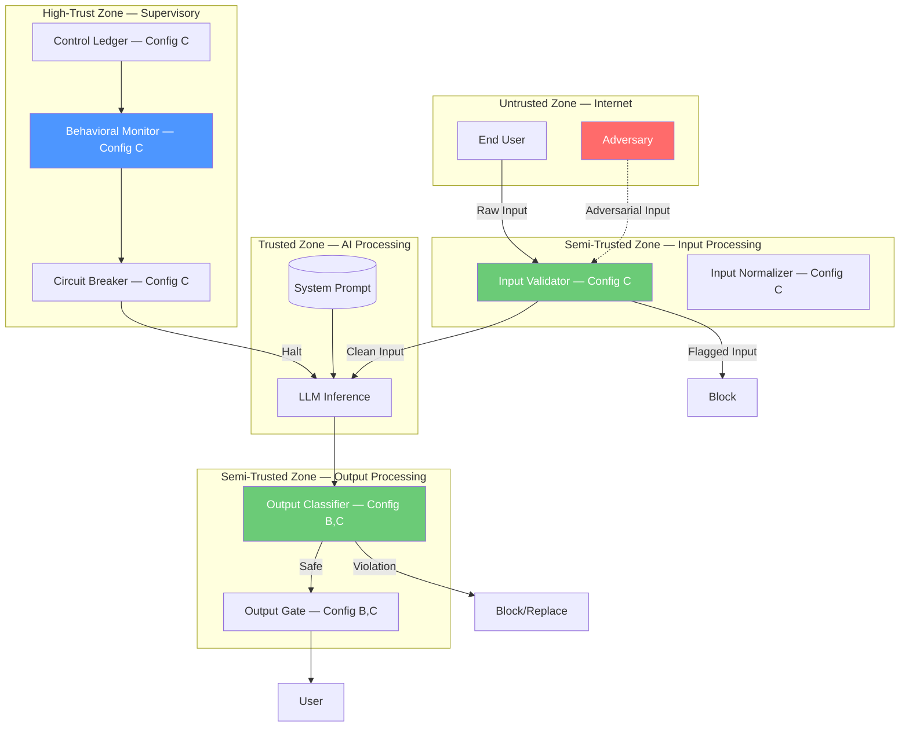

# Threat Model: AI System — Control-Theoretic Perspective

> **Version:** 1.0 | **Date:** 2025-03-01 | **Author:** Curriculum Team | **Classification:** PUBLIC

---

## System Description

This threat model analyzes an AI chatbot system from a control-theoretic perspective, identifying threats in terms of how they compromise the control loop's ability to maintain the safety objective. The analysis covers three configurations: open-loop (no safety feedback), closed-loop (output feedback only), and supervised (full supervisory hierarchy).

**System Purpose:** Provide conversational AI assistance with guaranteed safety properties under adversarial conditions.

**Key Components:**
- LLM inference service (primary controller)
- System prompt (controller objective definition)
- Input validation service (supervisory control — Config C only)
- Output classification service (feedback + supervisory control — Config B, C)
- Behavioral monitoring service (global supervisory control — Config C only)
- Control ledger (audit and analysis — Config C only)
- Circuit breaker and kill switch (safety fallback — Config C only)

**Deployment Model:** Cloud-hosted API

**Users/Stakeholders:**
- End users submitting natural-language queries
- Adversaries attempting to manipulate the system
- Security team monitoring and maintaining controls
- Operations team managing system availability

---

## Control-Loop Decomposition

| Loop ID | Objective | Controller | Key Observation | Key Action |
|---|---|---|---|---|
| CL-01 | No harmful output | Output classifier (B,C) | Output content classification | Block/replace unsafe output |
| CL-02 | No injection success | Input validator (C) | Input classification | Block injection input |
| CL-03 | System stability | Behavioral monitor (C) | Aggregate violation rate | Circuit breaker / kill switch |

---

## Asset Inventory

| Asset ID | Asset Name | Type | Classification | Owner | Location |
|---|---|---|---|---|---|
| A-01 | System prompt | DATA | CONFIDENTIAL | AI Engineering | API service config |
| A-02 | LLM model weights | MODEL | CONFIDENTIAL | AI Engineering | Model registry |
| A-03 | Output classifier model | MODEL | INTERNAL | Security Engineering | Classification service |
| A-04 | Control policy rules | DATA | CONFIDENTIAL | Security Engineering | Policy engine |
| A-05 | Control ledger / audit log | DATA | RESTRICTED | Security Engineering | Log store |
| A-06 | User conversation data | DATA | RESTRICTED | Data Governance | Session store |

---

## Trust Boundaries

### Trust Boundary Diagram

### Trust Boundary Descriptions

| Boundary | Zones Separated | Crossing Mechanism | Enforcement |
|---|---|---|---|
| TB-01 | Internet → Input Processing | Input validation + normalization | Injection detection (Config C) |
| TB-02 | Input Processing → AI Processing | Validated input only (Config C) or raw input (Config A,B) | Input gate |
| TB-03 | AI Processing → Output Processing | Raw LLM output | Output classification |
| TB-04 | Output Processing → User | Output gate (safe content only) | Block/replace on violation |
| TB-05 | All zones → Supervisory | Telemetry and audit | Read-only monitoring + override |

---

## Threat Identification

| Threat ID | Component | Attack Vector | Impact | Likelihood | Risk | Config A | Config B | Config C |
|---|---|---|---|---|---|---|---|---|
| T-01 | LLM | Direct prompt injection | Controller compromise | H | Critical | Unprotected | Partial (output filter) | Blocked (input + output) |
| T-02 | System prompt | Prompt extraction via adversarial questioning | IP exposure, attack facilitation | H | Critical | Unprotected | Partial | Blocked |
| T-03 | LLM | Multi-turn manipulation | Gradual safety erosion | M | High | Unprotected | Partial | Detected by monitor |
| T-04 | Output classifier | Evasion via encoding/obfuscation | Bypass output filter | M | High | N/A | Vulnerable | Second layer (input) backup |
| T-05 | Input validator | Evasion via novel injection patterns | Bypass input filter | M | High | N/A | N/A | Output filter backup |
| T-06 | LLM | Context overflow | Drown system prompt | M | High | Unprotected | Partial | Input length limit |
| T-07 | Behavioral monitor | Slow, low-signal attacks | Stay below anomaly threshold | L | Medium | N/A | N/A | Partial detection |
| T-08 | System | Volume-based saturation attack | Overwhelm controls | M | High | N/A | Vulnerable | Circuit breaker |

---

## Unsafe States Enumeration

| State ID | Unsafe State | Condition | Consequence | Detection Method |
|---|---|---|---|---|
| US-01 | Open-loop failure | No supervisory controls (Config A) | Any attack succeeds | None (Config A) |
| US-02 | Output filter bypass | Encoding evasion succeeds | Harmful output delivered | Post-hoc review only |
| US-03 | Divergent behavior | Multi-turn attack evades per-request detection | Progressive safety loss | Behavioral monitor (Config C) |
| US-04 | Control saturation | High-volume attack overwhelms filters | Effective open-loop operation | Circuit breaker (Config C) |
| US-05 | Steady-state error | Subtle violations below threshold | Consistent low-level policy violations | Threshold tuning needed |

---

## Existing Controls

| Control ID | Threat(s) Mitigated | Control Type | Implementation | Effectiveness |
|---|---|---|---|---|
| C-01 | T-01, T-02 | Preventive | Input validation and classification (Config C) | HIGH |
| C-02 | T-01, T-02, T-04 | Detective + Corrective | Output classification and blocking (Config B, C) | MEDIUM (evasion possible) |
| C-03 | T-06 | Preventive | Input length limiting (Config C) | HIGH |
| C-04 | T-08 | Corrective | Circuit breaker (Config C) | HIGH |
| C-05 | T-03, T-07 | Detective | Behavioral monitoring (Config C) | MEDIUM (slow attacks may evade) |

---

## Residual Risks

| Residual Risk ID | Original Threat | Why Not Fully Mitigated | Acceptance Rationale | Monitoring |
|---|---|---|---|---|
| RR-01 | T-04, T-05 | Evasion of classifiers by novel techniques | Classifiers updated regularly; defense in depth reduces impact | Classifier evasion rate |
| RR-02 | T-07 | Slow attacks below anomaly thresholds | Threshold tuning is ongoing; human review for edge cases | Behavioral monitor trends |
| RR-03 | T-03 | Multi-turn attacks may use novel strategies | Behavioral baseline improves with data | Multi-turn violation rate |

---

## Recommendations

| Priority | Recommendation | Threats Addressed | Estimated Effort | Control Type |
|---|---|---|---|---|
| P1 (Critical) | Deploy full supervisory hierarchy (Config C) | All | 2-3 weeks | Preventive + Detective + Corrective |
| P2 (High) | Implement input normalization to prevent encoding evasion | T-04 | 1 week | Preventive |
| P2 (High) | Add multi-turn behavioral analysis | T-03, T-07 | 2-3 weeks | Detective |
| P3 (Medium) | Implement adaptive thresholds for anomaly detection | T-07 | 1-2 weeks | Detective |
| P4 (Low) | Add cross-session attack correlation | T-07 | 2-3 weeks | Detective |

---

## Review History

| Date | Reviewer | Changes | Approved |
|---|---|---|---|
| 2025-03-01 | Curriculum Team | Initial threat model for Class 02 | YES |

---

*Threat Model 02 | AI Security from Scratch | Phase 1 — Foundations*
