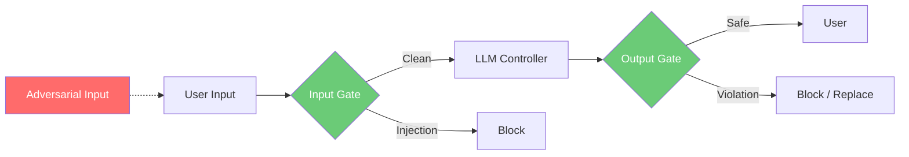
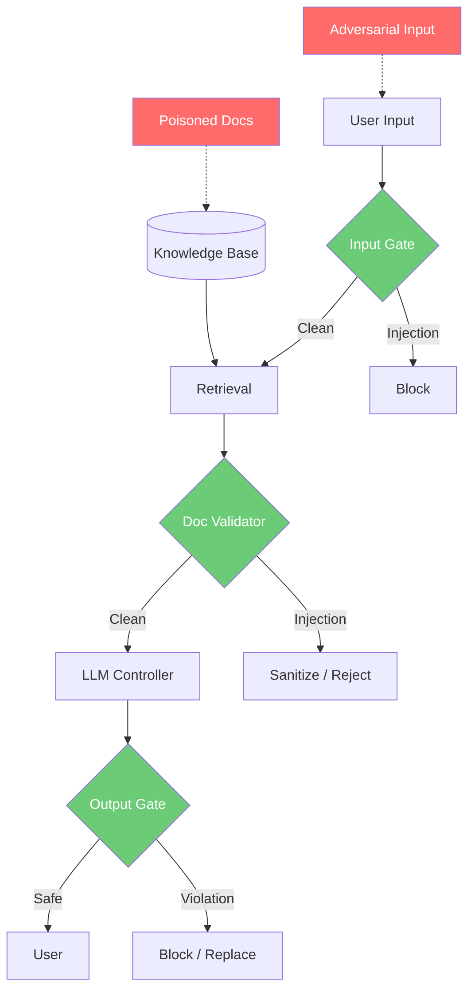
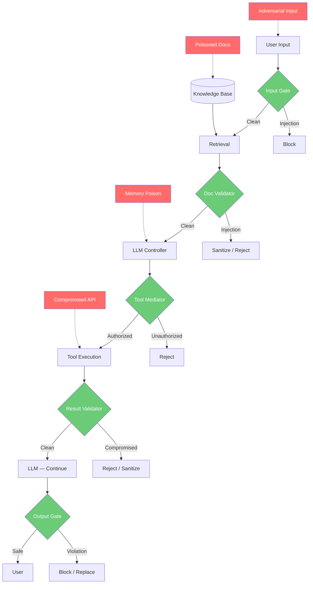

# Control-Loop Analysis: Chatbot, RAG, and Agent Systems

> **Version:** 1.0 | **Date:** 2025-03-01 | **Analyst:** Curriculum Team | **System Version:** Three AI System Architectures

---

## System Name and Description

**System Name:** AI System Architecture Comparison — Chatbot / RAG / Agent

**Description:**

This analysis decomposes three AI system architectures into their control-loop elements and compares their safety properties. Each system type is analyzed independently, then compared to demonstrate how increasing system complexity expands the attack surface and requires more elaborate supervisory controls.

1. **System A (Chatbot):** A conversational AI that accepts user input, processes it through an LLM with a system prompt, and returns generated text. No retrieval, no tools, no persistent memory.
2. **System B (RAG):** A retrieval-augmented generation system that extends the chatbot with a knowledge base retrieval pipeline. Retrieved documents are included in the LLM's context before generation.
3. **System C (Agent):** An autonomous agent that extends the RAG system with tool execution capabilities. The LLM can decide to call external tools (APIs, databases, code execution) and incorporate results into its reasoning.

**System Boundary:**
- **In scope:** LLM inference, input processing, retrieval pipeline, tool interfaces, output delivery, supervisory controls
- **Out of scope:** Infrastructure security, network security, authentication (covered in later phases)

---

## Objective Definition

The primary safety objective that the control loop must maintain, varying by system type:

> **Chatbot:** Ensure that AI-generated outputs comply with safety policies and never reveal internal instructions — with bounded error under adversarial disturbance via user input.

> **RAG:** Ensure that AI-generated outputs comply with safety policies, are grounded in verified retrieved content, and never follow instructions from untrusted documents — with bounded error under adversarial disturbance via user input OR retrieved content.

> **Agent:** Ensure that AI-generated outputs comply with safety policies, are grounded in verified content, only execute authorized tool calls, and never cause real-world harm — with bounded error under adversarial disturbance via any interface.

**Formal specification (Agent — most general):**

```
∀ input ∈ UserInput:
  ∀ docs ∈ RetrievedDocuments:
    ∀ tool_result ∈ ToolResults:
      ∀ memory ∈ SessionMemory:
        ∀ output ∈ SystemOutput(input, docs, tool_result, memory):
          |error(output, reference)| ≤ ε
        where error = max(
          deviation_from_safety_policy,
          deviation_from_factuality,
          deviation_from_authorization_policy
        )
        and ε = maximum tolerable safety deviation
```

**Objective decomposition:**

| Sub-objective | Description | Applies To | Priority |
|---|---|---|---|
| SO-01 | Output never contains system prompt content | All | CRITICAL |
| SO-02 | Output never contains harmful content | All | CRITICAL |
| SO-03 | Output is grounded in verified retrieved content | RAG, Agent | HIGH |
| SO-04 | Tool calls are authorized and parameters are valid | Agent | CRITICAL |
| SO-05 | Tool results are validated before use | Agent | HIGH |
| SO-06 | Memory/state is not contaminated across sessions | Agent | HIGH |
| SO-07 | System remains stable under sustained attack | All | CRITICAL |

---

## Controller Identification

### System A: Chatbot

| Controller ID | Name | Type | Location | Authority |
|---|---|---|---|---|
| CTRL-A1 | LLM + System Prompt | SOFTWARE | Inference service | CAN_GENERATE |
| CTRL-A2 | Input Validator (supervisory) | SOFTWARE | Input pipeline | CAN_BLOCK |
| CTRL-A3 | Output Classifier + Gate (supervisory) | SOFTWARE | Output pipeline | CAN_BLOCK, CAN_MODIFY |

### System B: RAG

| Controller ID | Name | Type | Location | Authority |
|---|---|---|---|---|
| CTRL-B1 | LLM + System Prompt + Retrieved Context | SOFTWARE | Inference service | CAN_GENERATE |
| CTRL-B2 | Input Validator (supervisory) | SOFTWARE | Input pipeline | CAN_BLOCK |
| CTRL-B3 | Document Validator (supervisory) | SOFTWARE | Retrieval pipeline | CAN_SANITIZ, CAN_REJECT |
| CTRL-B4 | Output Classifier + Gate (supervisory) | SOFTWARE | Output pipeline | CAN_BLOCK, CAN_MODIFY |
| CTRL-B5 | Behavioral Monitor (supervisory) | SOFTWARE | System level | CAN_ESCALATE, CAN_SHUTDOWN |

### System C: Agent

| Controller ID | Name | Type | Location | Authority |
|---|---|---|---|---|
| CTRL-C1 | LLM + System Prompt + Context + Tool Results | SOFTWARE | Inference service | CAN_GENERATE, CAN_REQUEST_TOOLS |
| CTRL-C2 | Input Validator (supervisory) | SOFTWARE | Input pipeline | CAN_BLOCK |
| CTRL-C3 | Document Validator (supervisory) | SOFTWARE | Retrieval pipeline | CAN_SANITIZ, CAN_REJECT |
| CTRL-C4 | Tool Mediator (supervisory) | SOFTWARE | Tool interface | CAN_REJECT, CAN_MODIFY_PARAMS |
| CTRL-C5 | Result Validator (supervisory) | SOFTWARE | Tool result pipeline | CAN_REJECT, CAN_SANITIZ |
| CTRL-C6 | Output Classifier + Gate (supervisory) | SOFTWARE | Output pipeline | CAN_BLOCK, CAN_MODIFY |
| CTRL-C7 | Behavioral Monitor (supervisory) | SOFTWARE | System level | CAN_ESCALATE, CAN_SHUTDOWN |
| CTRL-C8 | Memory Quarantine (supervisory) | SOFTWARE | Memory store | CAN_ISOLATE, CAN_RESET |

**Controller hierarchy (Agent — most complex):**

```
[Supervisory Controller — Behavioral Monitor]
    ├── [Input Validator]
    │       └── Blocks adversarial user inputs
    ├── [Document Validator]
    │       └── Sanitizes/rejects poisoned retrieved content
    ├── [Tool Mediator]
    │       └── Rejects unauthorized tool calls, validates parameters
    ├── [Result Validator]
    │       └── Rejects/sanitizes compromised tool results
    ├── [Output Classifier + Gate]
    │       └── Blocks unsafe outputs before reaching user
    ├── [Memory Quarantine]
    │       └── Isolates contaminated session state
    └── [Circuit Breaker / Kill Switch]
            └── System-level safety fallback
```

---

## Observations Enumeration

### System A: Chatbot

| Obs ID | Observation | Source | Type | Frequency | Latency |
|---|---|---|---|---|---|
| OBS-A1 | User message classification | Input validator | Synchronous | Per request | < 50ms |
| OBS-A2 | Output safety classification | Output classifier | Synchronous | Per request | < 100ms |
| OBS-A3 | Error signal (safety deviation) | Computed from A2 | Synchronous | Per request | < 110ms |

### System B: RAG

| Obs ID | Observation | Source | Type | Frequency | Latency |
|---|---|---|---|---|---|
| OBS-B1 | User message classification | Input validator | Synchronous | Per request | < 50ms |
| OBS-B2 | Retrieved document classification | Document validator | Synchronous | Per retrieval | < 200ms |
| OBS-B3 | Output safety classification | Output classifier | Synchronous | Per request | < 100ms |
| OBS-B4 | Error signal (safety + factuality) | Computed from B2, B3 | Synchronous | Per request | < 310ms |
| OBS-B5 | Aggregate violation rate | Control ledger | Asynchronous | Every 30s | < 1s |
| OBS-B6 | Retrieval anomaly score | Behavioral monitor | Asynchronous | Every 60s | < 2s |

### System C: Agent

| Obs ID | Observation | Source | Type | Frequency | Latency |
|---|---|---|---|---|---|
| OBS-C1 | User message classification | Input validator | Synchronous | Per request | < 50ms |
| OBS-C2 | Retrieved document classification | Document validator | Synchronous | Per retrieval | < 200ms |
| OBS-C3 | Tool call intent and parameters | Tool mediator | Synchronous | Per tool call | < 30ms |
| OBS-C4 | Tool result classification | Result validator | Synchronous | Per tool result | < 150ms |
| OBS-C5 | Output safety classification | Output classifier | Synchronous | Per request | < 100ms |
| OBS-C6 | Memory contamination indicators | Memory quarantine | Asynchronous | Per write | < 100ms |
| OBS-C7 | Error signal (safety + factuality + authorization) | Computed | Synchronous | Per action | < 380ms |
| OBS-C8 | Aggregate violation rate | Control ledger | Asynchronous | Every 30s | < 1s |
| OBS-C9 | Behavioral anomaly score | Behavioral monitor | Asynchronous | Every 60s | < 2s |

**Observation gaps:**

| Gap ID | What Cannot Be Observed | Applies To | Risk | Mitigation |
|---|---|---|---|---|
| GAP-01 | Internal model reasoning | All | Cannot detect malicious intent before action | Behavioral observation + action validation |
| GAP-02 | Multi-turn manipulation trajectory | All | Cannot predict progressive attacks | Aggregate behavioral monitoring |
| GAP-03 | Cross-session memory contamination | Agent | Cannot correlate across sessions | Memory quarantine + session isolation |
| GAP-04 | Tool side effects during execution | Agent | Cannot verify tool did only what was requested | Post-execution audit + sandboxing |
| GAP-05 | Document provenance and integrity | RAG, Agent | Cannot verify document source is legitimate | Provenance tracking + signed documents |

---

## Actions Enumeration

### System A: Chatbot

| Action ID | Action | Effect | Preconditions | Reversibility | Risk |
|---|---|---|---|---|---|
| ACT-A1 | Block input | Prevent adversarial input from reaching LLM | Input classified as injection | Reversible | False positive blocks |
| ACT-A2 | Block output | Prevent unsafe output from reaching user | Output classified as violation | Reversible | False positive blocks |
| ACT-A3 | Replace output | Substitute safe message for unsafe output | Output classified as violation | Reversible | Loss of useful content |

### System B: RAG

| Action ID | Action | Effect | Preconditions | Reversibility | Risk |
|---|---|---|---|---|---|
| ACT-B1 | Block input | Prevent adversarial input | Injection detected | Reversible | False positive |
| ACT-B2 | Sanitize document | Remove instruction-like content from retrieved docs | Document injection detected | Reversible | Loss of relevant content |
| ACT-B3 | Reject retrieval | Exclude document from context entirely | Document severely compromised | Reversible | Reduced answer quality |
| ACT-B4 | Block output | Prevent unsafe output | Output violation detected | Reversible | False positive |
| ACT-B5 | Activate circuit breaker | Halt processing | Violation rate exceeds threshold | Reversible | Service disruption |

### System C: Agent

| Action ID | Action | Effect | Preconditions | Reversibility | Risk |
|---|---|---|---|---|---|
| ACT-C1 | Block input | Prevent adversarial input | Injection detected | Reversible | False positive |
| ACT-C2 | Sanitize/reject document | Clean or exclude retrieved content | Document injection detected | Reversible | Reduced quality |
| ACT-C3 | Reject tool call | Cancel unauthorized tool invocation | Tool call fails validation | Reversible | Incomplete task |
| ACT-C4 | Modify tool parameters | Constrain dangerous parameters | Parameters out of bounds | Reversible | Altered behavior |
| ACT-C5 | Reject tool result | Discard compromised result | Result fails validation | Reversible | Incomplete information |
| ACT-C6 | Block output | Prevent unsafe output | Output violation detected | Reversible | False positive |
| ACT-C7 | Isolate memory | Quarantine contaminated session state | Memory contamination detected | Reversible | Session reset needed |
| ACT-C8 | Activate circuit breaker | Halt all processing | Aggregate threshold exceeded | Reversible | Service disruption |
| ACT-C9 | Kill switch | Shut down system | Critical safety condition | Reversible (manual) | Service outage |

---

## Environment Description

| Factor | Chatbot Impact | RAG Impact | Agent Impact |
|---|---|---|---|
| User population | Disturbance via direct input only | Same + indirect via documents | Same + tool result manipulation |
| Knowledge base integrity | N/A | Critical — poisoned docs are indirect injection vector | Critical — same + tool misuse |
| External API security | N/A | N/A | Critical — compromised APIs inject tool results |
| Operational tempo | Load affects output latency | Load affects retrieval + output | Load affects all stages + tool execution |
| Data sensitivity | Output text only | Output text + source documents | Output text + tool actions + data access |
| Regulatory context | Content policy compliance | + Data provenance compliance | + Action authorization + audit compliance |

---

## Feedback Paths

### System A: Chatbot

| Feedback ID | From | To | Signal | Delay | Reliability |
|---|---|---|---|---|---|
| FB-A1 | Output classifier | Request pipeline | Per-request error signal | ~150ms | HIGH |

**Stability:** STABLE — single feedback path, bounded consequences.

### System B: RAG

| Feedback ID | From | To | Signal | Delay | Reliability |
|---|---|---|---|---|---|
| FB-B1 | Output classifier | Request pipeline | Per-request error signal | ~350ms | HIGH |
| FB-B2 | Document validator | Retrieval pipeline | Per-retrieval quality signal | ~200ms | MEDIUM |
| FB-B3 | Control ledger | Behavioral monitor | Aggregate violation trend | ~30s | HIGH |

**Stability:** STABLE — multiple feedback paths, but document validation is harder than input validation (adversarial documents can be subtle).

### System C: Agent

| Feedback ID | From | To | Signal | Delay | Reliability |
|---|---|---|---|---|---|
| FB-C1 | Output classifier | Request pipeline | Per-request error signal | ~380ms | HIGH |
| FB-C2 | Document validator | Retrieval pipeline | Per-retrieval quality signal | ~200ms | MEDIUM |
| FB-C3 | Tool mediator | Tool pipeline | Per-tool-call authorization | ~30ms | HIGH |
| FB-C4 | Result validator | Context pipeline | Per-result validation | ~150ms | MEDIUM |
| FB-C5 | Memory quarantine | Session manager | Per-write contamination check | ~100ms | MEDIUM |
| FB-C6 | Control ledger | Behavioral monitor | Aggregate violation trend | ~30s | HIGH |
| FB-C7 | Behavioral monitor | Circuit breaker | Anomaly score | ~60s | HIGH |

**Stability:** STABLE with adequate controls, but UNSTABLE if any feedback path is missing — a single gap can cascade to real-world harm.

---

## Disturbance Sources

| Dist ID | Disturbance | Source | Chatbot | RAG | Agent |
|---|---|---|---|---|---|
| D-01 | Direct prompt injection | User input | YES | YES | YES |
| D-02 | Indirect injection via documents | Knowledge base | NO | YES | YES |
| D-03 | Tool result injection | Compromised API | NO | NO | YES |
| D-04 | Memory/state poisoning | Polluted session history | NO | NO | YES |
| D-05 | Tool parameter manipulation | Adversarial model reasoning | NO | NO | YES |
| D-06 | Multi-turn manipulation | User across turns | YES | YES | YES |
| D-07 | Context overflow | Long inputs | YES | YES | YES |
| D-08 | Encoding evasion | User or documents | YES | YES | YES |

---

## Unsafe States

| State ID | Unsafe State | Chatbot | RAG | Agent |
|---|---|---|---|---|
| US-01 | Model follows attacker instructions | YES (direct only) | YES (direct + indirect) | YES (all vectors) |
| US-02 | Unauthorized data access | NO | YES (via retrieval) | YES (via tools) |
| US-03 | Unauthorized action executed | NO | NO | YES (tool execution) |
| US-04 | Cross-session contamination | NO | NO | YES (memory poisoning) |
| US-05 | Privilege escalation | NO | NO | YES (tool chaining) |
| US-06 | Misinformation from poisoned source | NO | YES | YES |

---

## Supervisory Controls

| Sup ID | Supervisory Control | Monitors | Applies To | Override Capability |
|---|---|---|---|---|
| SUP-01 | Input validator | Input stream | All | Block input |
| SUP-02 | Document validator | Retrieved content | RAG, Agent | Sanitize/reject documents |
| SUP-03 | Tool mediator | Tool call stream | Agent | Reject/modify tool calls |
| SUP-04 | Result validator | Tool result stream | Agent | Reject/sanitize results |
| SUP-05 | Output gate | Output stream | All | Block/replace output |
| SUP-06 | Memory quarantine | Session state | Agent | Isolate/reset memory |
| SUP-07 | Behavioral monitor | Aggregate behavior | RAG, Agent | Circuit breaker, kill switch |
| SUP-08 | Control ledger | All control decisions | All | Audit only |

---

## Monitoring Points

| Monitor ID | Metric | Chatbot | RAG | Agent | Warning | Critical |
|---|---|---|---|---|---|---|
| MON-01 | Input rejection rate | YES | YES | YES | > 5% | > 15% |
| MON-02 | Document anomaly rate | NO | YES | YES | > 1% | > 5% |
| MON-03 | Tool call rejection rate | NO | NO | YES | > 2% | > 10% |
| MON-04 | Output violation rate | YES | YES | YES | > 1% | > 5% |
| MON-05 | Memory contamination events | NO | NO | YES | Any | > 3/session |
| MON-06 | Behavioral anomaly score | NO | YES | YES | > 0.5 | > 0.8 |
| MON-07 | Control latency | YES | YES | YES | > 500ms | > 2s |

---

## Recovery Procedures

### Procedure R-01: Chatbot Recovery

**Trigger:** Output violation rate exceeds critical threshold
**Time objective:** 5 minutes

| Step | Action | Responsible |
|---|---|---|
| 1 | Block further outputs with safety gate | Automated |
| 2 | Analyze violation pattern | Security team |
| 3 | Update input/output rules | Security team |
| 4 | Run security regression tests | Automated |
| 5 | Resume processing | Security team |

### Procedure R-02: RAG System Recovery

**Trigger:** Document anomaly rate exceeds critical threshold OR output violation rate exceeds critical threshold
**Time objective:** 15 minutes

| Step | Action | Responsible |
|---|---|---|
| 1 | Disable retrieval pipeline | Automated |
| 2 | Identify poisoned documents | Security team |
| 3 | Remove or sanitize poisoned documents | Security team + Data team |
| 4 | Run retrieval quality tests | Automated |
| 5 | Run security regression tests | Automated |
| 6 | Re-enable retrieval pipeline | Security team |

### Procedure R-03: Agent Recovery

**Trigger:** Tool call rejection rate exceeds critical threshold OR memory contamination detected OR behavioral anomaly exceeds threshold
**Time objective:** 30 minutes (may require manual intervention)

| Step | Action | Responsible |
|---|---|---|
| 1 | Activate circuit breaker — halt all processing | Automated |
| 2 | Identify which interface was compromised | Security team |
| 3 | Assess blast radius — did any unauthorized actions complete? | Security team + Ops team |
| 4 | Roll back unauthorized actions if possible | Ops team |
| 5 | Isolate contaminated memory — reset affected sessions | Automated |
| 6 | Update controls at compromised interface | Security team |
| 7 | Run full security regression tests | Automated |
| 8 | Generate assurance evidence | Automated |
| 9 | Manual review and approval to resume | Security lead |

---

## Control-Loop Diagrams

### System A: Chatbot



### System B: RAG System



### System C: Agent



---

## Analysis Summary

| Category | Chatbot | RAG System | Agent |
|---|---|---|---|
| Disturbance entry points | 1 | 2 | 4 |
| Supervisory controls needed | 2 (input + output) | 3 (+ doc validator) | 5+ (+ tool mediator + result validator + memory) |
| Feedback paths | 1 | 3 | 7 |
| Consequence of failure | Harmful text | Harmful text + misinformation | Real-world harm |
| Recovery complexity | Low | Medium | High |
| Overall safety rating | SAFE (with controls) | SAFE (with controls) | SAFE (with comprehensive controls) |
| Stability | STABLE | STABLE | STABLE (requires all feedback paths) |

---

*Control-Loop Analysis 03 | AI Security from Scratch | Phase 1 — Foundations*
