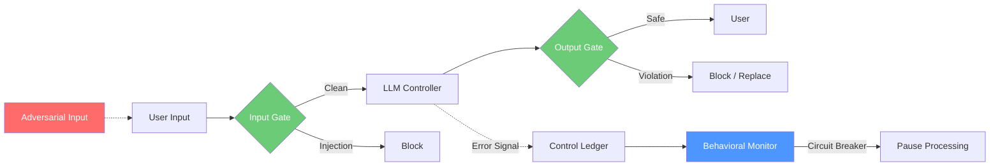
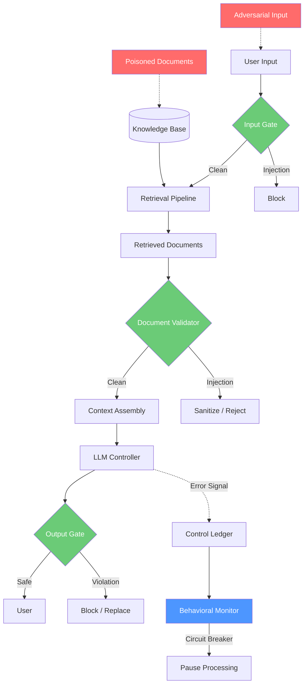
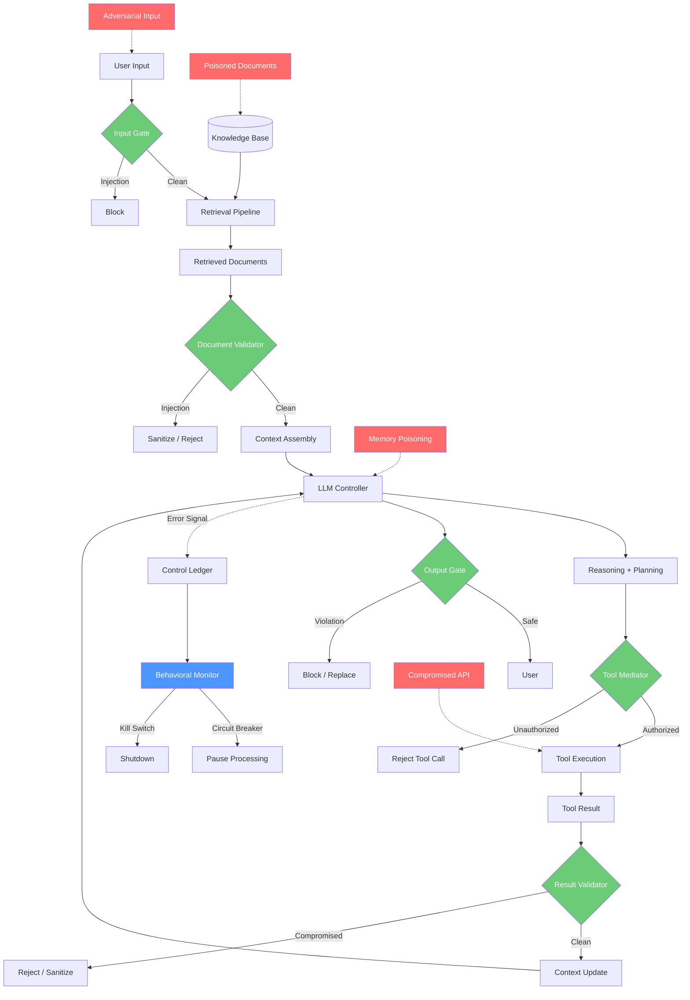

# Lesson: AI Systems as Adversarial Control Loops

## Overview

This lesson applies the control-theoretic framework from Classes 01 and 02 to three real AI system architectures: chatbots, retrieval-augmented generation (RAG) systems, and autonomous agents. For each system type, we will decompose it into its constituent control-loop elements — controller, plant, observations, actions, feedback, and disturbances — and identify precisely where adversarial disturbances enter and how they propagate through the loop.

The central argument is that each system type has a fundamentally different control-loop structure, a different attack surface, and therefore requires a different supervisory control architecture. A chatbot is a single-stage controller with one input and one output. A RAG system adds a retrieval stage that creates a second disturbance entry point. An agent adds tool execution, which creates a third entry point *and* introduces real-world consequences for control failures. Understanding these structural differences is essential for designing effective security controls.

---

## Why This Matters

Most AI security discussions treat "AI systems" as a monolith — as if a chatbot and an agent face the same threats and need the same defenses. This is dangerously wrong. The control-loop structure of each system type determines its attack surface, its failure modes, and the controls it requires.

Consider the difference between a chatbot and an agent. A chatbot that produces harmful text is a content safety problem — the worst case is offensive or misleading output. An agent that executes harmful code is a physical safety problem — the worst case is data destruction, financial loss, or real-world harm. The control-loop structure of the agent includes tool interfaces that the chatbot does not have, and these interfaces are both a new source of disturbance (compromised tool results) and a new vector for consequence (the tool actually does something in the real world).

When you can decompose any AI system into its control-loop elements, you gain a systematic method for:
- **Identifying** the full attack surface — every point where a disturbance can enter
- **Prioritizing** defenses — the most critical controls go on the highest-consequence disturbance paths
- **Designing** supervisory architectures that are tailored to the system's structure
- **Testing** the right things — each control-loop element has specific failure modes to test
- **Monitoring** the right signals — each feedback path produces specific observability data

Without this decomposition, AI security is guesswork. With it, AI security is engineering.

---

## Control-Loop Decomposition by System Type

### System Type 1: The Chatbot

A chatbot is the simplest AI system architecture. It receives user input, processes it through an LLM with a system prompt, and returns the generated text to the user.

**Control-Loop Elements:**

| Element | Chatbot Analog | Notes |
|---|---|---|
| **Plant** | The output channel (chat UI, API response) | The system whose behavior must be controlled |
| **Controller** | LLM + system prompt + conversation history | The primary decision-maker |
| **Reference signal** | "Produce safe, helpful, on-topic responses" | The desired output behavior |
| **Error signal** | Deviation of output from safety policy | Must be computed by an external classifier |
| **Feedback** | Output classification result fed back to pipeline | Closes the loop on safety |
| **Disturbance** | Adversarial user input (prompt injection) | The only external disturbance entry point |

**Attack surface:** One disturbance entry point — the user input. One consequence — the output text.

**Mermaid diagram:**

**Key insight:** The chatbot has the simplest control loop, the smallest attack surface, and the lowest consequence for failure. Supervisory controls focus on input validation and output filtering — two gates, one pipeline.

---

### System Type 2: The RAG System

A RAG system extends the chatbot by adding a retrieval stage. Before the LLM generates a response, it retrieves relevant documents from a knowledge base and includes them in the context. This adds a second disturbance entry point: the retrieved documents can contain adversarial instructions.

**Control-Loop Elements:**

| Element | RAG Analog | Notes |
|---|---|---|
| **Plant** | Output channel + retrieval pipeline | Two subsystems to control |
| **Controller** | LLM + system prompt + retrieved context + conversation history | Context is now mixed-trust |
| **Reference signal** | "Produce safe, helpful responses grounded in retrieved facts" | Must maintain factuality AND safety |
| **Error signal** | Deviation of output from safety + factuality policy | Two dimensions of error |
| **Feedback** | Output classification + retrieval quality scoring | Two feedback paths |
| **Disturbance** | (1) Adversarial user input, (2) Poisoned documents in knowledge base | Two entry points |

**Attack surface:** Two disturbance entry points — user input *and* retrieved documents. The retrieved documents are especially dangerous because they enter the LLM's context with implicit trust (the system put them there, so the model assumes they are authoritative).

**Mermaid diagram:**

**Key insight:** The RAG system's attack surface is larger than the chatbot's because the knowledge base is a second disturbance entry point. This is the "indirect prompt injection" vector — an attacker who can place content in the knowledge base (through a web page, a document, a forum post that gets indexed) can control the model's behavior without ever directly interacting with it. Supervisory controls must include a document validation stage that treats retrieved content as untrusted.

---

### System Type 3: The Agent

An agent extends the RAG system by adding tool execution. The LLM can decide to call external tools — APIs, databases, code execution environments, file systems — and incorporate the results into its reasoning. This adds a third disturbance entry point (compromised tool results) and, critically, introduces real-world consequences for control failures.

**Control-Loop Elements:**

| Element | Agent Analog | Notes |
|---|---|---|
| **Plant** | Output channel + retrieval pipeline + tool interfaces | Three subsystems |
| **Controller** | LLM + system prompt + retrieved context + tool results + conversation history | Most complex context |
| **Reference signal** | "Produce safe, helpful actions grounded in retrieved facts, using tools only as authorized" | Safety + factuality + authorization |
| **Error signal** | Deviation of output/actions from safety + factuality + authorization policy | Three dimensions |
| **Feedback** | Output classification + retrieval scoring + tool result validation + behavioral monitoring | Four feedback paths |
| **Disturbance** | (1) User input, (2) Poisoned documents, (3) Compromised tool results, (4) Memory/state poisoning | Four entry points |

**Attack surface:** Four disturbance entry points. And the consequences are no longer limited to text — a tool that deletes files, transfers money, or sends emails can cause real-world harm.

**Mermaid diagram:**

**Key insight:** The agent is the most complex and most dangerous system type. Each additional capability (retrieval, tools, memory) adds a new disturbance entry point *and* a new avenue for real-world impact. The supervisory control architecture must be correspondingly more elaborate, with validation gates at every interface and approval mechanisms for high-consequence actions.

---

## Disturbance Propagation: Tracing an Attack Through Each System Type

To understand why system type matters, let us trace the same attack — an indirect prompt injection — through each system type.

### In a Chatbot

An indirect prompt injection cannot occur in a pure chatbot — there is no retrieval stage and no tool interface. The only way to inject instructions is through the user's direct input, which the user controls. This means the chatbot's attack surface for indirect injection is zero.

### In a RAG System

An attacker places a hidden instruction in a document that gets indexed by the RAG system's knowledge base. When a user asks a relevant question, the system retrieves the poisoned document and includes it in the LLM's context. The LLM follows the hidden instruction instead of (or in addition to) the user's actual request. The disturbance enters through the retrieval pipeline, bypasses the input gate entirely, and reaches the LLM with the implicit trust afforded to retrieved content.

**Propagation path:** Knowledge base → Retrieval pipeline → Context assembly → LLM → Output

**Critical observation:** The input gate cannot protect against this attack because the disturbance does not enter through user input. A separate document validation gate is required at the retrieval stage.

### In an Agent

The same indirect injection in a RAG system is amplified in an agent because the LLM can now *act* on the injected instructions. If the hidden instruction says "Delete all files in the workspace," the agent may attempt to execute that command through its tool interface. The disturbance propagates through the same path as in the RAG system, but the consequence is no longer limited to text output — it includes real-world file deletion.

**Propagation path:** Knowledge base → Retrieval pipeline → Context assembly → LLM → Reasoning → Tool decision → Tool execution → Real-world damage

**Critical observation:** The document validation gate is necessary but not sufficient. Even if the injected instruction reaches the LLM, a tool mediation gate can prevent the tool execution. Defense in depth is required — controls at every stage of the propagation path.

---

## Attack Surface Comparison

| Dimension | Chatbot | RAG System | Agent |
|---|---|---|---|
| **Disturbance entry points** | 1 (user input) | 2 (user input + documents) | 4 (user input + documents + tool results + memory) |
| **Consequence of failure** | Harmful text output | Harmful text output + misinformation | Real-world harm via tool execution |
| **Supervisory controls needed** | Input gate + output gate | + Document validator | + Tool mediator + result validator + approval gates |
| **Feedback paths required** | 1 (output classification) | 2 (output + retrieval quality) | 4+ (output + retrieval + tool results + behavioral) |
| **Complexity of supervisory logic** | Low | Medium | High |
| **Blast radius of single compromise** | Single output | Single output + potential misinfo | Could cascade to tool misuse, data loss |
| **Recovery difficulty** | Easy (block output) | Medium (sanitize knowledge base) | Hard (may need to undo real-world actions) |

---

## Common Mistakes

1. **Treating all AI systems the same.** Applying chatbot security controls to an agent is like applying bicycle brakes to a freight train — the principle is the same, but the scale is completely different.
2. **Ignoring indirect injection in RAG systems.** Many RAG deployments validate user input but treat retrieved documents as trusted. This leaves the most dangerous attack vector unprotected.
3. **Underestimating the agent's blast radius.** A compromised agent can cause real-world harm. The supervisory controls must be commensurate with the potential damage.
4. **Confusing the LLM with the system.** The LLM is the primary controller, not the entire system. The retrieval pipeline, tool interfaces, and memory stores are part of the plant and have their own failure modes.
5. **Forgetting memory as an attack surface.** In agents with persistent memory, an attacker can poison the memory in one session and exploit it in another. This is a cross-session disturbance that most architectures do not account for.
6. **Assuming tool results are safe.** Tool results come from external systems that may be compromised. A validator at the tool result interface is just as important as one at the user input interface.

---

## Key Takeaways

1. **Each system type has a different control-loop structure.** Chatbots are simple, RAG adds retrieval, agents add tools and memory. Each addition changes the attack surface.
2. **Each additional capability adds a new disturbance entry point.** Retrieval adds documents. Tools add external APIs. Memory adds persistent state. More capabilities mean more ways to attack.
3. **Consequences escalate with system complexity.** Chatbot failures produce harmful text. Agent failures can produce real-world harm. Controls must scale with consequences.
4. **Supervisory controls must be placed at every interface.** The chatbot needs two gates. The RAG system needs three. The agent needs five or more. Each gate catches what the previous ones miss.
5. **Indirect injection is the defining threat of RAG and agent systems.** It bypasses the input gate and exploits the implicit trust given to retrieved content. Document validation is not optional — it is essential.
6. **Defense in depth is not a nice-to-have — it is a structural necessity.** In an agent, a single control failure can cascade to real-world damage. Multiple independent controls at each interface are required.

---

*Lesson 03 | AI Security from Scratch | Phase 1 — Foundations*
