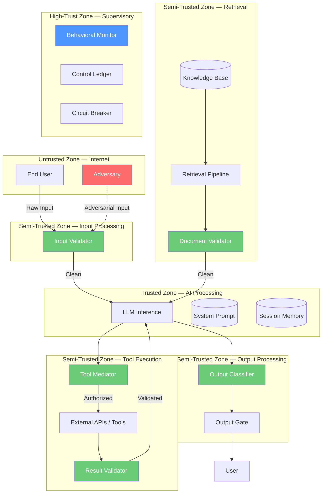

# Threat Model: Chatbot, RAG, and Agent Systems

> **Version:** 1.0 | **Date:** 2025-03-01 | **Author:** Curriculum Team | **Classification:** PUBLIC

---

## System Description

This threat model analyzes three AI system architectures — chatbot, RAG, and agent — from a control-theoretic perspective. Each system type is analyzed independently, then compared to demonstrate how increasing system complexity expands the threat landscape and necessitates more elaborate supervisory controls.

**System Purposes:**
- **Chatbot:** Provide conversational AI assistance with guaranteed content safety
- **RAG System:** Provide grounded, fact-based AI assistance with retrieval from a knowledge base
- **Agent:** Provide autonomous AI assistance with tool execution capabilities

**Key Components (by system type):**

| Component | Chatbot | RAG | Agent |
|---|---|---|---|
| LLM inference service | ✓ | ✓ | ✓ |
| System prompt | ✓ | ✓ | ✓ |
| Conversation history | ✓ | ✓ | ✓ |
| Input validation | ✓ | ✓ | ✓ |
| Output classification | ✓ | ✓ | ✓ |
| Knowledge base | — | ✓ | ✓ |
| Retrieval pipeline | — | ✓ | ✓ |
| Document validator | — | ✓ | ✓ |
| Tool interfaces | — | — | ✓ |
| Tool mediator | — | — | ✓ |
| Result validator | — | — | ✓ |
| Memory/state store | — | — | ✓ |
| Memory quarantine | — | — | ✓ |
| Behavioral monitor | — | ✓ | ✓ |
| Circuit breaker | — | ✓ | ✓ |

**Deployment Model:** Cloud-hosted API for all three systems

**Users/Stakeholders:**
- End users submitting natural-language queries
- Adversaries attempting to manipulate the system through any available interface
- Security team monitoring and maintaining controls
- Data team managing knowledge base content (RAG, Agent)
- Operations team managing tool integrations (Agent)

---

## Control-Loop Decomposition

| Loop ID | Objective | Controller | System Type |
|---|---|---|---|
| CL-01 | No harmful output | Output classifier | All |
| CL-02 | No injection success via user input | Input validator | All |
| CL-03 | No injection success via documents | Document validator | RAG, Agent |
| CL-04 | No unauthorized tool execution | Tool mediator | Agent |
| CL-05 | No compromised tool results | Result validator | Agent |
| CL-06 | No memory contamination | Memory quarantine | Agent |
| CL-07 | System stability under attack | Behavioral monitor | RAG, Agent |

---

## Asset Inventory

| Asset ID | Asset Name | Type | Classification | System Type | Location |
|---|---|---|---|---|---|
| A-01 | System prompt | DATA | CONFIDENTIAL | All | API service config |
| A-02 | LLM model weights | MODEL | CONFIDENTIAL | All | Model registry |
| A-03 | Input validation rules | DATA | CONFIDENTIAL | All | Input validator config |
| A-04 | Output classification model | MODEL | INTERNAL | All | Classification service |
| A-05 | Knowledge base documents | DATA | INTERNAL | RAG, Agent | Vector store / doc store |
| A-06 | Document validation model | MODEL | INTERNAL | RAG, Agent | Document validator |
| A-07 | Tool access policies | DATA | CONFIDENTIAL | Agent | Tool mediator config |
| A-08 | Tool API credentials | DATA | RESTRICTED | Agent | Secret manager |
| A-09 | User conversation data | DATA | RESTRICTED | All | Session store |
| A-10 | Memory/state store | DATA | RESTRICTED | Agent | State database |
| A-11 | Control ledger / audit log | DATA | RESTRICTED | All | Log store |
| A-12 | Behavioral monitor models | MODEL | INTERNAL | RAG, Agent | Monitor service |

---

## Trust Boundaries

### Trust Boundary Diagram — Agent (Most Complex)

### Trust Boundary Descriptions

| Boundary | Zones Separated | Crossing Mechanism | Applies To |
|---|---|---|---|
| TB-01 | Internet → Input Processing | Input validation + classification | All |
| TB-02 | Input Processing → AI Processing | Validated input only | All |
| TB-03 | Knowledge Base → AI Processing | Document validation + sanitization | RAG, Agent |
| TB-04 | AI Processing → Tool Execution | Tool mediation + authorization | Agent |
| TB-05 | Tool Execution → AI Processing | Result validation + sanitization | Agent |
| TB-06 | AI Processing → Output Processing | Output classification | All |
| TB-07 | Output Processing → User | Output gate (safe content only) | All |
| TB-08 | Memory → AI Processing | Memory quarantine + validation | Agent |
| TB-09 | All zones → Supervisory | Telemetry and audit | All |

---

## Threat Identification

### Chatbot Threats

| Threat ID | Component | Attack Vector | Impact | Likelihood | Risk |
|---|---|---|---|---|---|
| T-C01 | LLM | Direct prompt injection | Controller compromise | H | Critical |
| T-C02 | System prompt | Prompt extraction | IP exposure | H | High |
| T-C03 | LLM | Multi-turn manipulation | Gradual safety erosion | M | High |
| T-C04 | Output classifier | Encoding evasion | Bypass output filter | M | Medium |
| T-C05 | LLM | Context overflow | Drown system prompt | M | Medium |

### RAG-Specific Threats (in addition to chatbot threats)

| Threat ID | Component | Attack Vector | Impact | Likelihood | Risk |
|---|---|---|---|---|---|
| T-R01 | Knowledge base | Indirect prompt injection via documents | Controller compromise via retrieval | H | Critical |
| T-R02 | Retrieval pipeline | Ranking manipulation | Retrieve attacker's document first | M | High |
| T-R03 | Document validator | Subtle instruction encoding in documents | Bypass document validation | M | High |
| T-R04 | Knowledge base | Data poisoning over time | Gradual degradation of answer quality | L | Medium |
| T-R05 | Retrieval pipeline | Irrelevant document injection | Context pollution, reduced answer quality | M | Medium |

### Agent-Specific Threats (in addition to chatbot + RAG threats)

| Threat ID | Component | Attack Vector | Impact | Likelihood | Risk |
|---|---|---|---|---|---|
| T-A01 | Tool interface | Unauthorized tool execution via injection | Real-world harm (data loss, financial damage) | H | Critical |
| T-A02 | Tool parameters | Parameter manipulation via adversarial reasoning | Tool executes with dangerous parameters | M | Critical |
| T-A03 | External APIs | Compromised tool results (injection via API response) | Controller compromise via tool results | M | High |
| T-A04 | Memory/state | Memory poisoning across sessions | Persistent compromise, cross-session attacks | M | High |
| T-A05 | Tool interface | Privilege escalation via tool chaining | Expanded attack surface | L | High |
| T-A06 | Tool interface | Denial of service via infinite tool loops | System resource exhaustion | M | Medium |

---

## Unsafe States Enumeration

| State ID | Unsafe State | Chatbot | RAG | Agent | Consequence |
|---|---|---|---|---|---|
| US-01 | Model follows attacker instructions | YES | YES | YES | Arbitrary behavior |
| US-02 | System prompt leaked | YES | YES | YES | Attack facilitation |
| US-03 | Misinformation from poisoned source | NO | YES | YES | Incorrect decisions |
| US-04 | Unauthorized data access | NO | YES | YES | Information disclosure |
| US-05 | Unauthorized action executed | NO | NO | YES | Real-world harm |
| US-06 | Cross-session contamination | NO | NO | YES | Persistent compromise |
| US-07 | Privilege escalation | NO | NO | YES | Expanded attack surface |
| US-08 | Control saturation | YES | YES | YES | Effective open-loop operation |

---

## Existing Controls

### Chatbot Controls

| Control ID | Threat(s) Mitigated | Type | Effectiveness |
|---|---|---|---|
| CC-01 | T-C01, T-C02 | Preventive | Input validation — HIGH |
| CC-02 | T-C01, T-C02, T-C04 | Detective + Corrective | Output classification — MEDIUM |
| CC-03 | T-C05 | Preventive | Input length limiting — HIGH |

### RAG Controls (in addition to chatbot controls)

| Control ID | Threat(s) Mitigated | Type | Effectiveness |
|---|---|---|---|
| RC-01 | T-R01, T-R03 | Preventive | Document validation — MEDIUM (evasion possible) |
| RC-02 | T-R02 | Detective | Retrieval quality scoring — MEDIUM |
| RC-03 | T-R01 | Preventive | Context separation (mark documents as untrusted) — HIGH |
| RC-04 | T-R04 | Detective | Knowledge base audit trail — LOW (manual review) |

### Agent Controls (in addition to chatbot + RAG controls)

| Control ID | Threat(s) Mitigated | Type | Effectiveness |
|---|---|---|---|
| AC-01 | T-A01 | Preventive | Tool mediation + authorization — HIGH |
| AC-02 | T-A02 | Preventive | Parameter validation + bounds checking — HIGH |
| AC-03 | T-A03 | Detective + Preventive | Result validation — MEDIUM |
| AC-04 | T-A04 | Preventive | Memory quarantine + session isolation — MEDIUM |
| AC-05 | T-A05 | Preventive | Tool access policies (no chaining) — HIGH |
| AC-06 | T-A06 | Preventive | Tool loop detection + call limits — HIGH |

---

## Residual Risks

| Residual Risk ID | Original Threat | Applies To | Why Not Fully Mitigated | Monitoring |
|---|---|---|---|---|
| RR-01 | T-C04, T-R03 | All | Evasion of classifiers by novel encoding techniques | Classifier evasion rate |
| RR-02 | T-R01 | RAG, Agent | Subtle indirect injection may evade document validator | Document anomaly trends |
| RR-03 | T-A03 | Agent | Compromised API results may be indistinguishable from legitimate | Tool result anomaly rate |
| RR-04 | T-A04 | Agent | Cross-session attacks are inherently difficult to detect | Cross-session correlation metrics |
| RR-05 | T-A05 | Agent | Novel tool chaining strategies may not be in policy | Tool call sequence analysis |

---

## Recommendations

| Priority | Recommendation | Applies To | Threats Addressed | Effort |
|---|---|---|---|---|
| P1 | Deploy document validation with context separation for all RAG and agent systems | RAG, Agent | T-R01, T-R03 | 2-3 weeks |
| P1 | Deploy tool mediation with authorization for all agent systems | Agent | T-A01, T-A02, T-A05 | 2-3 weeks |
| P2 | Implement memory quarantine and session isolation | Agent | T-A04 | 1-2 weeks |
| P2 | Add result validation at tool interface | Agent | T-A03 | 1-2 weeks |
| P2 | Implement behavioral monitoring across all system types | All | T-C03, multi-turn attacks | 2-3 weeks |
| P3 | Add knowledge base provenance tracking | RAG, Agent | T-R04, T-R05 | 2-3 weeks |
| P3 | Implement adaptive thresholds for anomaly detection | All | Sub-threshold attacks | 1-2 weeks |
| P4 | Add cross-session attack correlation | Agent | T-A04 | 3-4 weeks |

---

## Review History

| Date | Reviewer | Changes | Approved |
|---|---|---|---|
| 2025-03-01 | Curriculum Team | Initial threat model for Class 03 | YES |

---

*Threat Model 03 | AI Security from Scratch | Phase 1 — Foundations*
