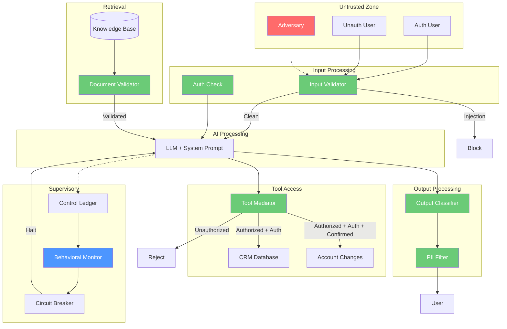

# Control-Loop Analysis: Threat Modeling Process as a Control System

> **Version:** 1.0 | **Date:** 2025-03-01 | **Analyst:** Curriculum Team | **System Version:** Customer Support Chatbot — Threat Modeled

---

## System Name and Description

**System Name:** Customer Support Chatbot — Threat Model Control-Loop Analysis

**Description:**

This analysis applies the control-loop framework to the threat modeling process itself, treating threat identification and mitigation as a control system that must converge to a state of comprehensive threat coverage. The system being threat-modeled is a customer support chatbot for a financial services company, but the control-loop analysis focuses on the threat modeling *process* — how we ensure that threats are identified, classified, mitigated, and monitored.

**System Purpose:** Provide accurate, safe customer support for financial services — answering account questions, looking up customer information, and initiating account changes — while maintaining security under adversarial conditions.

**System Boundary:**
- **In scope:** LLM inference, input processing, retrieval from knowledge base, CRM database access, account change API, output delivery, supervisory controls
- **Out of scope:** Infrastructure security, network security, authentication system (assumed provided by identity platform)

---

## Objective Definition

The primary safety objective that the control loop must maintain:

> **Objective:** Ensure that all identified threats to the customer support chatbot are cataloged, classified using STRIDE-AI, mapped to controls or accepted residual risks, and monitored — with zero critical threats lacking mitigation.

**Formal specification:**

```
∀ threat ∈ ThreatUniverse:
  ∀ boundary ∈ TrustBoundaries:
    threat ∈ ThreatCatalog  ∨
    threat ∈ AcceptedResidualRisk
  where ThreatUniverse = all threats applicable to this system
  and ThreatCatalog = threats identified and addressed
```

**Objective decomposition:**

| Sub-objective | Description | Priority |
|---|---|---|
| SO-01 | All trust boundaries identified and documented | CRITICAL |
| SO-02 | All STRIDE-AI categories assessed at each boundary | CRITICAL |
| SO-03 | Attack trees constructed for high-risk threats | HIGH |
| SO-04 | Every threat has a control or accepted residual risk | CRITICAL |
| SO-05 | Threat model reflects current system architecture | HIGH |
| SO-06 | Monitoring in place for residual risks | HIGH |

---

## Controller Identification

| Controller ID | Name | Type | Location | Authority |
|---|---|---|---|---|
| CTRL-01 | Threat Modeling Process | PROCESS | Security team | CAN_IDENTIFY, CAN_CLASSIFY, CAN_RECOMMEND |
| CTRL-02 | Architecture Review Board | PROCESS | Organization | CAN_APPROVE, CAN_REQUIRE_CONTROLS |
| CTRL-03 | Input Validator | SOFTWARE | Input pipeline | CAN_BLOCK |
| CTRL-04 | Document Validator | SOFTWARE | Retrieval pipeline | CAN_SANITIZ, CAN_REJECT |
| CTRL-05 | CRM Access Control | SOFTWARE | CRM interface | CAN_ENFORCE_PERIMETERS, CAN_LOG |
| CTRL-06 | Tool Mediator | SOFTWARE | Account change interface | CAN_REJECT, CAN_REQUIRE_CONFIRMATION |
| CTRL-07 | Output Classifier | SOFTWARE | Output pipeline | CAN_BLOCK, CAN_MODIFY |
| CTRL-08 | Behavioral Monitor | SOFTWARE | System level | CAN_ESCALATE, CAN_SHUTDOWN |

**Controller hierarchy:**

```
[Architecture Review Board — Governance]
    └── [Threat Modeling Process — Analysis]
            ├── [Input Validator — Preventive]
            ├── [Document Validator — Preventive]
            ├── [CRM Access Control — Preventive]
            ├── [Tool Mediator — Preventive + Corrective]
            ├── [Output Classifier — Detective + Corrective]
            └── [Behavioral Monitor — Detective + Corrective]
```

---

## Observations Enumeration

### System Observations (Chatbot)

| Obs ID | Observation | Source | Type | Frequency | Latency |
|---|---|---|---|---|---|
| OBS-01 | Input classification result | Input validator | Synchronous | Per request | < 50ms |
| OBS-02 | Retrieved document classification | Document validator | Synchronous | Per retrieval | < 200ms |
| OBS-03 | CRM query authorization result | CRM access control | Synchronous | Per query | < 30ms |
| OBS-04 | Tool call authorization result | Tool mediator | Synchronous | Per tool call | < 30ms |
| OBS-05 | Output safety classification | Output classifier | Synchronous | Per request | < 100ms |
| OBS-06 | User authentication status | Identity service | Synchronous | Per request | < 20ms |
| OBS-07 | Aggregate violation rate | Control ledger | Asynchronous | Every 30s | < 1s |
| OBS-08 | Behavioral anomaly score | Behavioral monitor | Asynchronous | Every 60s | < 2s |

### Process Observations (Threat Model)

| Obs ID | Observation | Source | Type | Frequency |
|---|---|---|---|---|
| OBS-P01 | Threat catalog completeness | Threat model review | Manual | Per review cycle |
| OBS-P02 | Control coverage ratio | Control mapping analysis | Manual | Per review cycle |
| OBS-P03 | Attack tree depth | Attack tree review | Manual | Per review cycle |
| OBS-P04 | Trust boundary accuracy | Architecture review | Manual | Per design change |
| OBS-P05 | Residual risk acceptances | Risk register | Manual | Per threat |

**Observation gaps:**

| Gap ID | What Cannot Be Observed | Risk | Mitigation |
|---|---|---|---|
| GAP-01 | Unknown unknowns — threats not yet in any catalog | Unmitigated threats | Threat intelligence + peer review |
| GAP-02 | Attacker's actual intent and capability | Cannot predict attack sophistication | Assume high capability |
| GAP-03 | Future attack techniques | Cannot model what hasn't been invented | Regular model updates |
| GAP-04 | Cross-system attack paths | Chatbot may be vector into other systems | Enterprise threat model |
| GAP-05 | Insider threats with legitimate access | Cannot distinguish malicious from normal | Behavioral analysis |

---

## Actions Enumeration

### System Actions (Chatbot Controls)

| Action ID | Action | Effect | Preconditions | Reversibility | Risk |
|---|---|---|---|---|---|
| ACT-01 | Block input | Prevent adversarial input from reaching LLM | Input classified as injection | Reversible | False positive |
| ACT-02 | Sanitize/reject document | Remove injection content from retrieval | Document injection detected | Reversible | Lost content |
| ACT-03 | Block CRM query | Prevent unauthorized database access | User not authorized for requested data | Reversible | User cannot get own data (FP) |
| ACT-04 | Reject tool call | Cancel unauthorized account change | Call fails authorization | Reversible | Incomplete task |
| ACT-05 | Require confirmation | Force user to confirm before action | High-impact tool call | Reversible | Extra user step |
| ACT-06 | Block output | Prevent unsafe output from reaching user | Output classified as violation | Reversible | False positive |
| ACT-07 | Redact PII | Remove personal information from output | PII detected in output | Reversible | Loss of context |
| ACT-08 | Activate circuit breaker | Halt processing temporarily | Violation rate > threshold | Reversible | Service disruption |

### Process Actions (Threat Model Maintenance)

| Action ID | Action | Effect | Preconditions | Reversibility |
|---|---|---|---|---|
| ACT-P01 | Add threat to catalog | Ensure threat is tracked | Threat identified | Irreversible |
| ACT-P02 | Map control to threat | Ensure threat has mitigation | Control available | Reversible |
| ACT-P03 | Accept residual risk | Document accepted unmitigated risk | Risk below acceptance threshold | Reversible |
| ACT-P04 | Update attack tree | Document new attack path | New path discovered | Reversible |
| ACT-P05 | Trigger control implementation | Build new control | Threat lacks adequate mitigation | Irreversible |

---

## Environment Description

| Factor | Description | Impact on Control Loop |
|---|---|---|
| User population | Authenticated customers + unauthenticated visitors | Two trust levels require different control policies |
| Data sensitivity | Financial PII (account numbers, balances, SSNs) | High sensitivity requires tight controls and monitoring |
| Regulatory context | Financial regulations (GLBA, PCI-DSS) | Compliance requires auditable controls and data protection |
| Knowledge base | Product docs + policy docs + some user-generated content | Mixed provenance creates indirect injection risk |
| Tool integration | CRM (read) + account changes (write) | Write access has higher consequence than read |
| Attack motivation | Financial gain, data theft, service disruption | High motivation → sophisticated attacks likely |
| Operational hours | 24/7 availability required | Circuit breaker must not cause extended outages |

---

## Feedback Paths

| Feedback ID | From | To | Signal | Delay | Reliability |
|---|---|---|---|---|---|
| FB-01 | Output classifier | Request pipeline | Per-request error signal | ~150ms | HIGH |
| FB-02 | Document validator | Retrieval pipeline | Per-retrieval quality signal | ~200ms | MEDIUM |
| FB-03 | CRM access control | CRM query pipeline | Per-query authorization | ~30ms | HIGH |
| FB-04 | Tool mediator | Tool pipeline | Per-call authorization | ~30ms | HIGH |
| FB-05 | Control ledger | Behavioral monitor | Aggregate violation trend | ~30s | HIGH |
| FB-06 | Security incidents | Threat model | Missed threat indicator | Days to weeks | MEDIUM |
| FB-07 | Threat model updates | Control implementation | New control requirements | Weeks | MEDIUM |

**Feedback loop dynamics:**
- **System-level:** Fast feedback (milliseconds to seconds) for real-time control decisions
- **Process-level:** Slow feedback (days to weeks) for threat model updates based on incidents and new intelligence
- **Key risk:** The process-level feedback loop is slow. A novel attack technique may exploit the system for weeks before the threat model is updated.

---

## Disturbance Sources

| Dist ID | Disturbance | Source | System Impact | Process Impact |
|---|---|---|---|---|
| D-01 | Direct prompt injection | Untrusted user input | Controller compromise | Must be in threat catalog |
| D-02 | Indirect injection via KB | Poisoned documents | Controller compromise via retrieval | Must be in threat catalog |
| D-03 | CRM data exposure | Model returns PII | Data breach | Must be in threat catalog |
| D-04 | Unauthorized account change | Injection → tool call | Real-world financial harm | Must be in threat catalog |
| D-05 | Unauth user accessing auth features | Auth bypass | Unauthorized data access | Must be in threat catalog |
| D-06 | Novel attack technique | Evolving threat landscape | Control bypass | Gap in threat catalog |
| D-07 | Architecture change | Feature development | New trust boundaries | Threat model becomes stale |
| D-08 | Control drift | Operational changes | Controls degrade | Controls map to wrong threat |

---

## Unsafe States

| State ID | Unsafe State | Condition | Consequence |
|---|---|---|---|
| US-01 | Model follows attacker instructions | Successful injection (direct or indirect) | Arbitrary behavior |
| US-02 | PII exposure to unauthorized party | CRM data returned without access check | Data breach, regulatory violation |
| US-03 | Unauthorized account change | Injection causes tool call without authorization | Financial harm to customer |
| US-04 | Cross-user data access | Model queries wrong user's data | Data breach |
| US-05 | Threat model gap | Threat not in catalog | Unmitigated risk |
| US-06 | Stale threat model | Architecture changed, model not updated | False security confidence |
| US-07 | Control not implemented | Threat identified, control designed but not deployed | Known unmitigated risk |

---

## Supervisory Controls

| Sup ID | Supervisory Control | Monitors | Override Capability | Applies To |
|---|---|---|---|---|
| SUP-01 | Input validator | Input stream | Block input | System |
| SUP-02 | Document validator | Retrieved content | Sanitize/reject documents | System |
| SUP-03 | CRM access control | CRM queries | Block unauthorized queries | System |
| SUP-04 | Tool mediator | Tool calls | Reject/require confirmation | System |
| SUP-05 | Output classifier | Output stream | Block/redact output | System |
| SUP-06 | Behavioral monitor | Aggregate behavior | Circuit breaker, kill switch | System |
| SUP-07 | Threat model review | Threat catalog | Require new controls | Process |
| SUP-08 | Architecture review board | Design changes | Block deployment without security review | Process |

---

## Monitoring Points

| Monitor ID | Metric | Collection Method | Warning | Critical | Alert Channel |
|---|---|---|---|---|---|
| MON-01 | Input rejection rate | Input validator | > 5% | > 15% | Security team |
| MON-02 | Document anomaly rate | Document validator | > 1% | > 5% | Data team |
| MON-03 | CRM query rejection rate | CRM access control | > 2% | > 10% | Security team |
| MON-04 | Tool call rejection rate | Tool mediator | > 2% | > 10% | Security team |
| MON-05 | PII detection in output | Output classifier | > 0.5% | > 2% | Security team + compliance |
| MON-06 | Output violation rate | Output classifier | > 1% | > 5% | Circuit breaker |
| MON-07 | Threat catalog completeness | Manual review | < 95% | < 80% | Architecture review |
| MON-08 | Threat model age | Manual review | > 90 days | > 180 days | Mandatory review |

---

## Recovery Procedures

### Procedure R-01: Chatbot Security Incident

**Trigger:** Any STRIDE-AI threat materializes despite controls
**Severity:** Varies by threat
**Time objective:** 15 minutes to 2 hours depending on severity

| Step | Action | Responsible |
|---|---|---|
| 1 | Identify which threat materialized and which control failed | Security team |
| 2 | Contain: activate circuit breaker if ongoing | Automated / Security team |
| 3 | Assess impact: what data was exposed, what actions were taken | Security team + Data team |
| 4 | Notify affected customers if PII was exposed (regulatory requirement) | Compliance team |
| 5 | Update threat model with new information | Security team |
| 6 | Implement additional controls if needed | Security team + Engineering |
| 7 | Run security regression tests | Automated |
| 8 | Post-incident review | Security team |

### Procedure R-02: Threat Model Gap Discovery

**Trigger:** New threat identified that was not in the catalog
**Time objective:** 48 hours for assessment, 2 weeks for control implementation

| Step | Action | Responsible |
|---|---|---|
| 1 | Add threat to catalog with STRIDE-AI classification | Security team |
| 2 | Assess whether existing controls partially mitigate | Security team |
| 3 | Design additional controls if needed | Security team + Engineering |
| 4 | Build attack tree for the new threat | Security team |
| 5 | Implement controls | Engineering |
| 6 | Run security regression tests | Automated |
| 7 | Update monitoring and alerting | Security team |

---

## Control-Loop Diagram — Customer Support Chatbot



---

## Analysis Summary

| Category | Status | Notes |
|---|---|---|
| Trust boundaries identified | 8 | User, input, retrieval, processing, CRM, account, output, supervisory |
| STRIDE-AI threats cataloged | 11 | All categories covered |
| Attack trees constructed | 2 | System prompt extraction + unauthorized account change |
| Threats with controls | 11/11 | All threats have at least one control |
| Residual risks accepted | 3 | Novel encoding, novel extraction, obfuscated PII |
| Monitoring in place | 8 metrics | System + process level |
| Recovery procedures | 2 | Incident response + threat model gap |

---

*Control-Loop Analysis 04 | AI Security from Scratch | Phase 1 — Foundations*
