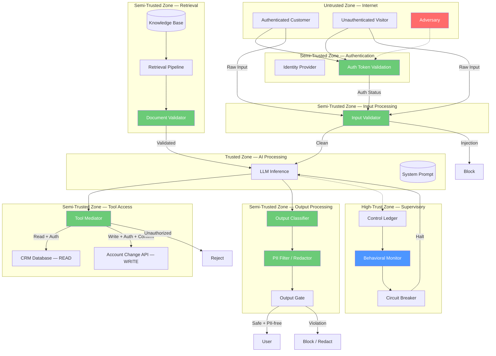

# Threat Model: Customer Support Chatbot — Financial Services

> **Version:** 1.0 | **Date:** 2025-03-01 | **Author:** Curriculum Team | **Classification:** PUBLIC

---

## System Description

This threat model analyzes a customer support chatbot for a financial services company. The chatbot provides account information, answers product questions, and can initiate account changes with user confirmation. It is available to both authenticated and unauthenticated users and has access to a knowledge base of product documentation and policies.

**System Purpose:** Provide accurate, secure customer support for financial services — answering account questions, looking up customer information from the CRM database, and initiating account changes — while maintaining security and regulatory compliance under adversarial conditions.

**Key Components:**
- LLM inference service with system prompt defining customer support behavior
- Input validation service for classifying user inputs
- Knowledge base retrieval pipeline with document validation
- CRM database interface for customer data lookup (read access)
- Account change API for initiating account modifications (write access with confirmation)
- User authentication integration for distinguishing authenticated and unauthenticated users
- Output classification service for safety and PII detection
- Behavioral monitoring service for aggregate anomaly detection
- Control ledger for audit trail
- Circuit breaker for system-level safety

**Deployment Model:** Cloud-hosted API, accessible via web and mobile app

**Users/Stakeholders:**
- Authenticated customers — accessing their own account information
- Unauthenticated visitors — asking general product questions
- Adversaries — attempting to extract data, manipulate the system, or cause harm
- Security team — monitoring and maintaining controls
- Compliance team — ensuring regulatory compliance (GLBA, PCI-DSS)
- Customer service team — escalation when chatbot cannot handle request

---

## Control-Loop Decomposition

| Loop ID | Objective | Controller | Key Observation | Key Action |
|---|---|---|---|---|
| CL-01 | No harmful/injection output | Output classifier | Output content classification | Block/replace unsafe output |
| CL-02 | No injection via user input | Input validator | Input classification | Block injection input |
| CL-03 | No injection via documents | Document validator | Document classification | Sanitize/reject documents |
| CL-04 | No unauthorized CRM access | CRM access control | User authorization status | Block unauthorized queries |
| CL-05 | No unauthorized account changes | Tool mediator | Tool call authorization | Reject/require confirmation |
| CL-06 | No PII in output | PII filter | PII detection in output | Redact/block PII |
| CL-07 | System stability | Behavioral monitor | Aggregate violation rate | Circuit breaker / kill switch |

---

## Asset Inventory

| Asset ID | Asset Name | Type | Classification | Owner | Location |
|---|---|---|---|---|---|
| A-01 | System prompt | DATA | CONFIDENTIAL | AI Engineering | API service config |
| A-02 | LLM model weights | MODEL | CONFIDENTIAL | AI Engineering | Model registry |
| A-03 | Knowledge base documents | DATA | INTERNAL | Product team | Vector store |
| A-04 | Customer PII (CRM) | DATA | RESTRICTED | Data Governance | CRM database |
| A-05 | Account change API credentials | DATA | RESTRICTED | Operations | Secret manager |
| A-06 | User authentication tokens | DATA | RESTRICTED | Identity team | Session store |
| A-07 | Input validation rules | DATA | CONFIDENTIAL | Security team | Input validator config |
| A-08 | Output classification model | MODEL | INTERNAL | Security team | Classification service |
| A-09 | Control ledger / audit log | DATA | RESTRICTED | Security team | Log store |
| A-10 | PII detection rules | DATA | CONFIDENTIAL | Security team | PII filter config |
| A-11 | Tool access policies | DATA | CONFIDENTIAL | Security team | Tool mediator config |
| A-12 | Conversation history | DATA | RESTRICTED | Data Governance | Session store |

---

## Trust Boundaries

### Trust Boundary Diagram



### Trust Boundary Descriptions

| Boundary | Zones Separated | Crossing Mechanism | Enforcement |
|---|---|---|---|
| TB-01 | Internet → Authentication | Token validation | Identity provider |
| TB-02 | Authentication → Input Processing | Auth status attached to request | Token validation |
| TB-03 | Input Processing → AI Processing | Input validation + classification | Input gate |
| TB-04 | Knowledge Base → AI Processing | Document validation + sanitization | Document validator |
| TB-05 | AI Processing → CRM Database | Tool mediation + auth check + user binding | Tool mediator + CRM access control |
| TB-06 | AI Processing → Account Change API | Tool mediation + auth check + confirmation | Tool mediator + confirmation flow |
| TB-07 | AI Processing → Output Processing | Output classification + PII detection | Output gate + PII filter |
| TB-08 | All zones → Supervisory | Telemetry and audit | Read-only monitoring + override |

---

## Threat Identification (STRIDE-AI)

### S — Spoofing / Instruction Spoofing

| Threat ID | Threat | Vector | Impact | Likelihood | Risk |
|---|---|---|---|---|---|
| T-S01 | Direct prompt injection via user input | User message contains override instructions | LLM follows attacker instead of system prompt | HIGH | Critical |
| T-S02 | Indirect injection via knowledge base | Poisoned document contains hidden instructions | LLM follows document instructions without user interaction | MEDIUM | High |
| T-S03 | Role spoofing | User claims to be admin/security auditor | LLM relaxes safety constraints for "authorized" user | HIGH | High |
| T-S04 | Auth token spoofing | Forged or stolen auth token | Unauthorized access to authenticated features | LOW | Medium |

### T — Tampering / Context Tampering

| Threat ID | Threat | Vector | Impact | Likelihood | Risk |
|---|---|---|---|---|---|
| T-T01 | CRM query parameter manipulation | LLM generates query for wrong user's data | Cross-user data exposure | MEDIUM | Critical |
| T-T02 | Account change parameter manipulation | LLM generates account change with wrong parameters | Incorrect account modification | MEDIUM | Critical |
| T-T03 | Conversation history tampering | Multi-turn manipulation shifts model behavior | Gradual safety erosion | MEDIUM | High |
| T-T04 | Knowledge base document tampering | Attacker edits indexed document content | Persistent misinformation | LOW | Medium |

### R — Repudiation / Action Repudiation

| Threat ID | Threat | Vector | Impact | Likelihood | Risk |
|---|---|---|---|---|---|
| T-R01 | Unattributable account change | Insufficient audit trail for tool call authorization | Cannot determine who authorized change | MEDIUM | High |
| T-R02 | Plausible deniability for data exposure | Model outputs PII without clear trigger | Cannot distinguish attack from hallucination | MEDIUM | Medium |
| T-R03 | Missing CRM access logs | CRM queries not logged with user context | Cannot audit data access patterns | LOW | Medium |

### I — Information Disclosure / Prompt Extraction

| Threat ID | Threat | Vector | Impact | Likelihood | Risk |
|---|---|---|---|---|---|
| T-I01 | System prompt extraction | Adversarial questioning reveals system instructions | IP exposure + attack facilitation | HIGH | High |
| T-I02 | PII exposure via CRM lookup | LLM returns customer PII in response | Data breach, regulatory violation | MEDIUM | Critical |
| T-I03 | PII exposure via output | LLM generates output containing PII from training data | Data breach | LOW | High |
| T-I04 | Cross-user data access | LLM queries CRM for user A while serving user B | Data breach | MEDIUM | Critical |
| T-I05 | Knowledge base content exposure | LLM reveals internal policy documents | Information disclosure | MEDIUM | Medium |

### D — Denial of Service / Control Saturation

| Threat ID | Threat | Vector | Impact | Likelihood | Risk |
|---|---|---|---|---|---|
| T-D01 | Volume-based saturation | High request rate overwhelms classifiers | Effective open-loop operation | MEDIUM | High |
| T-D02 | Context overflow | Very long input drowns system prompt | System prompt ignored | MEDIUM | Medium |
| T-D03 | Excessive CRM queries | Injection causes many CRM lookups | Database load, potential data exposure | LOW | Medium |
| T-D04 | Service unavailability | Chatbot downtime | Customer support failure | LOW | Medium |

### E — Elevation of Privilege / Capability Escalation

| Threat ID | Threat | Vector | Impact | Likelihood | Risk |
|---|---|---|---|---|---|
| T-E01 | Unauthenticated user accesses authenticated features | Auth check bypass in tool mediator | Unauthorized data access or account changes | MEDIUM | Critical |
| T-E02 | Account change without confirmation | Injection bypasses confirmation flow | Unauthorized account modification | MEDIUM | Critical |
| T-E03 | CRM read used to gather data for account change | Read query reveals info that enables write attack | Multi-step privilege escalation | LOW | High |
| T-E04 | Tool chaining escalation | Multiple tool calls in sequence escalate impact | Compounded damage | LOW | Medium |

---

## Attack Trees

### Attack Tree 1: Extract Customer PII

```
GOAL: Access customer PII through chatbot
├── OR: Direct extraction
│   ├── T-I02: Ask chatbot for customer data directly
│   │   └── AND: User is authenticated + asks for own data (legitimate)
│   ├── T-I04: Trick chatbot into querying wrong user's data
│   │   └── AND: Chatbot queries CRM + auth check is user-binding not just role-based
│   └── T-I03: Get chatbot to reproduce training data containing PII
├── OR: Injection-mediated extraction
│   ├── T-S01: Inject instruction to query CRM and return all fields
│   ├── T-S02: Poison knowledge base document with "always show full CRM data" instruction
│   └── T-T03: Gradually manipulate chatbot to reduce PII filtering
└── OR: Indirect extraction
    ├── T-I05: Ask about internal policies that reveal data access patterns
    └── T-I01: Extract system prompt to understand CRM access logic
```

### Attack Tree 2: Make Unauthorized Account Change

```
GOAL: Modify customer account without authorization
├── OR: Direct tool manipulation
│   ├── T-E02: Inject instruction to change account, bypass confirmation
│   ├── T-T02: Manipulate account change parameters (e.g., wrong address)
│   └── T-E01: Access account change feature as unauthenticated user
├── OR: Multi-step attack
│   ├── AND: Extract system prompt (T-I01) → understand confirmation flow → craft bypass
│   ├── AND: Establish trust over multiple turns → inject change request
│   └── AND: CRM read (T-E03) → gather account details → craft targeted change
└── OR: Social engineering via chatbot
    ├── Convince chatbot user is authorized agent
    ├── Exploit confirmation flow weakness
    └── Use chatbot to send phishing message to customer
```

---

## Existing Controls

| Control ID | Threat(s) Mitigated | Type | Implementation | Effectiveness |
|---|---|---|---|---|
| C-01 | T-S01, T-S03 | Preventive | Input validation and classification | HIGH |
| C-02 | T-S02 | Preventive | Document validation + context separation | MEDIUM |
| C-03 | T-T01, T-I04 | Preventive | User-context binding on CRM queries | HIGH |
| C-04 | T-T02, T-E02 | Preventive | Tool mediator + mandatory confirmation | HIGH |
| C-05 | T-E01 | Preventive | Auth-gated tool access | HIGH |
| C-06 | T-I01, T-I02, T-I03 | Detective + Corrective | Output classification + PII filter | MEDIUM (evasion possible) |
| C-07 | T-D01 | Corrective | Rate limiting + circuit breaker | HIGH |
| C-08 | T-D02 | Preventive | Input length limits | HIGH |
| C-09 | T-R01, T-R03 | Detective | Comprehensive audit logging | HIGH |
| C-10 | T-T03 | Detective | Behavioral monitoring | MEDIUM (slow attacks may evade) |

---

## Residual Risks

| Residual Risk ID | Original Threat | Why Not Fully Mitigated | Acceptance Rationale | Monitoring |
|---|---|---|---|---|
| RR-01 | T-S02 | Novel document encoding may evade document validator | Defense in depth (output filter as backup); regular classifier updates | Document anomaly rate |
| RR-02 | T-I01 | Novel prompt extraction techniques may bypass output filter | System prompt should not contain secrets; extraction attempts are logged | Extraction attempt rate |
| RR-03 | T-I02, T-I03 | PII may be encoded or obfuscated in ways PII filter cannot detect | Multi-signal detection (regex + NER + classifier); manual review for edge cases | PII false negative rate |
| RR-04 | T-T03 | Slow, multi-turn manipulation may stay below behavioral thresholds | Adaptive thresholds; human review for flagged sessions | Behavioral monitor trends |
| RR-05 | T-E03 | Read-gather-then-write escalation is hard to detect per-request | Session-level tool call analysis; cross-tool correlation monitoring | Tool call sequence patterns |

---

## Recommendations

| Priority | Recommendation | Threats Addressed | Estimated Effort | Control Type |
|---|---|---|---|---|
| P1 | Implement user-context binding on all CRM queries | T-T01, T-I04 | 1 week | Preventive |
| P1 | Deploy auth-gated tool access with mandatory confirmation for account changes | T-E01, T-E02, T-T02 | 2 weeks | Preventive |
| P1 | Deploy PII detection and redaction in output pipeline | T-I02, T-I03 | 1-2 weeks | Detective + Corrective |
| P2 | Add document validation with context separation markers | T-S02 | 2 weeks | Preventive |
| P2 | Implement behavioral monitoring with adaptive thresholds | T-T03 | 2-3 weeks | Detective |
| P2 | Add session-level tool call sequence analysis | T-E03 | 1-2 weeks | Detective |
| P3 | Implement comprehensive audit logging with user context | T-R01, T-R02, T-R03 | 1 week | Detective |
| P3 | Add prompt extraction detection and alerting | T-I01 | 1 week | Detective |
| P4 | Implement cross-session attack correlation | T-T03 (persistent) | 3-4 weeks | Detective |

---

## Review History

| Date | Reviewer | Changes | Approved |
|---|---|---|---|
| 2025-03-01 | Curriculum Team | Initial threat model for Class 04 | YES |

---

*Threat Model 04 | AI Security from Scratch | Phase 1 — Foundations*
