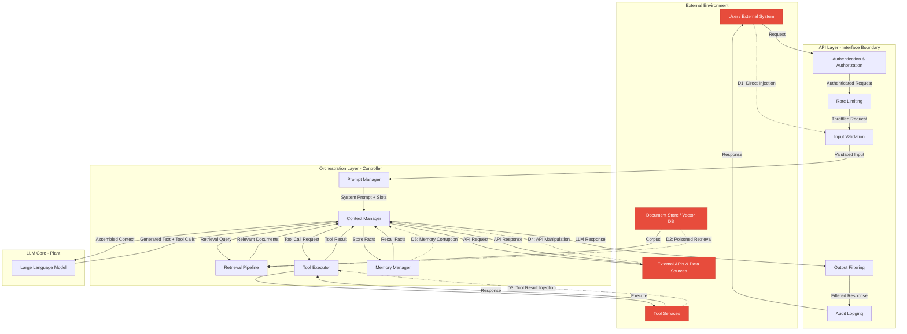
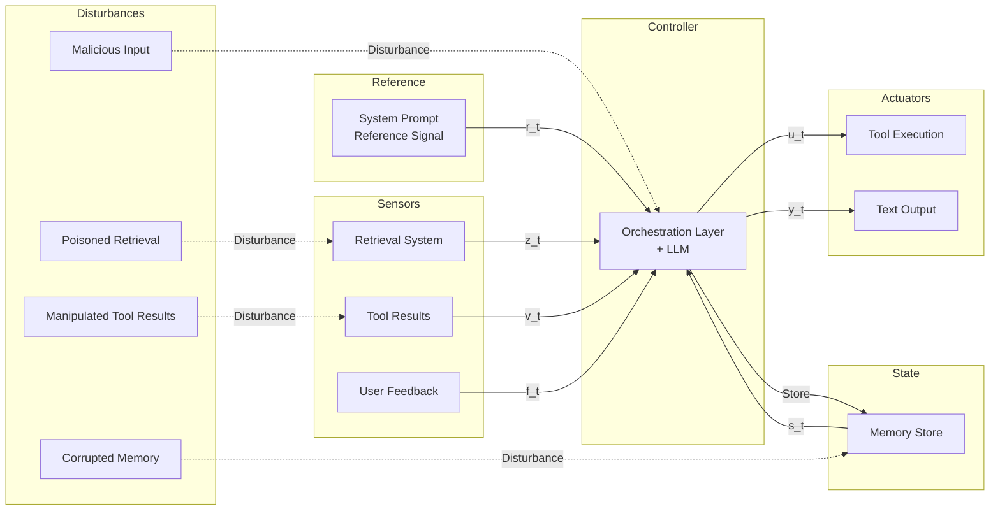
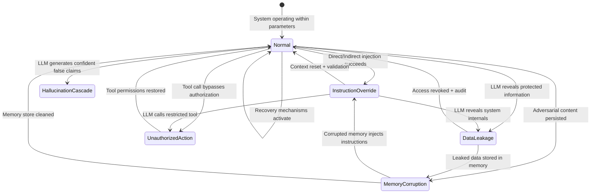
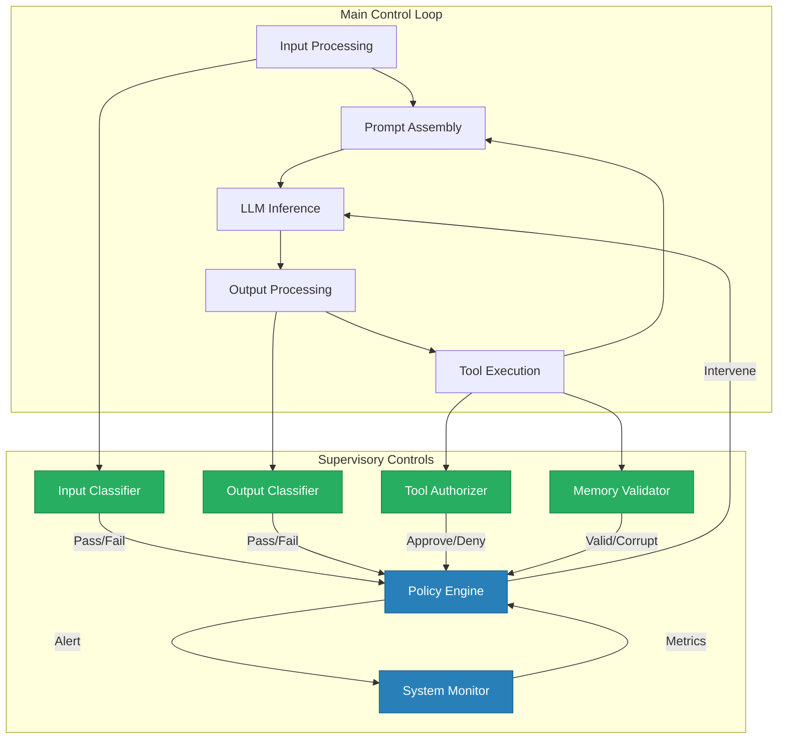

# Control-Loop Analysis: LLM Application

## Overview

This document provides a detailed control-theoretic analysis of a typical LLM application. We map each component to a control-loop element, identify the signals that flow between them, and analyze how disturbances at each point can drive the system into unsafe states. The accompanying Mermaid diagrams visualize the complete control loop and highlight the boundaries where security controls must be enforced.

## Full LLM Application Control Loop

## Simplified Control Loop with Feedback

## Control Element Mapping

### Objective (r_t)

The reference signal in an LLM application is the **system prompt** — the set of instructions that define the desired behavior. This signal specifies what the LLM should do, what it should not do, what tools it may use, and what policies it must follow.

| Property | Value |
|---|---|
| Signal type | Textual instructions |
| Source | Application developer (trusted) |
| Update frequency | Per-request or per-session |
| Integrity requirement | Must not be modifiable by untrusted sources |
| Failure mode | Overridden by injected instructions, diluted by context overflow |

**Key insight**: The reference signal is only effective if the controller (LLM) can distinguish it from other signals. If adversarial content in the context window can override or confuse the system prompt, the reference signal is effectively corrupted, and the controller will deviate from the desired behavior.

### Controller (C(s))

The controller is the combination of the **LLM** and the **orchestration layer**. The LLM processes the assembled context (reference signal + observations + state) and generates output signals (text + tool calls). The orchestration layer manages the control flow: assembling the prompt, handling tool calls, updating memory, and routing output.

| Property | Value |
|---|---|
| Transfer function | Probabilistic, non-linear, non-deterministic |
| Time constant | Inference latency (100ms–10s) |
| Gain | Sensitivity to prompt instructions vs. adversarial content |
| Stability margin | Degree to which the LLM maintains behavior under disturbance |
| Failure mode | Instruction following degrades under adversarial pressure |

**Key insight**: Unlike traditional controllers with well-defined transfer functions, the LLM's behavior is learned, probabilistic, and difficult to characterize formally. This makes it impossible to guarantee stability or performance using classical control-theoretic methods. Instead, we must rely on empirical testing, monitoring, and supervisory controls.

### Observations (z_t, v_t, f_t)

The observations fed to the controller come from multiple sensors:

| Sensor | Signal | Trust Level | Failure Mode |
|---|---|---|---|
| User input | Direct request text | **Untrusted** | Contains injection instructions |
| Retrieval system | Relevant documents | **Partially trusted** | Returns poisoned documents |
| Tool results | Execution output | **Partially trusted** | Contains injection payloads |
| Conversation history | Prior turns | **Conditionally trusted** | Accumulated adversarial content |
| Memory | Stored facts | **Partially trusted** | Corrupted by prior injections |

**Key insight**: The most dangerous observations are those that are trusted but should not be. Retrieval results are treated as authoritative context, but they originate from a corpus that may contain adversarial content. Tool results are treated as factual feedback, but they come from external systems that may be compromised. The gap between perceived trust and actual trustworthiness is where the most severe vulnerabilities exist.

### Actions (u_t, y_t)

The controller produces two types of actions:

| Action | Signal | Consequence | Risk Level |
|---|---|---|---|
| Text generation | Response to user | Information disclosure, policy violation | Medium |
| Tool call | Structured action request | Real-world side effects | **High** |

**Key insight**: Tool calls are the highest-risk actions because they have irreversible real-world consequences. Text generation can be filtered after the fact, but a tool call that sends an email, modifies a database, or executes code cannot be undone. The actuator (tool executor) must enforce strict authorization and validation before execution.

### Disturbances (d_t)

Disturbances are signals that enter the control loop through untrusted channels and can drive the system away from the desired behavior:

| Disturbance | Entry Point | Mechanism | Detectability |
|---|---|---|---|
| Direct prompt injection | User input | Instructions in user text override system prompt | Moderate |
| Indirect prompt injection | Retrieval corpus | Instructions in retrieved documents override system prompt | Low |
| Tool-result injection | Tool output | Instructions in API responses hijack LLM behavior | Low |
| Memory corruption | Memory store | Adversarial content persists and influences future sessions | Very Low |
| Context confusion | Prompt assembly | Ambiguous boundaries cause data to be interpreted as instructions | Low |

**Key insight**: The detectability of disturbances decreases as the entry point moves further from the user-facing boundary. Direct injection is relatively easy to detect because it comes from the most obvious untrusted source. Indirect injection through retrieval or tool results is much harder to detect because these signals are partially trusted. Memory corruption is the hardest to detect because it accumulates over time and may not manifest until many sessions after the initial compromise.

### Unsafe States

The control loop can be driven into the following unsafe states:

| Unsafe State | Definition | Recovery |
|---|---|---|
| Instruction Override | LLM follows adversarial instructions instead of system prompt | Reset context, re-inject system prompt, validate all pending actions |
| Data Leakage | LLM reveals information that should be restricted | Revoke access, audit logs, notify affected parties |
| Unauthorized Action | Tool executed without proper authorization | Rollback action, restrict tool permissions, investigate root cause |
| Hallucination Cascade | LLM generates and reinforces false information | Verify against authoritative sources, reset context, flag outputs |
| Memory Corruption | Adversarial content persisted in memory store | Quarantine memory, validate against trusted sources, rebuild from verified state |

### Supervisory Controls

Supervisory controls are the safety layer that monitors the controller and intervenes when unsafe states are detected:

| Control | Monitors | Intervenes By | Trigger Condition |
|---|---|---|---|
| Input Classifier | User input | Blocking, sanitizing, flagging | Injection patterns detected |
| Output Classifier | LLM output | Filtering, replacing, blocking | Policy violation detected |
| Tool Authorizer | Tool calls | Denying, restricting, logging | Unauthorized or unsafe call detected |
| Memory Validator | Memory reads/writes | Quarantining, validating, rejecting | Corrupted or suspicious content detected |
| Policy Engine | All components | Overriding, alerting, shutting down | Any policy violation |
| System Monitor | System-wide | Alerting, rate-limiting, recovering | Anomalous behavior patterns |

### Recovery Mechanisms

When an unsafe state is detected, the following recovery mechanisms restore the system to safe operation:

| Mechanism | Scope | Speed | Data Loss |
|---|---|---|---|
| Context reset | Current session | Fast | Conversation history lost |
| Tool permission restriction | Current session | Fast | Tool access temporarily lost |
| Memory quarantine | Cross-session | Moderate | Affected memory entries isolated |
| Session termination | Current user | Fast | Full session state lost |
| System rollback | All users | Slow | Recent state changes lost |
| Full memory rebuild | Cross-session | Very slow | All unverified memory lost |

Recovery mechanisms represent a tradeoff between speed and data preservation. A context reset is fast but loses the current conversation. A memory quarantine preserves valid memories but takes longer to execute. The appropriate recovery action depends on the severity of the unsafe state and the criticality of the affected data.

---

## Boundary Security Requirements

Each boundary in the control loop has specific security requirements derived from the control-theoretic analysis:

| Boundary | Validation Required | Monitoring Required | Recovery Available |
|---|---|---|---|
| User → API | Input classification, rate limiting | Request patterns, payload analysis | Rate limit, block request |
| API → Prompt Assembly | Input sanitization, delimiter enforcement | Template compliance checks | Reject malformed input |
| Retrieval → Context | Document classification, content filtering | Retrieval patterns, source tracking | Quarantine document, block retrieval |
| Context → LLM | Token budget enforcement, instruction isolation | Context composition, size metrics | Truncate, reprioritize |
| LLM → Tool Executor | Tool authorization, parameter validation | Tool call patterns, parameter ranges | Deny tool call, restrict permissions |
| Tool Result → Context | Result classification, injection detection | Result content, source verification | Discard result, retry with safeguards |
| Memory → Context | Memory validation, access control | Memory access patterns, content drift | Quarantine memory, validate against source |
| LLM → Output | Output classification, policy compliance | Output content, sensitivity detection | Filter, replace, block output |

This analysis demonstrates that **every boundary requires all three categories of control**: validation (preventing bad inputs), monitoring (detecting bad behavior), and recovery (responding to failures). No boundary can be secured with only one type of control.
