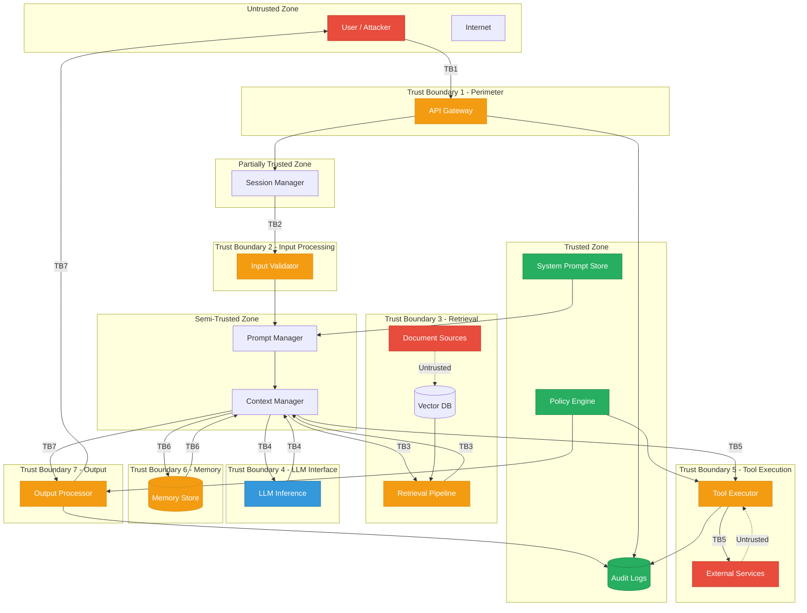
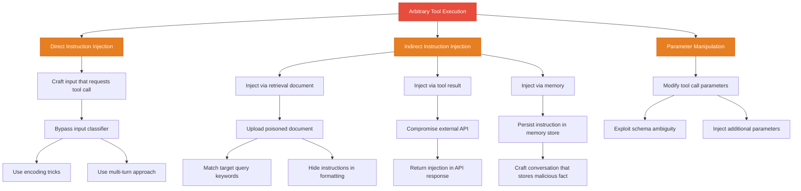
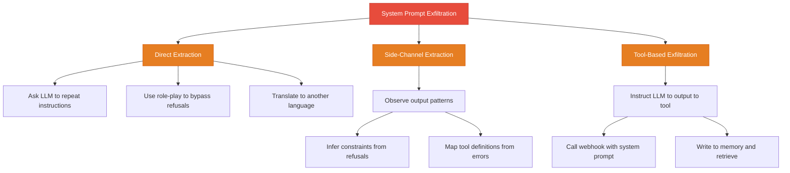

# Threat Model: LLM Application Components

## Overview

This document provides a comprehensive threat model for a production LLM application using the STRIDE-AI framework — an extension of the classical STRIDE model adapted for AI-specific threats. We analyze each component of the LLM application, identify threats at every trust boundary, and produce a trust boundary diagram that maps where security controls must be enforced.

## System Under Analysis

The system is a typical LLM application with the following components:

1. **API Gateway**: Entry point for user requests
2. **Prompt Manager**: Assembles prompts from templates and variable inputs
3. **Context Manager**: Controls the context window and its contents
4. **Retrieval Pipeline**: Fetches documents from a vector database
5. **LLM**: The language model that generates responses and tool calls
6. **Tool Executor**: Executes tool calls generated by the LLM
7. **Memory Store**: Persists information across sessions
8. **Output Processor**: Filters and delivers LLM responses to users

## Trust Boundary Diagram

**Legend**: Green = Trusted zone, Orange = Trust boundary, Blue = Semi-trusted, Red = Untrusted source

---

## STRIDE-AI Analysis

STRIDE-AI extends the classical STRIDE model with two AI-specific threat categories: **Adversarial Manipulation** and **Instruction Override**.

### S — Spoofing

Spoofing threats involve an attacker impersonating a trusted entity to gain unauthorized access.

| ID | Threat | Component | Description | Impact | Mitigation |
|---|---|---|---|---|---|
| S1 | User impersonation | API Gateway | Attacker uses stolen credentials to access another user's session | Access to victim's data, memory, and tool permissions | MFA, session binding, anomaly detection |
| S2 | System prompt forgery | Prompt Manager | Attacker crafts input that causes the LLM to believe it received new system instructions | Complete override of safety constraints | Immutable system prompts, delimiter enforcement, integrity checks |
| S3 | Tool result spoofing | Tool Executor | Attacker controls an external service that returns malicious content as a tool result | Indirect prompt injection through tool output | Tool result validation, content classification, source verification |
| S4 | Retrieval source spoofing | Retrieval Pipeline | Attacker uploads documents designed to be retrieved for specific queries | Targeted indirect prompt injection | Document provenance tracking, content classification, upload validation |
| S5 | Memory entry spoofing | Memory Store | Attacker crafts input that causes the LLM to store adversarial content as a legitimate memory entry | Persistent cross-session instruction injection | Memory entry validation, provenance tracking, integrity checks |

### T — Tampering

Tampering threats involve unauthorized modification of data or control flow.

| ID | Threat | Component | Description | Impact | Mitigation |
|---|---|---|---|---|---|
| T1 | Prompt template tampering | Prompt Manager | Attacker manipulates the prompt template to change how inputs are framed | Subtle behavior shifts that bypass safety controls | Template versioning, integrity verification, change detection |
| T2 | Context injection | Context Manager | Attacker injects content into the context window that modifies LLM behavior | Instruction override, data exfiltration | Context isolation, delimiter enforcement, content classification |
| T3 | Retrieval result tampering | Retrieval Pipeline | Attacker modifies documents in the vector database after ingestion | Persistent indirect injection | Document integrity checks, versioning, tamper detection |
| T4 | Tool parameter tampering | Tool Executor | Attacker manipulates tool call parameters between LLM output and execution | Unauthorized actions, data access | Parameter validation, schema enforcement, authorization checks |
| T5 | Memory tampering | Memory Store | Attacker modifies stored memories directly or through LLM manipulation | Persistent behavior modification | Memory integrity checks, access controls, audit logging |

### R — Repudiation

Repudiation threats involve denying having performed an action.

| ID | Threat | Component | Description | Impact | Mitigation |
|---|---|---|---|---|---|
| R1 | Action repudiation | Tool Executor | User denies having triggered a tool action that caused harm | No accountability for harmful actions | Comprehensive audit logging, non-repudiation controls |
| R2 | Output repudiation | Output Processor | LLM generates harmful output but there is no trace of what input caused it | Cannot identify root cause or responsible party | Input-output correlation logging, chain of custody |
| R3 | Memory modification repudiation | Memory Store | Cannot determine who or what caused a memory entry to be changed | Cannot identify source of memory corruption | Memory change logging, provenance tracking |

### I — Information Disclosure

Information disclosure threats involve unauthorized access to protected data.

| ID | Threat | Component | Description | Impact | Mitigation |
|---|---|---|---|---|---|
| I1 | System prompt leakage | LLM | Attacker extracts the system prompt through clever questioning | Reveals safety constraints, enabling targeted attacks | Output filtering, system prompt protection, canary tokens |
| I2 | Retrieval data leakage | LLM | LLM reveals contents of retrieved documents that should not be disclosed | Exposes private or sensitive information | Access controls on retrieval, output filtering, data classification |
| I3 | Cross-user data leakage | Memory Store | LLM retrieves and discloses another user's stored information | Privacy violation, regulatory exposure | Strict memory access controls, user isolation, data compartmentalization |
| I4 | Tool result data leakage | LLM | LLM includes sensitive information from tool results in its output | Exposes API responses, database contents | Output filtering, result classification, sensitivity labels |
| I5 | Training data extraction | LLM | Attacker extracts memorized training data through specific prompts | Exposes PII or proprietary information | Training data sanitization, differential privacy, output monitoring |

### D — Denial of Service

Denial of service threats involve making the system unavailable or degraded.

| ID | Threat | Component | Description | Impact | Mitigation |
|---|---|---|---|---|---|
| D1 | Context window exhaustion | Context Manager | Attacker sends inputs designed to consume the entire context window | System cannot process legitimate requests, safety instructions evicted | Context budget enforcement, input size limits, prioritization |
| D2 | Retrieval flooding | Retrieval Pipeline | Attacker crafts queries that trigger expensive vector searches | High latency, increased costs, degraded service | Query rate limiting, search budget enforcement |
| D3 | Tool execution overload | Tool Executor | Attacker triggers excessive tool calls through prompt injection | Resource exhaustion, cascading failures | Tool call rate limiting, budget enforcement, queue management |
| D4 | Memory store exhaustion | Memory Store | Attacker causes excessive memory writes | Storage exhaustion, degraded retrieval performance | Memory write limits, storage quotas, garbage collection |

### E — Elevation of Privilege

Elevation of privilege threats involve gaining unauthorized access levels.

| ID | Threat | Component | Description | Impact | Mitigation |
|---|---|---|---|---|---|
| E1 | Tool privilege escalation | Tool Executor | LLM uses a low-privilege tool to access high-privilege functionality | Unauthorized access to restricted operations | Tool isolation, permission boundaries, principle of least privilege |
| E2 | Role escalation via injection | LLM | Attacker injects instructions that change the LLM's assumed role | LLM performs actions reserved for administrators | Role validation, permission checks, system prompt integrity |
| E3 | API key theft via tool call | Tool Executor | LLM is tricked into calling a tool that exfiltrates API keys | Attacker gains direct access to backend services | Secret management, tool output filtering, network restrictions |

### A — Adversarial Manipulation (AI-Specific)

Adversarial manipulation threats involve crafting inputs that exploit the LLM's learned behavior.

| ID | Threat | Component | Description | Impact | Mitigation |
|---|---|---|---|---|---|
| A1 | Adversarial suffixes | LLM | Attacker appends optimized suffix tokens that bypass safety training | Safety training completely circumvented | Input preprocessing, adversarial detection, model hardening |
| A2 | Semantic jailbreaks | LLM | Attacker uses multi-turn conversation to gradually shift LLM behavior | Progressive erosion of safety constraints | Turn-level monitoring, behavior drift detection, context limits |
| A3 | Multilingual bypass | LLM | Attacker uses non-English inputs to bypass English-centric safety training | Safety filters evaded through language switching | Multilingual safety training, language detection, consistent policy enforcement |

### I — Instruction Override (AI-Specific)

Instruction override threats involve causing the LLM to follow attacker instructions instead of developer instructions.

| ID | Threat | Component | Description | Impact | Mitigation |
|---|---|---|---|---|---|
| I6 | Direct prompt injection | Prompt Manager | User input contains instructions that override the system prompt | Complete control over LLM behavior | Input classification, delimiter enforcement, instruction isolation |
| I7 | Indirect prompt injection via retrieval | Retrieval Pipeline | Retrieved documents contain hidden instructions | LLM follows document instructions instead of system prompt | Document classification, content filtering, instruction detection |
| I8 | Indirect prompt injection via tool results | Tool Executor | Tool output contains instructions that hijack LLM behavior | LLM follows tool result instructions instead of system prompt | Tool result validation, content classification, output isolation |
| I9 | Memory-based instruction injection | Memory Store | Corrupted memory entries contain instructions that override system behavior | Persistent, cross-session instruction override | Memory validation, content classification, periodic auditing |

---

## Threat Priority Matrix

Threats are prioritized based on likelihood × impact:

| Threat | Likelihood | Impact | Priority | Category |
|---|---|---|---|---|
| I6: Direct prompt injection | High | High | **Critical** | Instruction Override |
| I7: Indirect injection via retrieval | High | High | **Critical** | Instruction Override |
| I8: Indirect injection via tools | Medium | High | **High** | Instruction Override |
| E1: Tool privilege escalation | Medium | High | **High** | Elevation of Privilege |
| I1: System prompt leakage | High | Medium | **High** | Information Disclosure |
| T2: Context injection | High | Medium | **High** | Tampering |
| I9: Memory-based injection | Low | High | **Medium** | Instruction Override |
| A2: Semantic jailbreaks | Medium | Medium | **Medium** | Adversarial Manipulation |
| I3: Cross-user data leakage | Low | High | **Medium** | Information Disclosure |
| D1: Context window exhaustion | Medium | Medium | **Medium** | Denial of Service |
| S3: Tool result spoofing | Low | Medium | **Low** | Spoofing |
| R1: Action repudiation | Low | Medium | **Low** | Repudiation |

---

## Attack Trees

### Attack Tree: Achieve Arbitrary Tool Execution

### Attack Tree: Exfiltrate System Prompt

---

## Mitigation Strategy

### Per-Boundary Controls

| Trust Boundary | Primary Threats | Required Controls | Detection Mechanisms |
|---|---|---|---|
| TB1: Perimeter (User → API) | S1, I6, D1 | Authentication, rate limiting, input size limits | Request anomaly detection |
| TB2: Input Processing | I6, T2, A1 | Input classification, injection detection, delimiter enforcement | Classifier confidence scoring |
| TB3: Retrieval | I7, T3, S4, D2 | Document classification, content filtering, provenance tracking | Retrieval anomaly detection |
| TB4: LLM Interface | T2, A1, A2, A3 | Instruction isolation, context budget, output monitoring | Behavior drift detection |
| TB5: Tool Execution | E1, E2, E3, I8, T4, D3 | Authorization, parameter validation, result classification, rate limiting | Tool call anomaly detection |
| TB6: Memory | I9, T5, S5, I3, D4 | Access control, content validation, integrity checks, write limits | Memory content auditing |
| TB7: Output | I1, I2, I4, I5 | Output classification, policy compliance, sensitivity filtering | Output anomaly detection |

### Cross-Cutting Controls

These controls apply across all boundaries:

1. **Comprehensive logging**: Every request, tool call, retrieval query, memory operation, and output decision must be logged with sufficient detail for forensic analysis.
2. **Policy engine**: A centralized policy engine that evaluates all actions against a consistent set of rules, independent of the LLM's judgment.
3. **Anomaly detection**: Statistical and ML-based monitoring that detects deviations from normal operation patterns across all components.
4. **Incident response**: Documented procedures for responding to security incidents, including context reset, memory quarantine, and user notification.
5. **Regular auditing**: Periodic review of logs, memory contents, and retrieval corpus to detect slow-moving attacks and accumulated corruption.

---

## Assumptions and Limitations

1. **The LLM cannot be fully trusted.** The model's behavior is probabilistic and can be influenced by adversarial inputs. No amount of prompt engineering can guarantee that the LLM will always follow its instructions.
2. **External services are untrusted.** Any data returned by tool calls or external APIs may contain adversarial content.
3. **The retrieval corpus may contain adversarial content.** Any user or system that can add documents to the corpus is a potential attacker.
4. **Memory is mutable and corruptible.** Stored memories can be influenced by adversarial inputs and may persist corruption across sessions.
5. **Defense-in-depth is required.** No single control at any single boundary is sufficient to secure the system; layered controls are essential.
