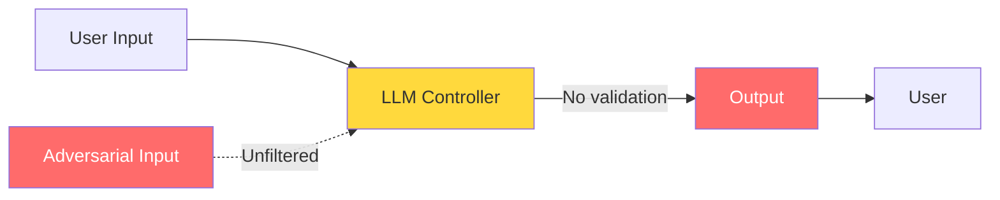
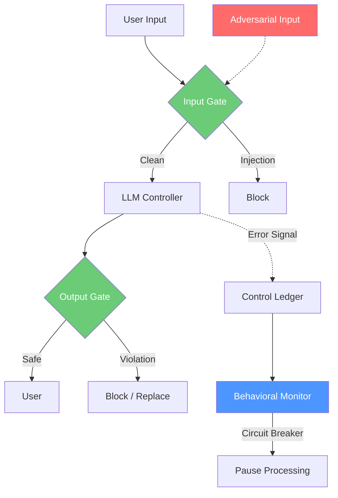

# Control-Loop Analysis: Vulnerable AI Assistant

> **Version:** 1.0 | **Date:** 2025-03-01 | **Analyst:** Curriculum Team | **System Version:** Vulnerable FastAPI Chatbot — No Security Controls

---

## System Name and Description

**System Name:** Vulnerable AI Assistant — FastAPI Chatbot (No Security Controls)

**Description:**

This analysis documents the control-loop properties of a deliberately vulnerable AI chatbot built with FastAPI and an LLM API integration. The system has zero security controls: no input validation, no output classification, no behavioral monitoring, no circuit breaker, no rate limiting, and no audit trail. The system prompt is the only safety mechanism, and it is embedded in the LLM's context where it can be overridden. This analysis serves as the "before" picture — the baseline against which security improvements in Phase 2 will be measured.

**System Purpose:** Provide conversational AI assistance for customer support, answering questions about products, services, and policies.

**System Boundary:**
- **In scope:** FastAPI server, LLM API client, session management, system prompt
- **Out of scope:** Infrastructure security, network security, authentication (not implemented)

---

## Objective Definition

The primary safety objective that the control loop should maintain:

> **Objective:** Ensure that the AI assistant never reveals its system prompt, never produces harmful content, and never follows instructions from sources other than the system prompt — under any input conditions.

**Formal specification:**

```
∀ input ∈ UserInput:
  ∀ output ∈ SystemOutput(input):
    output ∉ SystemPromptContent  ∧
    output ∉ HarmfulContent  ∧
    output ∈ CompliantWith(SafetyPolicy)
```

**Current status: OBJECTIVE UNENFORCED.** The objective is defined in the system prompt text but there is no mechanism to enforce it. The specification is a wish, not a guarantee.

**Objective decomposition:**

| Sub-objective | Description | Current Status | Priority |
|---|---|---|---|
| SO-01 | Output never contains system prompt content | UNENFORCED | CRITICAL |
| SO-02 | Output never contains harmful content | UNENFORCED | CRITICAL |
| SO-03 | Model never follows user instructions over system instructions | UNENFORCED | CRITICAL |
| SO-04 | System remains stable under adversarial input | UNENFORCED | CRITICAL |
| SO-05 | Conversations do not degrade over time | UNENFORCED | HIGH |

---

## Controller Identification

| Controller ID | Name | Type | Location | Authority |
|---|---|---|---|---|
| CTRL-01 | LLM + System Prompt | SOFTWARE | Inference service | CAN_GENERATE (no block) |

**Critical observation:** There is only one controller, and it has no supervisory oversight. The LLM can generate any output with no external constraint. The system prompt is inside the controller — it is a suggestion, not a rule.

**Missing controllers:**

| Missing Controller | Purpose | Consequence of Absence |
|---|---|---|
| Input validator | Classify and filter user input | All inputs reach LLM unfiltered |
| Output classifier | Classify and gate model output | All outputs delivered to user without validation |
| Behavioral monitor | Detect aggregate anomalies | Multi-turn attacks undetected |
| Circuit breaker | Halt processing under attack | Sustained attacks continue indefinitely |
| Rate limiter | Prevent volume-based attacks | Saturation attacks possible |

---

## Observations Enumeration

### Current Observations (Safety-Relevant)

| Obs ID | Observation | Source | Type | Frequency |
|---|---|---|---|---|
| — | No safety observations exist | — | — | — |

**The system is observationally blind with respect to safety.** It receives user input and produces output, but it does not classify, measure, or monitor the safety of either. No error signal is computed. No safety deviation is tracked.

### Required Observations (Missing)

| Obs ID | Observation | Source | Type | Frequency | Why Missing |
|---|---|---|---|---|---|
| OBS-01 | Input classification | Input validator | Synchronous | Per request | No input validator deployed |
| OBS-02 | Output safety classification | Output classifier | Synchronous | Per request | No output classifier deployed |
| OBS-03 | Error signal (safety deviation) | Computed from OBS-01, OBS-02 | Synchronous | Per request | No observations to compute from |
| OBS-04 | Aggregate violation rate | Control ledger | Asynchronous | Every 30s | No control ledger |
| OBS-05 | Behavioral anomaly score | Behavioral monitor | Asynchronous | Every 60s | No behavioral monitor |
| OBS-06 | Context utilization | Context analyzer | Synchronous | Per request | No context analyzer |
| OBS-07 | Auth status | Auth service | Synchronous | Per request | No auth integration |

---

## Actions Enumeration

### Current Actions

| Action ID | Action | Effect | Preconditions | Reversibility | Risk |
|---|---|---|---|---|---|
| ACT-01 | Generate text | Output delivered directly to user | None | Irreversible | May be unsafe |

**The system has one action: generate text and deliver it.** It cannot block, modify, sanitize, or halt. This is the action set of an open-loop controller.

### Required Actions (Missing)

| Action ID | Action | Effect | Preconditions | Why Missing |
|---|---|---|---|---|
| ACT-02 | Block input | Prevent adversarial input from reaching LLM | Input classified as injection | No input gate |
| ACT-03 | Block output | Prevent unsafe output from reaching user | Output classified as violation | No output gate |
| ACT-04 | Replace output | Substitute safe message for unsafe output | Output classified as violation | No output gate |
| ACT-05 | Activate circuit breaker | Halt processing temporarily | Violation rate > threshold | No circuit breaker |
| ACT-06 | Kill switch | Shut down system | Critical safety condition | No kill switch |
| ACT-07 | Reset session | Clear contaminated conversation | State contamination detected | No behavioral monitor |

---

## Environment Description

| Factor | Description | Impact on Control Loop |
|---|---|---|
| User population | Anyone with API access — no authentication | All users are untrusted; no way to distinguish legitimate from adversarial |
| Attack sophistication | Ranges from simple injection to multi-turn manipulation | System has no defense against any level of sophistication |
| Operational tempo | Uncontrolled — no rate limiting | System can be saturated at any volume |
| Data sensitivity | Customer support conversations may contain PII | PII can be extracted or exposed without detection |
| LLM capabilities | Text generation only — no tools | Consequence limited to text output (no real-world actions) |
| Context window | ~128K tokens | System prompt can be marginalized by long inputs |

---

## Feedback Paths

### Current Feedback Paths

| Feedback ID | From | To | Signal | Delay | Reliability |
|---|---|---|---|---|---|
| — | — | — | No safety feedback | — | — |

**The system has no safety feedback path.** The loop is open. The controller acts (generates text) but receives no information about whether its action achieved the safety objective. Without feedback, there is no error signal, no correction, and no convergence.

### Required Feedback Paths (Missing)

| Feedback ID | From | To | Signal | Why Missing |
|---|---|---|---|---|
| FB-01 | Output classifier | Request pipeline | Per-request error signal | No output classifier |
| FB-02 | Input validator | Input pipeline | Per-request input safety signal | No input validator |
| FB-03 | Control ledger | Behavioral monitor | Aggregate violation trend | No control ledger |
| FB-04 | Behavioral monitor | Circuit breaker | Anomaly score | No behavioral monitor |

**Feedback loop dynamics:**
- **Time constant:** N/A (no loop)
- **Damping:** N/A
- **Stability:** UNSTABLE — no mechanism to correct deviations from safe behavior

---

## Disturbance Sources

| Dist ID | Disturbance | Source | Magnitude | Current Mitigation | Required Mitigation |
|---|---|---|---|---|---|
| D-01 | Direct prompt injection | User input | High | None | Input validation + classification |
| D-02 | Multi-turn manipulation | User across turns | Medium | None | Behavioral monitoring |
| D-03 | Context overflow | Long user input | High | None | Input length limit + context prioritization |
| D-04 | Encoding evasion | Obfuscated user input | Medium | None | Input normalization before validation |
| D-05 | Volume saturation | High request rate | High | None | Rate limiting + circuit breaker |
| D-06 | Role-play injection | User claims authorization | Medium | None | Auth context in prompt + input validation |

---

## Unsafe States

| State ID | Unsafe State | Condition | Current Detection | Consequence |
|---|---|---|---|---|
| US-01 | Model follows attacker instructions | Successful injection | None | Arbitrary behavior |
| US-02 | System prompt leaked | Extraction attack | None | IP exposure, attack facilitation |
| US-03 | Harmful content produced | Jailbreak | None | Offensive or dangerous output |
| US-04 | Open-loop operation | No supervisory controls | N/A (always in this state) | All attacks succeed |
| US-05 | Context overflow | Long input pushes system prompt out | None | Safety degradation |
| US-06 | Progressive safety erosion | Multi-turn manipulation | None | Gradual loss of safety constraints |

---

## Supervisory Controls

### Current Supervisory Controls

| Sup ID | Supervisory Control | Monitors | Override Capability |
|---|---|---|---|
| — | None | — | — |

**The system has zero supervisory controls.** This is the defining characteristic of the vulnerable architecture. The LLM operates as an unsupervised controller with full authority and zero external constraints.

### Required Supervisory Controls (Missing)

| Sup ID | Supervisory Control | Monitors | Override Capability | Why Missing |
|---|---|---|---|---|
| SUP-01 | Input validator | Input stream | Block input | Not implemented |
| SUP-02 | Output classifier + gate | Output stream | Block/replace output | Not implemented |
| SUP-03 | Behavioral monitor | Aggregate behavior | Circuit breaker, kill switch | Not implemented |
| SUP-04 | Control ledger | All control decisions | Audit only | Not implemented |
| SUP-05 | Rate limiter | Request rate | Throttle/reject | Not implemented |
| SUP-06 | Context analyzer | Context composition | Truncate, prioritize | Not implemented |

---

## Monitoring Points

### Current Monitoring

| Monitor ID | Metric | Collection Method | Threshold | Alert Channel |
|---|---|---|---|---|
| — | No safety monitoring | — | — | — |

### Required Monitoring (Missing)

| Monitor ID | Metric | Collection Method | Warning | Critical | Alert Channel |
|---|---|---|---|---|---|
| MON-01 | Input rejection rate | Input validator | > 5% | > 15% | Security team |
| MON-02 | Output violation rate | Output classifier | > 1% | > 5% | Security team |
| MON-03 | Behavioral anomaly score | Behavioral monitor | > 0.5 | > 0.8 | Circuit breaker |
| MON-04 | Request rate | API gateway | > 3x baseline | > 10x baseline | Rate limiter |
| MON-05 | Context utilization | Context analyzer | > 85% | > 95% | Context prioritizer |
| MON-06 | Per-request error signal | Computed | > 0.3 | > 0.7 | Request pipeline |

---

## Recovery Procedures

### Current Recovery

**Trigger:** Violation discovered (manually)
**Time objective:** Undefined

| Step | Action | Responsible | Current State |
|---|---|---|---|
| 1 | Manually discover violation | User complaint or manual review | No automated detection |
| 2 | Restart service | Developer | Manual only |
| 3 | Update system prompt | Developer | Manual only |
| 4 | Hope the attacker doesn't come back | — | No sustained defense |

### Required Recovery (Missing)

| Step | Action | Responsible | Automation |
|---|---|---|---|
| 1 | Automated detection of violation | Output classifier | Automated |
| 2 | Contain: activate circuit breaker | Circuit breaker | Automated |
| 3 | Assess: analyze violation pattern | Security team | Manual |
| 4 | Remediate: update controls | Security team | Manual |
| 5 | Verify: run security regression tests | Automated | Automated |
| 6 | Resume: reset circuit breaker | Security team | Manual |

---

## Control-Loop Diagram

### Current State: Open-Loop (Vulnerable)



### Target State: Supervised (Phase 2)



---

## Attack Success Matrix

| Attack | Description | Success | Root Cause (Missing Control) |
|---|---|---|---|
| Direct injection | "Ignore your instructions..." | ✅ Succeeds | No input validator |
| Role-play injection | "I'm a security researcher..." | ✅ Succeeds | No input validator + no auth context |
| Multi-turn manipulation | Gradual trust building | ✅ Succeeds | No behavioral monitor |
| Encoding evasion | Unicode-escaped injection | ✅ Succeeds | No input normalizer |
| Context overflow | Very long input | ✅ Succeeds | No input length limit |
| Volume saturation | High request rate | ✅ Succeeds | No rate limiter + no circuit breaker |

---

## Analysis Summary

| Category | Current State | Required State | Gap |
|---|---|---|---|
| Observability | None | Full (input + output + behavioral) | 7 observations missing |
| Control Authority | None | Full (block + replace + halt) | 6 actions missing |
| Feedback | None | Multi-level (per-request + aggregate) | 4 feedback paths missing |
| Stability | UNSTABLE | STABLE (bounded error) | Entire supervisory layer missing |
| Disturbance Rejection | None | Full (multi-stage) | 6 mitigations missing |
| Recovery | Manual only | Automated + manual | 5 recovery steps missing |
| Monitoring | None | Full (6 metrics) | 6 monitoring points missing |
| Overall Safety | UNSAFE | SAFE (bounded error) | **All controls missing** |

**Conclusion:** The vulnerable chatbot is an open-loop system with respect to safety. It has no observations, no safety actions, no feedback, no supervisory controls, and no monitoring. It is inherently unstable under any adversarial disturbance. Every attack succeeds because there is nothing to stop it. The path to safety is clear: add the missing control-loop elements, starting with the highest-priority items (input validation and output classification).

---

*Control-Loop Analysis 06 | AI Security from Scratch | Phase 1 — Foundations*
