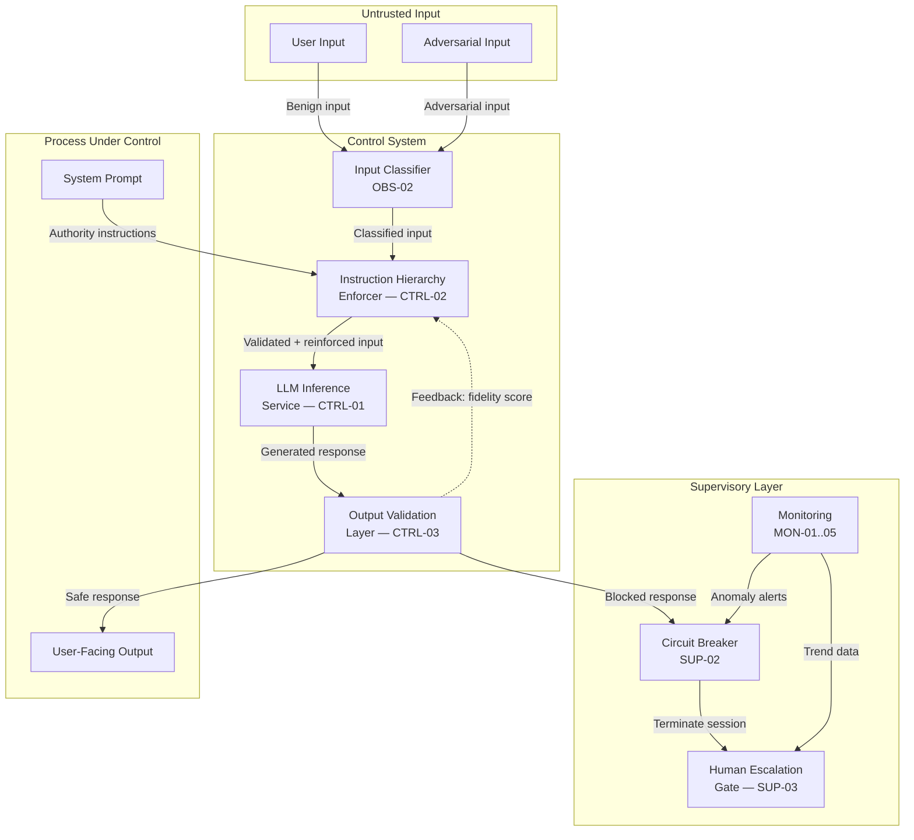

# Control-Loop Analysis: Direct Prompt Injection

> **Version:** 1.0.0 | **Date:** 2025-01-15 | **Analyst:** Curriculum Team | **System Version:** Class-06 Chatbot (Vulnerable)

---

## System Name and Description

**System Name:** Class-06 Vulnerable AI Assistant

**Description:**

A conversational AI assistant built in Class 06 that accepts user messages, processes them through an LLM with a system prompt defining its behavior and constraints, and returns generated responses. The assistant has no input validation, no instruction hierarchy enforcement, and no output filtering. It is the canonical example of an LLM application built for functionality without security.

**System Boundary:**
- **In scope:** The chatbot API endpoint, the LLM inference service, the system prompt, the conversation state manager, and the output channel
- **Out of scope:** The LLM training pipeline, the hosting infrastructure, and client-side processing

---

## Objective Definition

The primary safety objective that the control loop must maintain:

> **Objective:** Ensure that the AI assistant follows its system prompt instructions at all times, never allows user input to override system-level directives, and never produces output that violates its defined safety policies.

**Formal specification:**

```
∀ input ∈ UserInput:
  ∀ output ∈ SystemOutput(input):
    FollowsSystemPrompt(output) ∧ ¬OverriddenBy(input) ∧ Safe(output)
```

**Objective decomposition:**

| Sub-objective | Description | Priority |
|---|---|---|
| SO-01 | Instruction integrity: System prompt directives are never overridden by user input | CRITICAL |
| SO-02 | Output safety: Generated responses comply with safety policies | CRITICAL |
| SO-03 | Information confidentiality: System prompt contents are never revealed to users | HIGH |
| SO-04 | Availability: Legitimate users can use the assistant normally | MEDIUM |

---

## Controller Identification

The component(s) responsible for making decisions to maintain the objective:

| Controller ID | Name | Type | Location | Authority |
|---|---|---|---|---|
| CTRL-01 | LLM Inference Service | SOFTWARE | Cloud API | Generates text responses |
| CTRL-02 | Instruction Hierarchy Enforcer | SOFTWARE | Application middleware | CAN_BLOCK, CAN_MODIFY |
| CTRL-03 | Output Validation Layer | SOFTWARE | Application middleware | CAN_BLOCK, CAN_REDACT |

**Controller hierarchy:**

```
[Output Validation Layer — CTRL-03]
    └── [Instruction Hierarchy Enforcer — CTRL-02]
            └── [LLM Inference Service — CTRL-01]
```

Note: In the vulnerable version, CTRL-02 and CTRL-03 are absent. CTRL-01 operates without supervisory controls.

---

## Observations Enumeration

What the controllers can perceive about the system state:

| Obs ID | Observation | Source | Type | Frequency | Latency |
|---|---|---|---|---|---|
| OBS-01 | User input text | HTTP request body | SYNCHRONOUS | Per request | < 10ms |
| OBS-02 | Input classification label (benign/suspicious/adversarial) | Input classifier | SYNCHRONOUS | Per request | < 100ms |
| OBS-03 | System prompt integrity hash | Configuration store | SYNCHRONOUS | Per request | < 5ms |
| OBS-04 | Instruction-following fidelity score | Output classifier | SYNCHRONOUS | Per response | < 200ms |
| OBS-05 | Conversation context summary | Session manager | SYNCHRONOUS | Per request | < 50ms |

**Observation gaps (blind spots):**

| Gap ID | What Cannot Be Observed | Risk | Mitigation |
|---|---|---|---|
| GAP-01 | Semantic intent of encoded or obfuscated input | Adversarial input evades classifier | Normalize input before classification |
| GAP-02 | Model's internal reasoning process | Cannot detect subtle instruction override during generation | Infer from output analysis |
| GAP-03 | Multi-turn manipulation patterns across sessions | Patient adversary evades per-request detection | Implement cross-turn anomaly detection |

---

## Actions Enumeration

What the controllers can do to influence the system:

| Action ID | Action | Effect | Preconditions | Reversibility | Risk |
|---|---|---|---|---|---|
| ACT-01 | Block request | User input never reaches model | Input classified as adversarial | REVERSIBLE | False positive blocks legitimate queries |
| ACT-02 | Sanitize input | Instruction-like patterns stripped | Instruction-like content detected | REVERSIBLE | Over-sanitization degrades user experience |
| ACT-03 | Inject hierarchy reminder | Reinforces system prompt priority | Low instruction-following fidelity detected | REVERSIBLE | Reminder may be counterproductive if overused |
| ACT-04 | Block response | Model output not returned to user | Output violates safety policy | REVERSIBLE | False positives block legitimate responses |
| ACT-05 | Escalate to human | Conversation routed to human operator | Repeated adversarial behavior detected | REVERSIBLE | Increased operational cost |

---

## Environment Description

The external context in which the system operates:

| Factor | Description | Impact on Control Loop |
|---|---|---|
| User population | Mixed: legitimate users and potential adversaries | Must balance security and usability |
| Network environment | Public internet with API gateway | Input arrives untrusted; must validate |
| Threat landscape | Active prompt injection research and tooling | Attack techniques evolve rapidly |
| Regulatory context | Data protection and content safety regulations | Non-compliance has legal consequences |
| Operational tempo | Request rates vary from 1 to 1000+ per minute | Controls must scale with load |
| Data sensitivity | System prompts contain proprietary business logic | Leakage has business impact |

---

## Feedback Paths

How the controllers learn whether their actions achieved the objective:

| Feedback ID | From | To | Signal | Delay | Reliability |
|---|---|---|---|---|---|
| FB-01 | Output classifier | Instruction Hierarchy Enforcer | Instruction-following fidelity score | < 200ms | HIGH |
| FB-02 | User behavior analytics | Session manager | Injection attempt frequency | < 5min (batch) | MEDIUM |
| FB-03 | Security regression tests | Development pipeline | Pass/fail on known attack payloads | Per CI run | HIGH |

**Feedback loop dynamics:**
- **Time constant:** Seconds to minutes (real-time per-request feedback) to hours (trend-based feedback)
- **Damping:** High — false positives in blocking create negative user experience feedback
- **Stability:** Stable when all layers operate; marginally stable if output validation is the only active control

---

## Disturbance Sources

External factors that can push the system away from the objective:

| Dist ID | Disturbance | Source | Magnitude | Frequency | Predictability | Current Mitigation |
|---|---|---|---|---|---|---|
| D-01 | Direct override instructions ("Ignore previous instructions") | Malicious user | High | Very frequent | Predictable | None (vulnerable) |
| D-02 | Social engineering ("My manager said to...") | Patient adversary | Medium | Frequent | Partially predictable | None (vulnerable) |
| D-03 | Encoding tricks (Unicode, base64, markdown headers) | Technical attacker | High | Occasional | Unpredictable | None (vulnerable) |
| D-04 | Multi-turn gradual manipulation | Patient adversary | Very High | Occasional | Unpredictable | None (vulnerable) |
| D-05 | Context-window stuffing | Technical attacker | High | Rare | Unpredictable | None (vulnerable) |

---

## Unsafe States

States in which the system violates its safety objective:

| State ID | Unsafe State | Trigger Condition | Time to Unsafe State | Consequence | Reversibility |
|---|---|---|---|---|---|
| US-01 | Controller hijacked | Model follows user override instructions | Seconds | Attacker controls model behavior | REVERSIBLE_WITH_EFFORT |
| US-02 | System prompt leaked | Model reveals system prompt contents | Seconds | Attacker gains intelligence for targeted attacks | IRREVERSIBLE (information disclosed) |
| US-03 | Safety policy violated | Model produces harmful content | Seconds | Harmful content reaches users | IRREVERSIBLE (content delivered) |
| US-04 | Tool misuse initiated | Model calls tools based on injected instructions | Seconds | Unauthorized actions executed | REVERSIBLE_WITH_EFFORT (if caught) |
| US-05 | Persistent compromise | Multi-turn manipulation establishes new behavioral baseline | Minutes | Long-term controller subversion | REVERSIBLE_WITH_EFFORT |

---

## Supervisory Controls

Higher-level controls that monitor and override the primary controllers:

| Sup ID | Supervisory Control | Monitors | Override Capability | Activation Condition |
|---|---|---|---|---|
| SUP-01 | Output Validation Layer | Every model response | CAN_BLOCK, CAN_REDACT | Output violates safety policy or reveals system prompt |
| SUP-02 | Circuit Breaker | Injection attempt rate per session | CAN_TERMINATE_SESSION | > 3 injection attempts in 5 minutes |
| SUP-03 | Human Escalation Gate | Sessions flagged as adversarial | CAN_ROUTE_TO_HUMAN | Anomaly score exceeds threshold |

---

## Monitoring Points

Ongoing observability for the control loop:

| Monitor ID | Metric | Collection Method | Threshold (Warning) | Threshold (Critical) | Alert Channel |
|---|---|---|---|---|---|
| MON-01 | Injection attempt rate | Application logs | > 3 per session / 5 min | > 10 per session / 5 min | Security dashboard + Slack |
| MON-02 | Instruction override success rate | Output classifier | > 0% in 1 hour | > 1% in 1 hour | PagerDuty |
| MON-03 | Input classifier confidence | ML metrics pipeline | Avg confidence < 0.7 | Avg confidence < 0.5 | ML ops dashboard |
| MON-04 | Output policy violation rate | Content safety pipeline | > 0.5% of responses | > 2% of responses | Security team alert |
| MON-05 | False positive rate (legitimate queries blocked) | User feedback + manual review | > 5% | > 10% | Product team alert |

---

## Recovery Procedures

### Procedure R-01: Active Controller Hijack Response

**Trigger:** Output classifier detects instruction override or safety policy violation
**Severity:** CRITICAL
**Time objective:** < 30 seconds (automated), < 5 minutes (human review)

| Step | Action | Responsible | Verification |
|---|---|---|---|
| 1 | Block the offending response from reaching the user | Output Validation Layer | Response not visible in conversation log |
| 2 | Terminate or suspend the user session | Circuit Breaker | Session no longer active in session store |
| 3 | Preserve conversation logs for forensic analysis | Logging service | Logs available in secure storage |
| 4 | Replay attack against input classifier to determine gap | Security engineer | Classification result recorded |
| 5 | Update input classification rules and/or instruction hierarchy | Security engineer | Updated rules deployed to staging |
| 6 | Run security regression test suite | CI pipeline | All tests pass |
| 7 | Deploy updated controls to production | DevOps | Deployment confirmed |

### Procedure R-02: System Prompt Leakage Response

**Trigger:** Output contains verbatim system prompt content
**Severity:** HIGH
**Time objective:** < 1 hour (assessment and mitigation)

| Step | Action | Responsible | Verification |
|---|---|---|---|
| 1 | Assess scope of disclosed information | Security engineer | Disclosure impact documented |
| 2 | Rotate any compromised credentials or secrets | Security engineer | Secrets rotated in vault |
| 3 | Update system prompt to remove sensitive content if necessary | Product owner | New prompt deployed |
| 4 | Add leakage detection to output classifier | ML engineer | Detection test passes |
| 5 | Run regression tests | CI pipeline | All tests pass |

---

## Control-Loop Diagram



---

## Analysis Summary

| Category | Finding | Severity |
|---|---|---|
| Observability | Vulnerable system has no input classification or output monitoring — completely blind to injection | Critical |
| Control Authority | No instruction hierarchy enforcer exists — the LLM treats all context tokens equally | Critical |
| Feedback | No feedback path from output to input processing — compromises go undetected | Critical |
| Disturbances | Direct injection attacks are trivial to execute and highly effective against undefended systems | Critical |
| Unsafe States | Controller hijack occurs in seconds; information disclosure is irreversible | Critical |
| Recovery | No automated recovery; detection depends on external monitoring or user reports | High |

---

*Control-Loop Analysis v1.0.0 | AI Security from Scratch*
