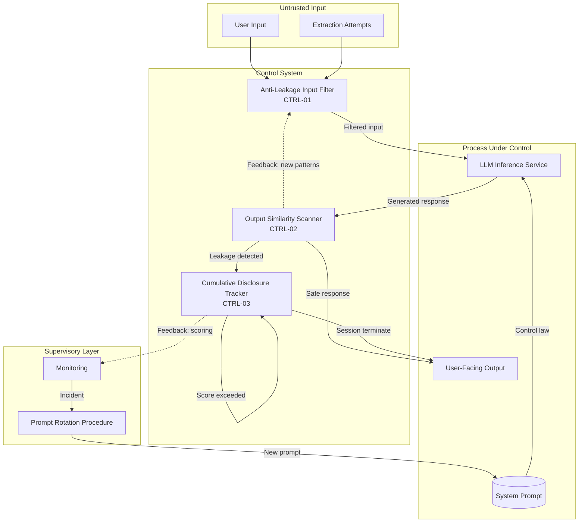

# Control-Loop Analysis: System Prompt Leakage

> **Version:** 1.0.0 | **Date:** 2025-01-15 | **Analyst:** Curriculum Team | **System Version:** LLM Chatbot with System Prompt

---

## System Name and Description

**System Name:** LLM Chatbot with Confidential System Prompt

**Description:**

A conversational AI assistant whose behavior is governed by a system prompt containing business logic, safety rules, tool configurations, and potentially sensitive internal procedures. The system prompt is the control law — it defines how the controller (the LLM) maps observations (user input) to actions (responses). The system must prevent this control law from being disclosed to users through any output channel.

**System Boundary:**
- **In scope:** The system prompt, the LLM inference service, the output channel, the conversation state manager, and all leakage detection and prevention mechanisms
- **Out of scope:** The training pipeline, model weights, and infrastructure security

---

## Objective Definition

The primary safety objective that the control loop must maintain:

> **Objective:** Ensure that the system prompt contents are never disclosed to users — neither verbatim, nor in paraphrased form, nor through cumulative information aggregation across conversation turns.

**Formal specification:**

```
∀ session ∈ UserSessions:
  ∀ turn ∈ session.turns:
    ∀ output ∈ SystemOutput(turn):
      Similarity(output, SystemPrompt) < θ_verbatim
    CumulativeSimilarity(session.outputs, SystemPrompt) < θ_cumulative
```

**Objective decomposition:**

| Sub-objective | Description | Priority |
|---|---|---|
| SO-01 | Verbatim disclosure prevention: No output contains exact system prompt text (>5 words) | CRITICAL |
| SO-02 | Paraphrase disclosure prevention: No output semantically reveals system prompt rules | CRITICAL |
| SO-03 | Cumulative disclosure prevention: No session reveals enough fragments to reconstruct the prompt | HIGH |
| SO-04 | Behavioral inference resistance: Model behavior does not trivially reveal prompt rules | MEDIUM |

---

## Controller Identification

The component(s) responsible for making decisions to maintain the objective:

| Controller ID | Name | Type | Location | Authority |
|---|---|---|---|---|
| CTRL-01 | Anti-Leakage Input Filter | SOFTWARE | Application middleware | CAN_BLOCK, CAN_FLAG |
| CTRL-02 | Output Similarity Scanner | SOFTWARE | Post-generation pipeline | CAN_BLOCK, CAN_REDACT |
| CTRL-03 | Cumulative Disclosure Tracker | SOFTWARE | Session manager | CAN_TERMINATE_SESSION |

**Controller hierarchy:**

```
[Cumulative Disclosure Tracker — CTRL-03]
    └── [Output Similarity Scanner — CTRL-02]
            └── [Anti-Leakage Input Filter — CTRL-01]
                    └── [LLM Inference Service]
```

---

## Observations Enumeration

What the controllers can perceive about the system state:

| Obs ID | Observation | Source | Type | Frequency | Latency |
|---|---|---|---|---|---|
| OBS-01 | User input text | HTTP request | SYNCHRONOUS | Per request | < 10ms |
| OBS-02 | Extraction-attempt classification | Input classifier | SYNCHRONOUS | Per request | < 100ms |
| OBS-03 | Output-to-prompt similarity score | Output scanner | SYNCHRONOUS | Per response | < 200ms |
| OBS-04 | Cumulative disclosure score | Session tracker | SYNCHRONOUS | Per response | < 50ms |
| OBS-05 | Conversation topic classification | Intent classifier | SYNCHRONOUS | Per request | < 150ms |

**Observation gaps (blind spots):**

| Gap ID | What Cannot Be Observed | Risk | Mitigation |
|---|---|---|---|
| GAP-01 | Semantic equivalence in paraphrased leakage | Paraphrased rules go undetected | Use embedding-based semantic similarity |
| GAP-02 | Cross-session extraction by same user | Attacker uses multiple sessions to avoid cumulative tracking | Cross-session user tracking with consent |
| GAP-03 | Behavioral inferences from model refusals | Refusal patterns reveal what's forbidden | Normalize refusal responses |

---

## Actions Enumeration

What the controllers can do to influence the system:

| Action ID | Action | Effect | Preconditions | Reversibility | Risk |
|---|---|---|---|---|---|
| ACT-01 | Block extraction-attempt input | User input never reaches model | Input classified as extraction attempt | REVERSIBLE | False positive blocks legitimate queries |
| ACT-02 | Redact leaked content in output | Prompt fragments replaced with [REDACTED] | Output similarity exceeds low threshold | REVERSIBLE | Over-redaction degrades response quality |
| ACT-03 | Block full output | Response not returned to user | Output similarity exceeds high threshold | REVERSIBLE | False positive blocks legitimate responses |
| ACT-04 | Terminate session | Conversation ended, cumulative score reset | Cumulative disclosure score exceeds threshold | IRREVERSIBLE (session) | User frustration |
| ACT-05 | Rotate system prompt | New prompt deployed | Confirmed leakage incident | REVERSIBLE | Operational disruption |

---

## Environment Description

The external context in which the system operates:

| Factor | Description | Impact on Control Loop |
|---|---|---|
| User population | Mix of legitimate users, curious users, and adversaries | Must balance openness with protection |
| Threat landscape | Active research on prompt extraction techniques | Attack methods continuously evolving |
| Data sensitivity | System prompts contain business logic and possibly credentials | Disclosure has financial and security impact |
| Regulatory context | Data protection regulations may apply to prompt contents | Non-compliance has legal consequences |
| Competitive context | Competitors may attempt to extract proprietary logic | Business impact of IP disclosure |

---

## Feedback Paths

How the controllers learn whether their actions achieved the objective:

| Feedback ID | From | To | Signal | Delay | Reliability |
|---|---|---|---|---|---|
| FB-01 | Output scanner | Input filter | Extraction pattern that succeeded | < 1 hour (batch) | HIGH |
| FB-02 | Cumulative tracker | Session manager | Session disclosure score trajectory | Real-time | HIGH |
| FB-03 | Incident reports | Prompt designer | Confirmed leakage → prompt redesign | < 1 day | MEDIUM |

**Feedback loop dynamics:**
- **Time constant:** Real-time for per-response scanning; minutes for cumulative tracking; days for prompt redesign
- **Damping:** High — false positive redactions create negative user experience feedback
- **Stability:** Stable when all layers operate; marginally stable if only output scanning is active (cumulative extraction can still succeed)

---

## Disturbance Sources

External factors that can push the system away from the objective:

| Dist ID | Disturbance | Source | Magnitude | Frequency | Predictability | Current Mitigation |
|---|---|---|---|---|---|---|
| D-01 | Direct extraction queries | Any user | High | Very frequent | Predictable | Anti-leakage input filter |
| D-02 | Translation exfiltration | Technical attacker | High | Frequent | Partially predictable | Intent classification |
| D-03 | Paraphrase extraction | Sophisticated attacker | Medium | Occasional | Unpredictable | Semantic similarity scanner |
| D-04 | Cumulative multi-turn extraction | Patient adversary | Very High | Occasional | Unpredictable | Cumulative disclosure tracker |
| D-05 | Behavioral inference | Expert adversary | Medium | Rare | Unpredictable | Normalized refusal responses |

---

## Unsafe States

States in which the system violates its safety objective:

| State ID | Unsafe State | Trigger Condition | Time to Unsafe State | Consequence | Reversibility |
|---|---|---|---|---|---|
| US-01 | Verbatim prompt disclosed | Model outputs exact prompt text | Seconds | Complete control law exposure | IRREVERSIBLE |
| US-02 | Key rules paraphrased | Model describes prompt rules in own words | Seconds | Effective control law exposure | IRREVERSIBLE |
| US-03 | Cumulative threshold exceeded | Multiple turns reveal prompt fragments | Minutes | Reconstructed control law | IRREVERSIBLE |
| US-04 | Credentials embedded in prompt leaked | Model outputs API keys or secrets | Seconds | Compromised credentials | IRREVERSIBLE (must rotate) |
| US-05 | Behavioral boundaries mapped | Attacker infers rules from refusal patterns | Minutes-Hours | Approximate control law | IRREVERSIBLE |

---

## Supervisory Controls

Higher-level controls that monitor and override the primary controllers:

| Sup ID | Supervisory Control | Monitors | Override Capability | Activation Condition |
|---|---|---|---|---|
| SUP-01 | Output Similarity Scanner | Every model response | CAN_BLOCK, CAN_REDACT | Response similarity > threshold |
| SUP-02 | Cumulative Disclosure Tracker | Full conversation history | CAN_TERMINATE_SESSION | Cumulative score > threshold |
| SUP-03 | Prompt Rotation Procedure | Leakage incidents | CAN_REPLACE_PROMPT | Confirmed disclosure incident |

---

## Monitoring Points

Ongoing observability for the control loop:

| Monitor ID | Metric | Collection Method | Threshold (Warning) | Threshold (Critical) | Alert Channel |
|---|---|---|---|---|---|
| MON-01 | Output-to-prompt similarity score | Embedding comparison | > 0.3 | > 0.6 | Security dashboard |
| MON-02 | Extraction attempt rate | Input classifier logs | > 2 per session | > 5 per session | Session monitor alert |
| MON-03 | Cumulative disclosure score per session | Session tracker | > 0.4 | > 0.7 | PagerDuty |
| MON-04 | False positive rate (legitimate responses blocked) | Manual review sampling | > 5% | > 10% | Product team alert |
| MON-05 | Prompt rotation frequency | Incident tracker | > 0 per month | > 1 per month | Security team review |

---

## Recovery Procedures

### Procedure R-01: Confirmed Prompt Leakage Response

**Trigger:** Output scanner detects verbatim or high-similarity system prompt content
**Severity:** CRITICAL
**Time objective:** < 5 minutes (automated containment), < 1 hour (full remediation)

| Step | Action | Responsible | Verification |
|---|---|---|---|
| 1 | Block the response containing leaked content | Output Scanner | Response not delivered to user |
| 2 | Assess scope — what specific content was disclosed | Security engineer | Disclosure log updated |
| 3 | Rotate any credentials or secrets that were in the disclosed prompt | Security engineer | Secrets rotated in vault |
| 4 | Update the system prompt to remove unnecessary sensitive content | Prompt designer | New prompt deployed to staging |
| 5 | Update extraction-pattern detection rules | Security engineer | Updated patterns in production |
| 6 | Run security regression test suite | CI pipeline | All leakage tests pass |
| 7 | Deploy updated controls to production | DevOps | Deployment confirmed |

### Procedure R-02: Cumulative Disclosure Threshold Exceeded

**Trigger:** Cumulative disclosure score exceeds threshold
**Severity:** HIGH
**Time objective:** < 15 minutes

| Step | Action | Responsible | Verification |
|---|---|---|---|
| 1 | Terminate the user session | Cumulative Tracker | Session no longer active |
| 2 | Review conversation to assess what was disclosed | Security engineer | Assessment documented |
| 3 | Determine if prompt redesign is necessary | Prompt designer | Decision documented |
| 4 | Adjust cumulative scoring thresholds if needed | ML engineer | Updated thresholds deployed |

---

## Control-Loop Diagram



---

## Analysis Summary

| Category | Finding | Severity |
|---|---|---|
| Observability | Output scanning can detect verbatim leaks but paraphrased and cumulative leakage are harder to observe | High |
| Control Authority | Output scanner can block responses but cannot prevent the model from generating leaked content | Medium |
| Feedback | Limited feedback from successful extractions back to input filter; relies on batch updates | Medium |
| Disturbances | Translation and paraphrase extraction are difficult to detect at the input stage | High |
| Unsafe States | Information disclosure is irreversible; prompt rotation is the only recovery | Critical |
| Recovery | Automated containment works for verbatim leaks; cumulative extraction requires session termination | High |

---

*Control-Loop Analysis v1.0.0 | AI Security from Scratch*
