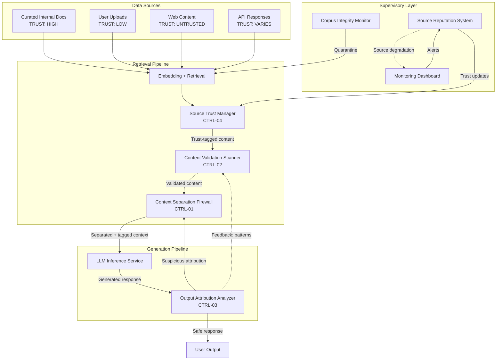

# Control-Loop Analysis: Indirect Prompt Injection

> **Version:** 1.0.0 | **Date:** 2025-01-15 | **Analyst:** Curriculum Team | **System Version:** RAG Document Q&A System

---

## System Name and Description

**System Name:** RAG Document Q&A System

**Description:**

A retrieval-augmented generation (RAG) system that answers user questions by retrieving relevant documents from a corpus and including them in the LLM's context. The system consists of a document store, an embedding-based retrieval pipeline, and an LLM inference service. Documents come from multiple sources: curated internal documents, user uploads, and web-crawled content.

**System Boundary:**
- **In scope:** The retrieval pipeline, the document store, the context composition logic, the LLM inference service, and all validation and separation mechanisms
- **Out of scope:** The document ingestion pipeline (addressed in Phase 3), the LLM training process, and infrastructure security

---

## Objective Definition

The primary safety objective that the control loop must maintain:

> **Objective:** Ensure that content retrieved from external data sources is treated as data to be processed and never as instructions to be followed, and that the model's behavior is governed exclusively by its system prompt regardless of retrieved content.

**Formal specification:**

```
∀ query ∈ UserQueries:
  ∀ doc ∈ RetrievedDocs(query):
    ∀ output ∈ SystemOutput(query, doc):
      GovernedBy(output, SystemPrompt) ∧ ¬InfluencedByInstructionsIn(output, doc)
```

**Objective decomposition:**

| Sub-objective | Description | Priority |
|---|---|---|
| SO-01 | Retrieved content never overrides system prompt instructions | CRITICAL |
| SO-02 | Instruction-like content in retrieved documents is detected and neutralized | CRITICAL |
| SO-03 | Data sources are classified by trust level with appropriate validation | HIGH |
| SO-04 | Model output attribution can identify retrieval-driven behavior | HIGH |

---

## Controller Identification

The component(s) responsible for making decisions to maintain the objective:

| Controller ID | Name | Type | Location | Authority |
|---|---|---|---|---|
| CTRL-01 | Context Separation Firewall | SOFTWARE | Retrieval pipeline | CAN_SANITIZE, CAN_TAG, CAN_BLOCK |
| CTRL-02 | Content Validation Scanner | SOFTWARE | Retrieval pipeline | CAN_FLAG, CAN_BLOCK |
| CTRL-03 | Output Attribution Analyzer | SOFTWARE | Post-generation | CAN_BLOCK, CAN_FLAG |
| CTRL-04 | Source Trust Manager | SOFTWARE | Data management | CAN_DEGRADE_TRUST, CAN_BLOCK_SOURCE |

**Controller hierarchy:**

```
[Source Trust Manager — CTRL-04]
    └── [Content Validation Scanner — CTRL-02]
            └── [Context Separation Firewall — CTRL-01]
                    └── [LLM Inference Service]
                            └── [Output Attribution Analyzer — CTRL-03]
```

---

## Observations Enumeration

What the controllers can perceive about the system state:

| Obs ID | Observation | Source | Type | Frequency | Latency |
|---|---|---|---|---|---|
| OBS-01 | Retrieved document content | Retrieval pipeline | SYNCHRONOUS | Per retrieval | < 500ms |
| OBS-02 | Content classification (data vs. instruction-like) | Content scanner | SYNCHRONOUS | Per retrieval | < 200ms |
| OBS-03 | Source trust level | Source registry | SYNCHRONOUS | Per retrieval | < 10ms |
| OBS-04 | Context window composition | Context manager | SYNCHRONOUS | Per request | < 10ms |
| OBS-05 | Output attribution scores | Attribution analyzer | SYNCHRONOUS | Per response | < 300ms |

**Observation gaps (blind spots):**

| Gap ID | What Cannot Be Observed | Risk | Mitigation |
|---|---|---|---|
| GAP-01 | Semantic intent of subtly encoded instructions in retrieved content | Sophisticated indirect injection evades scanner | Combine pattern matching with output monitoring |
| GAP-02 | Cross-document instruction composition | Instructions split across multiple retrieved chunks | Aggregate scanning of full retrieval set |
| GAP-03 | Delayed instruction activation | Instructions that trigger only under specific query conditions | Query-aware content validation |

---

## Actions Enumeration

What the controllers can do to influence the system:

| Action ID | Action | Effect | Preconditions | Reversibility | Risk |
|---|---|---|---|---|---|
| ACT-01 | Tag retrieved content as untrusted data | Content wrapped in delimiters + explicit data markers | Any retrieval from non-curated source | REVERSIBLE | None (additive) |
| ACT-02 | Sanitize instruction-like content | Strip or neutralize imperative patterns | Instruction-like content detected | REVERSIBLE | May degrade retrieval quality |
| ACT-03 | Block retrieval from untrusted source | Content from source not included in context | Source trust below threshold | REVERSIBLE | Reduces available information |
| ACT-04 | Limit retrieval volume | Cap number/size of retrieved chunks | High volume of retrieval hits | REVERSIBLE | May miss relevant information |
| ACT-05 | Block response with high retrieval influence | Response not returned when attribution is suspicious | Output attribution exceeds threshold | REVERSIBLE | False positives block valid responses |

---

## Environment Description

The external context in which the system operates:

| Factor | Description | Impact on Control Loop |
|---|---|---|
| Data sources | Mix of curated internal docs, user uploads, and web content | Multiple trust levels require graduated defenses |
| Document corpus size | 100K+ documents, growing daily | Cannot manually review all content |
| User population | Internal employees + external users | Varying privilege levels |
| Threat landscape | Active research on indirect injection in RAG systems | Attack techniques evolving |
| Tool access | LLM can call search, database, and API tools | Amplifies impact of successful injection |

---

## Feedback Paths

How the controllers learn whether their actions achieved the objective:

| Feedback ID | From | To | Signal | Delay | Reliability |
|---|---|---|---|---|---|
| FB-01 | Output attribution analyzer | Content scanner | New instruction pattern detected in output | < 1 hour | HIGH |
| FB-02 | Source reputation system | Source trust manager | Source associated with suspicious outputs | < 1 day | MEDIUM |
| FB-03 | Security regression tests | Development pipeline | Known attack patterns blocked/not blocked | Per CI run | HIGH |

**Feedback loop dynamics:**
- **Time constant:** Real-time for per-retrieval scanning; hours for source reputation updates; days for scanner retraining
- **Damping:** Moderate — false positive sanitization reduces retrieval quality but does not cascade
- **Stability:** Stable when all layers operate; marginally stable if only output monitoring is active

---

## Disturbance Sources

External factors that can push the system away from the objective:

| Dist ID | Disturbance | Source | Magnitude | Frequency | Predictability | Current Mitigation |
|---|---|---|---|---|---|---|
| D-01 | Poisoned documents in RAG corpus | Adversary with upload access | Very High | Occasional | Unpredictable | Content scanning + source trust |
| D-02 | Malicious web pages | Public internet | High | Frequent | Partially predictable | Source trust (untrusted) + sanitization |
| D-03 | Compromised API responses | Supply chain | Very High | Rare | Unpredictable | Response validation |
| D-04 | User-uploaded files with hidden instructions | Malicious user | High | Occasional | Unpredictable | Upload scanning + low trust level |
| D-05 | Cross-document instruction composition | Sophisticated adversary | Very High | Rare | Unpredictable | Aggregate scanning |

---

## Unsafe States

States in which the system violates its safety objective:

| State ID | Unsafe State | Trigger Condition | Time to Unsafe State | Consequence | Reversibility |
|---|---|---|---|---|---|
| US-01 | Retrieved instructions override system prompt | Model follows instructions in retrieved document | Seconds | Attacker controls model behavior | REVERSIBLE_WITH_EFFORT |
| US-02 | Data exfiltration via retrieval-influenced tool calls | Model sends data to attacker-controlled endpoint | Seconds | Data breach | IRREVERSIBLE |
| US-03 | Persistent poisoning of corpus | Multiple documents contain coordinated instructions | Weeks | Scalable, persistent attack | REVERSIBLE_WITH_EFFORT (purge and re-validate) |
| US-04 | Source trust degradation spiral | Legitimate sources flagged due to false positives | Days | Reduced retrieval quality | REVERSIBLE_WITH_EFFORT |
| US-05 | User trust erosion | Users receive manipulated responses | Ongoing | Loss of system credibility | DIFFICULT |

---

## Supervisory Controls

Higher-level controls that monitor and override the primary controllers:

| Sup ID | Supervisory Control | Monitors | Override Capability | Activation Condition |
|---|---|---|---|---|
| SUP-01 | Output Attribution Analyzer | Every model response for retrieval influence | CAN_BLOCK | Attribution score > threshold |
| SUP-02 | Source Reputation System | Source quality over time | CAN_DEGRADE_TRUST, CAN_BLOCK_SOURCE | Source associated with suspicious outputs |
| SUP-03 | Corpus Integrity Monitor | Document corpus for known malicious patterns | CAN_QUARANTINE_DOCUMENTS | Malicious content pattern detected |

---

## Monitoring Points

Ongoing observability for the control loop:

| Monitor ID | Metric | Collection Method | Threshold (Warning) | Threshold (Critical) | Alert Channel |
|---|---|---|---|---|---|
| MON-01 | Instruction-like content rate in retrievals | Content scanner logs | > 5% of chunks | > 15% of chunks | Data team alert |
| MON-02 | Retrieval-to-output influence score | Attribution analyzer | > 0.5 per response | > 0.8 per response | Security dashboard |
| MON-03 | Source trust level distribution | Source registry | > 20% sources at low trust | > 40% sources at low trust | Data team alert |
| MON-04 | Retrieval-driven policy violations | Output classifier | > 0.1% of responses | > 0.5% of responses | PagerDuty |
| MON-05 | Corpus poisoning indicators | Integrity monitor | Any confirmed poison | Any confirmed poison | Critical security alert |

---

## Recovery Procedures

### Procedure R-01: Document Corpus Poisoning Response

**Trigger:** Content scanner or output attribution detects malicious retrieved content
**Severity:** CRITICAL
**Time objective:** < 30 minutes (containment), < 4 hours (full remediation)

| Step | Action | Responsible | Verification |
|---|---|---|---|
| 1 | Quarantine the identified document(s) | Corpus Integrity Monitor | Document no longer retrieved |
| 2 | Block responses influenced by the malicious content | Output Attribution Analyzer | No compromised responses delivered |
| 3 | Assess scope — how many users were affected, what actions were taken | Security engineer | Impact assessment documented |
| 4 | Scan entire corpus for similar patterns | Security engineer + automated scanner | Full corpus scan completed |
| 5 | Update content scanner with new injection pattern | ML engineer | Updated scanner deployed |
| 6 | Run security regression test suite | CI pipeline | All tests pass |
| 7 | Restore quarantined documents if false positive | Data team | Documents back in corpus |

### Procedure R-02: Source Compromise Response

**Trigger:** Source reputation system detects a trusted source producing suspicious content
**Severity:** HIGH
**Time objective:** < 1 hour

| Step | Action | Responsible | Verification |
|---|---|---|---|
| 1 | Degrade source trust level to "untrusted" | Source Trust Manager | Source flagged in registry |
| 2 | Apply strict validation to all content from the source | Content Scanner | Validation rules active |
| 3 | Investigate the source for compromise | Security engineer | Investigation report |
| 4 | Restore trust if source is clean; block if compromised | Security engineer | Decision documented |

---

## Control-Loop Diagram



---

## Analysis Summary

| Category | Finding | Severity |
|---|---|---|
| Observability | Content scanning can detect obvious instruction patterns but misses subtle and encoded instructions | High |
| Control Authority | Context separation firewall can tag content but cannot prevent the model from reading it as instruction | Medium |
| Feedback | Attribution analysis provides post-hoc detection but not prevention; feedback to scanner is delayed | Medium |
| Disturbances | RAG corpus poisoning is high-magnitude and can affect many users; web content is inherently untrusted | Critical |
| Unsafe States | Data exfiltration through tool calls is irreversible; corpus poisoning is persistent and scalable | Critical |
| Recovery | Document quarantine is effective but full corpus re-scan is time-consuming for large corpora | High |

---

*Control-Loop Analysis v1.0.0 | AI Security from Scratch*
