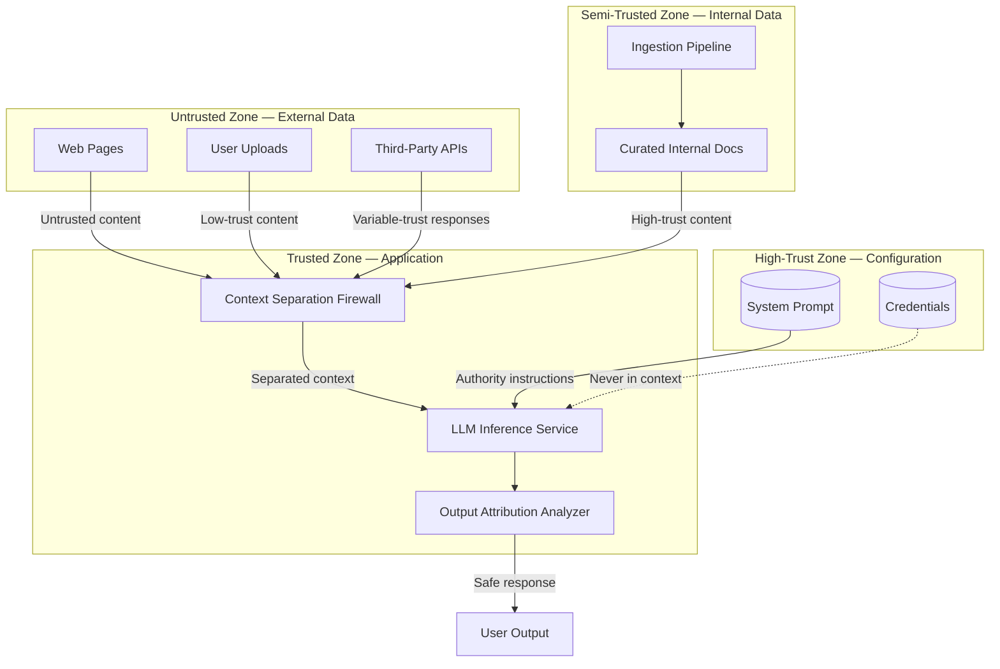

# Threat Model: Indirect Prompt Injection via RAG

> **Version:** 1.0.0 | **Date:** 2025-01-15 | **Author:** Curriculum Team | **Classification:** PUBLIC

---

## System Description

A retrieval-augmented generation (RAG) system that answers user questions by retrieving documents from a mixed-trust corpus (curated internal, user-uploaded, and web-crawled) and including them in the LLM's context. The system must prevent retrieved content from acting as instructions that override the system prompt.

**System Purpose:** Provide accurate, grounded answers to user questions based on a document corpus while ensuring that retrieved content never controls the model's behavior.

**Key Components:**
- Document store with mixed-trust sources
- Embedding-based retrieval pipeline
- Context composition engine (combining system prompt, retrieved docs, and user query)
- LLM inference service
- Context separation firewall
- Content validation scanner
- Output attribution analyzer

**Deployment Model:** Cloud-hosted API service

**Users/Stakeholders:**
- End users asking questions (not attackers in the indirect model)
- Data engineers managing document ingestion
- Adversaries who have compromised data sources
- Security team monitoring for retrieval-driven attacks

---

## Control-Loop Decomposition

| Loop ID | Objective | Controller | Key Observation | Key Action |
|---|---|---|---|---|
| CL-01 | Prevent retrieved instructions from overriding system prompt | Context Separation Firewall | Retrieved content classification | Tag + separate retrieved content |
| CL-02 | Detect instruction-like content in retrieval results | Content Validation Scanner | Instruction-pattern detection | Flag or sanitize content |
| CL-03 | Attribute model behavior to retrieval influence | Output Attribution Analyzer | Retrieval-to-output influence score | Block high-influence responses |

---

## Asset Inventory

| Asset ID | Asset Name | Type | Classification | Owner | Location |
|---|---|---|---|---|---|
| A-01 | Document corpus | DATA | INTERNAL | Data team | Document store |
| A-02 | System prompt | DATA | CONFIDENTIAL | Prompt designer | Application config |
| A-03 | User query history | DATA | INTERNAL | Application | Session store |
| A-04 | Retrieval index (embeddings) | MODEL | INTERNAL | ML team | Vector database |
| A-05 | Tool API credentials | CREDENTIAL | RESTRICTED | Security team | Secrets store |

---

## Trust Boundaries

### Trust Boundary Diagram

### Trust Boundary Descriptions

| Boundary | Zones Separated | Crossing Mechanism | Enforcement |
|---|---|---|---|
| TB-01 | External Data → Application | Content validation + trust tagging | Content Scanner + Source Trust |
| TB-02 | Internal Data → Application | Provenance verification + periodic auditing | Ingestion pipeline validation |
| TB-03 | Application → Output | Attribution analysis + output validation | Output Attribution Analyzer |
| TB-04 | Configuration → Application | Service-to-service auth | IAM roles |

---

## Threat Identification

| Threat ID | Component | Attack Vector | Impact | Likelihood | Risk |
|---|---|---|---|---|---|
| T-01 | Document corpus | Poisoned document with embedded instructions in RAG corpus | Model follows attacker instructions when doc retrieved | H | Critical |
| T-02 | Web browsing tool | Malicious web page with hidden instruction text | Model follows hidden instructions from web page | M | High |
| T-03 | API responses | Compromised third-party API returns instruction payload | Model follows instructions in API response | M | High |
| T-04 | User upload feature | Malicious file upload contains hidden prompt injection | Model follows instructions when file is processed | H | Critical |
| T-05 | Embedding index | Adversarial embeddings crafted to match specific queries | Targeted retrieval of poisoned documents | L | Medium |
| T-06 | Cross-document composition | Instructions split across multiple retrieved chunks | Combined chunks form complete injection payload | L | Medium |
| T-07 | Data exfiltration | Retrieved content instructs model to exfiltrate data via tool calls | Sensitive data sent to attacker-controlled endpoint | M | Critical |
| T-08 | Tool call manipulation | Retrieved content instructs model to call tools with specific parameters | Unauthorized tool execution | M | Critical |

---

## Unsafe States Enumeration

| State ID | Unsafe State | Condition | Consequence | Detection Method |
|---|---|---|---|---|
| US-01 | Retrieved instructions override system prompt | Model follows instructions found in retrieved content | Attacker controls model via data source | Output attribution analysis |
| US-02 | Data exfiltration via tool calls | Model sends sensitive data to attacker-controlled endpoint | Data breach | Tool call parameter monitoring |
| US-03 | Unauthorized tool execution | Model calls tools based on retrieved instructions | Real-world damage (transactions, deletions, etc.) | Tool call authorization check |
| US-04 | Persistent corpus poisoning | Multiple documents contain coordinated instructions | Scalable, persistent attack on all users | Corpus integrity monitoring |
| US-05 | Reputation damage from manipulated responses | Model produces inaccurate or harmful responses due to retrieval | User trust erosion | User feedback + output audit |

---

## Existing Controls

| Control ID | Threat(s) Mitigated | Control Type | Implementation | Effectiveness |
|---|---|---|---|---|
| C-01 | T-01, T-04 | Preventive | Content validation scanner for retrieved documents | MEDIUM (pattern-based, evadable) |
| C-02 | T-01, T-02, T-04 | Preventive | Context separation firewall with trust tagging | MEDIUM (structural separation but model may still follow) |
| C-03 | T-07, T-08 | Detective | Output attribution analyzer | MEDIUM (post-hoc detection) |
| C-04 | T-01 | Preventive | Source trust levels with graduated validation | HIGH (reduces attack surface significantly) |
| C-05 | T-02 | Preventive | Web content stripped of hidden elements before retrieval | MEDIUM (cannot catch all encoding tricks) |

---

## Residual Risks

| Residual Risk ID | Original Threat | Why Not Fully Mitigated | Acceptance Rationale | Monitoring |
|---|---|---|---|---|
| RR-01 | T-01, T-04 | Content scanner cannot detect all instruction encoding variants | Accept; rely on output attribution as backup | Monitor attribution scores; update scanner weekly |
| RR-02 | T-05 | Adversarial embeddings can be crafted to target specific queries | Accept; mitigate with retrieval diversity requirements | Monitor retrieval pattern anomalies |
| RR-03 | T-06 | Cross-document composition is inherently difficult to detect per-document | Accept; mitigate with retrieval volume limits | Monitor for coordinated multi-retrieval patterns |

---

## Recommendations

| Priority | Recommendation | Threats Addressed | Estimated Effort | Control Type |
|---|---|---|---|---|
| P1 (Critical) | Deploy context separation firewall with structural delimiters and explicit data markers | T-01, T-02, T-04 | 2 sprints | Preventive |
| P1 (Critical) | Implement source trust system with graduated validation | T-01, T-04 | 2 sprints | Preventive |
| P2 (High) | Add output attribution analyzer to detect retrieval-driven behavior | T-07, T-08 | 2 sprints | Detective |
| P2 (High) | Sanitize web content before retrieval (strip hidden elements, normalize formatting) | T-02 | 1 sprint | Preventive |
| P3 (Medium) | Implement retrieval volume limits and diversity requirements | T-05, T-06 | 1 sprint | Preventive |
| P4 (Low) | Add cross-document composition detection | T-06 | 2-3 sprints | Detective |

---

## Review History

| Date | Reviewer | Changes | Approved |
|---|---|---|---|
| 2025-01-15 | Curriculum Team | Initial threat model for Class 09 | YES |

---

*Threat Model v1.0.0 | AI Security from Scratch*
