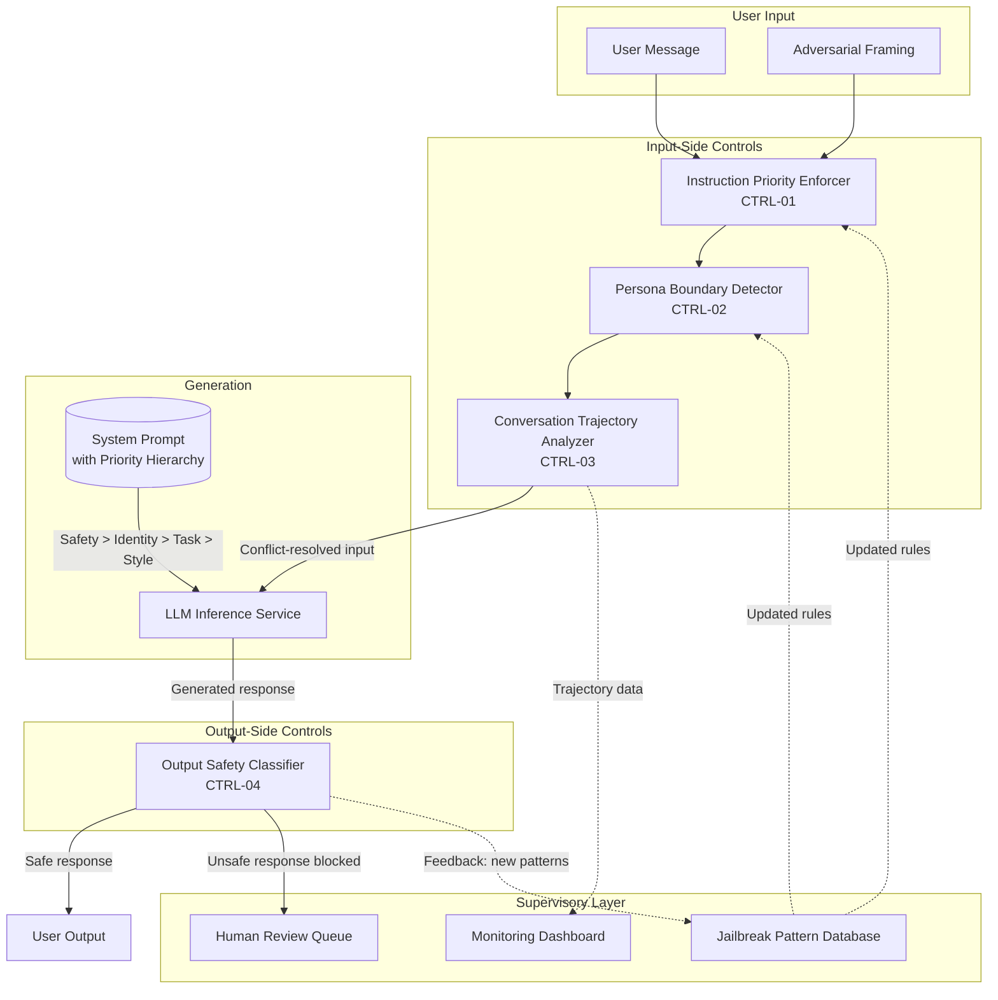

# Control-Loop Analysis: Jailbreaks and Instruction Conflicts

> **Version:** 1.0.0 | **Date:** 2025-01-15 | **Analyst:** Curriculum Team | **System Version:** LLM Chatbot with Safety Alignment

---

## System Name and Description

**System Name:** Safety-Aligned LLM Chatbot

**Description:**

A conversational AI assistant with safety alignment training that is designed to be both helpful and safe. The system prompt defines behavioral constraints, and the model has been fine-tuned to refuse harmful requests. However, the system lacks explicit instruction priority enforcement — when safety and helpfulness instructions conflict, the model resolves the conflict based on contextual salience rather than a fixed hierarchy.

**System Boundary:**
- **In scope:** The system prompt, the instruction hierarchy logic, the conversation state, the safety classification pipeline, and the output channel
- **Out of scope:** The model training pipeline, the alignment training process, and infrastructure security

---

## Objective Definition

The primary safety objective that the control loop must maintain:

> **Objective:** Ensure that when safety and helpfulness instructions conflict, safety always takes precedence, and that the model never produces output violating its safety policy regardless of the framing, persona, or conversation context.

**Formal specification:**

```
∀ input ∈ UserInput:
  ∀ output ∈ SystemOutput(input):
    Safe(output) ∧ (Conflicting(input) → SafetyOverridesHelpfulness(output))
```

**Objective decomposition:**

| Sub-objective | Description | Priority |
|---|---|---|
| SO-01 | Safety-first conflict resolution: Safety always overrides helpfulness | CRITICAL |
| SO-02 | Persona boundary enforcement: No persona can bypass safety constraints | CRITICAL |
| SO-03 | Fictionality boundary enforcement: Fictional framing does not exempt safety rules | HIGH |
| SO-04 | Multi-turn manipulation resistance: Conversation trajectories toward jailbreak are detected and blocked | HIGH |

---

## Controller Identification

The component(s) responsible for making decisions to maintain the objective:

| Controller ID | Name | Type | Location | Authority |
|---|---|---|---|---|
| CTRL-01 | Instruction Priority Enforcer | SOFTWARE | Application middleware | CAN_RESOLVE_CONFLICTS, CAN_BLOCK |
| CTRL-02 | Persona Boundary Detector | SOFTWARE | Input pipeline | CAN_BLOCK_PERSONA_ADOPTION |
| CTRL-03 | Conversation Trajectory Analyzer | SOFTWARE | Session manager | CAN_INJECT_REMINDER, CAN_ESCALATE |
| CTRL-04 | Output Safety Classifier | SOFTWARE | Post-generation | CAN_BLOCK, CAN_REPLACE |

**Controller hierarchy:**

```
[Output Safety Classifier — CTRL-04]
    └── [Conversation Trajectory Analyzer — CTRL-03]
            └── [Persona Boundary Detector — CTRL-02]
                    └── [Instruction Priority Enforcer — CTRL-01]
                            └── [LLM Inference Service]
```

---

## Observations Enumeration

What the controllers can perceive about the system state:

| Obs ID | Observation | Source | Type | Frequency | Latency |
|---|---|---|---|---|---|
| OBS-01 | Instruction conflict signals | Input + context analyzer | SYNCHRONOUS | Per request | < 100ms |
| OBS-02 | Persona adoption detection | Input classifier | SYNCHRONOUS | Per request | < 100ms |
| OBS-03 | Conversation trajectory score | Session analyzer | SYNCHRONOUS | Per turn | < 200ms |
| OBS-04 | Output safety classification | Output classifier | SYNCHRONOUS | Per response | < 200ms |
| OBS-05 | Fictionality frame detection | Input classifier | SYNCHRONOUS | Per request | < 100ms |

**Observation gaps (blind spots):**

| Gap ID | What Cannot Be Observed | Risk | Mitigation |
|---|---|---|---|
| GAP-01 | Model's internal conflict resolution process | Cannot predict which instruction will win | Infer from output classification |
| GAP-02 | Subtle persona adoption through behavior rather than explicit request | Gradual persona shift undetected | Track behavioral patterns across turns |
| GAP-03 | Novel jailbreak techniques not in training data | Unknown attack patterns succeed | Output safety classification as universal backstop |

---

## Actions Enumeration

What the controllers can do to influence the system:

| Action ID | Action | Effect | Preconditions | Reversibility | Risk |
|---|---|---|---|---|---|
| ACT-01 | Enforce safety-first priority | Resolves conflicts in favor of safety | Instruction conflict detected | REVERSIBLE | May over-restrict legitimate edge cases |
| ACT-02 | Block persona adoption | Prevents model from adopting unsafe personas | Unauthorized persona detected | REVERSIBLE | May block creative/legitimate role-play |
| ACT-03 | Inject safety reminder | Reinforces safety constraints | Trajectory analysis shows drift | REVERSIBLE | May be counterproductive if overused |
| ACT-04 | Block unsafe output | Response not delivered to user | Output classified as unsafe | REVERSIBLE | False positives degrade user experience |
| ACT-05 | Replace with safe fallback | Unsafe output replaced with safe alternative | Output classified as unsafe | REVERSIBLE | May produce awkward transitions |

---

## Environment Description

The external context in which the system operates:

| Factor | Description | Impact on Control Loop |
|---|---|---|
| User expectations | Users expect helpfulness and may be frustrated by refusals | Tension between safety and user satisfaction |
| Threat landscape | Active research and community sharing of jailbreak techniques | Attack techniques evolve rapidly |
| Regulatory context | Content safety regulations require blocking harmful output | Non-compliance has legal consequences |
| Competitive context | Competitors may be less restrictive, attracting users | Business pressure to be more permissive |
| Use case diversity | Users range from students to professionals with legitimate edge-case needs | Hard to distinguish jailbreaks from legitimate use |

---

## Feedback Paths

How the controllers learn whether their actions achieved the objective:

| Feedback ID | From | To | Signal | Delay | Reliability |
|---|---|---|---|---|---|
| FB-01 | Output safety classifier | Instruction Priority Enforcer | Jailbreak success → missing conflict rule | < 1 day | HIGH |
| FB-02 | Trajectory analyzer | Persona Boundary Detector | Persona shift pattern in successful jailbreaks | < 1 week | MEDIUM |
| FB-03 | Security regression tests | Development pipeline | Known jailbreak patterns blocked/not blocked | Per CI run | HIGH |

**Feedback loop dynamics:**
- **Time constant:** Real-time for per-response safety classification; days for trajectory pattern updates
- **Damping:** High — over-restrictive safety enforcement creates negative user feedback
- **Stability:** Stable when all layers operate; marginally stable when only output classification is active (jailbreaks succeed at the generation stage)

---

## Disturbance Sources

External factors that can push the system away from the objective:

| Dist ID | Disturbance | Source | Magnitude | Frequency | Predictability | Current Mitigation |
|---|---|---|---|---|---|---|
| D-01 | Role-playing jailbreak ("pretend you are DAN") | Adversarial user | Very High | Very frequent | Predictable | Persona boundary detector |
| D-02 | Hypothetical framing ("in a fictional world...") | Adversarial user | High | Frequent | Partially predictable | Fictionality detector + safety boundary |
| D-03 | Multi-turn gradual manipulation | Patient adversary | Very High | Occasional | Unpredictable | Trajectory analyzer |
| D-04 | Competing objectives exploitation | Sophisticated attacker | High | Occasional | Unpredictable | Priority enforcer |
| D-05 | Many-shot in-context jailbreak | Technical attacker | High | Rare | Unpredictable | Input length limits + pattern detection |
| D-06 | Emotional/social manipulation | Social engineer | Medium | Frequent | Partially predictable | Policy-based enforcement (no exceptions) |

---

## Unsafe States

States in which the system violates its safety objective:

| State ID | Unsafe State | Trigger Condition | Time to Unsafe State | Consequence | Reversibility |
|---|---|---|---|---|---|
| US-01 | Safety overridden by helpfulness | Model chooses helpfulness over safety in conflict | Seconds | Harmful content produced | IRREVERSIBLE (content delivered) |
| US-02 | Unauthorized persona adopted | Model adopts persona without safety constraints | Seconds | All safety constraints bypassed | REVERSIBLE_WITH_EFFORT |
| US-03 | Fictionality boundary crossed | Model provides real actionable instructions under fictional framing | Seconds | Dangerous instructions provided | IRREVERSIBLE |
| US-04 | Manipulation chain completed | Multi-turn manipulation achieves jailbreak | Minutes | Targeted harmful output | IRREVERSIBLE |
| US-05 | Safety exception precedent set | Model makes one exception, making future exceptions more likely | Seconds | Eroding safety boundary | DIFFICULT |

---

## Supervisory Controls

Higher-level controls that monitor and override the primary controllers:

| Sup ID | Supervisory Control | Monitors | Override Capability | Activation Condition |
|---|---|---|---|---|
| SUP-01 | Output Safety Classifier | Every model response | CAN_BLOCK, CAN_REPLACE | Output classified as unsafe |
| SUP-02 | Jailbreak Pattern Database | Known jailbreak techniques | CAN_UPDATE_DETECTION_RULES | New jailbreak pattern identified |
| SUP-03 | Human Review Queue | Ambiguous cases | CAN_MAKE_FINAL_DETERMINATION | Confidence below threshold |

---

## Monitoring Points

Ongoing observability for the control loop:

| Monitor ID | Metric | Collection Method | Threshold (Warning) | Threshold (Critical) | Alert Channel |
|---|---|---|---|---|---|
| MON-01 | Jailbreak success rate | Red team testing + production monitoring | > 0% | > 1% | PagerDuty |
| MON-02 | Instruction conflict frequency | Priority enforcer logs | > 5 per session | > 10 per session | Security dashboard |
| MON-03 | Persona adoption attempt rate | Persona detector logs | > 2 per session | > 5 per session | Session monitor |
| MON-04 | Trajectory anomaly rate | Trajectory analyzer | > 1 per 100 sessions | > 5 per 100 sessions | Security team |
| MON-05 | Safety refusal rate (false positive indicator) | User feedback + manual review | > 10% | > 20% | Product team alert |

---

## Recovery Procedures

### Procedure R-01: Successful Jailbreak Response

**Trigger:** Output safety classifier detects harmful content that was generated despite safety alignment
**Severity:** CRITICAL
**Time objective:** < 30 seconds (automated containment), < 4 hours (full remediation)

| Step | Action | Responsible | Verification |
|---|---|---|---|
| 1 | Block the unsafe output from reaching the user | Output Safety Classifier | Output not delivered |
| 2 | Analyze the jailbreak technique used | Security engineer | Technique documented |
| 3 | Identify which conflict resolution rule was missing or bypassed | Security engineer | Missing rule identified |
| 4 | Update instruction priority enforcer with new rule | Security engineer | Rule deployed to staging |
| 5 | Add jailbreak pattern to security regression tests | Security engineer | Test added to suite |
| 6 | Run full security regression test suite | CI pipeline | All tests pass |
| 7 | Deploy updated controls to production | DevOps | Deployment confirmed |

---

## Control-Loop Diagram



---

## Analysis Summary

| Category | Finding | Severity |
|---|---|---|
| Observability | Cannot observe model's internal conflict resolution; must infer from output | High |
| Control Authority | Priority enforcer can resolve conflicts but cannot guarantee model follows the resolution | Medium |
| Feedback | Jailbreak successes provide clear feedback but only after the fact | Medium |
| Disturbances | Role-playing and multi-turn manipulation are highly effective and continuously evolving | Critical |
| Unsafe States | Safety override is irreversible once content is delivered | Critical |
| Recovery | Pattern-based recovery works for known jailbreaks; novel techniques require manual analysis | High |

---

*Control-Loop Analysis v1.0.0 | AI Security from Scratch*
