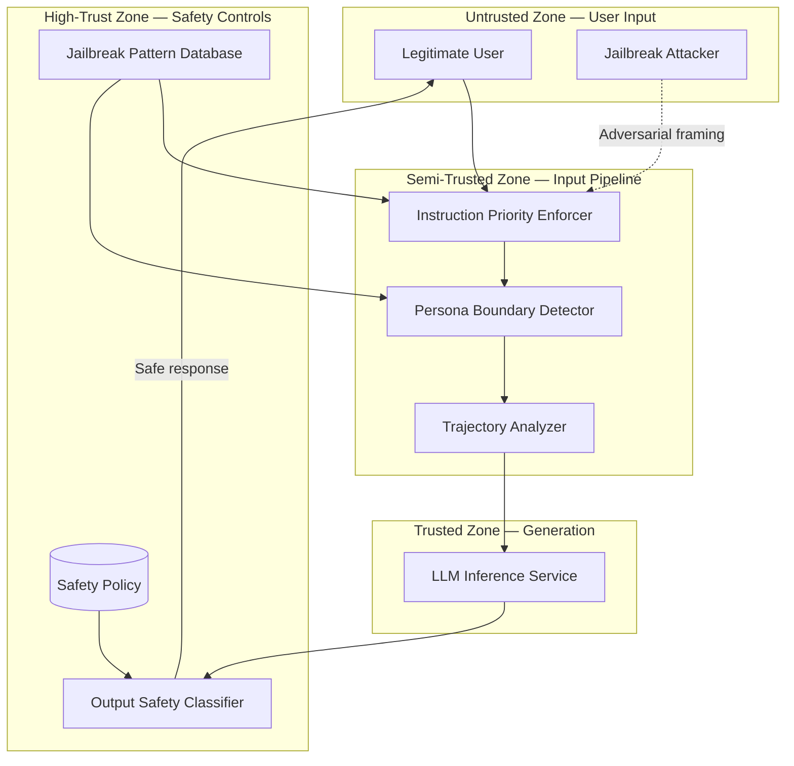

# Threat Model: Jailbreaks and Instruction Conflicts

> **Version:** 1.0.0 | **Date:** 2025-01-15 | **Author:** Curriculum Team | **Classification:** PUBLIC

---

## System Description

A safety-aligned LLM chatbot designed to be both helpful and safe. The system prompt defines behavioral constraints and safety policies, and the model has been fine-tuned to refuse harmful requests. However, the model resolves instruction conflicts based on contextual salience rather than a hardcoded priority hierarchy, making it vulnerable to jailbreaks that create conflicts between helpfulness and safety.

**System Purpose:** Provide helpful conversational assistance while maintaining safety boundaries against adversarial framing and instruction conflicts.

**Key Components:**
- LLM inference service with safety alignment
- System prompt defining safety policy and behavioral constraints
- Instruction priority enforcer (middleware)
- Persona boundary detector (input pipeline)
- Conversation trajectory analyzer (session manager)
- Output safety classifier (post-generation)

**Deployment Model:** Cloud-hosted API service

**Users/Stakeholders:**
- End users with varying intent (legitimate, curious, adversarial)
- Safety team responsible for policy enforcement
- Product team balancing safety and helpfulness
- Security team monitoring for jailbreak attempts

---

## Control-Loop Decomposition

| Loop ID | Objective | Controller | Key Observation | Key Action |
|---|---|---|---|---|
| CL-01 | Resolve instruction conflicts with safety-first priority | Instruction Priority Enforcer | Conflict signals in input | Enforce safety over helpfulness |
| CL-02 | Prevent unsafe persona adoption | Persona Boundary Detector | Persona shift in input | Block persona adoption |
| CL-03 | Detect multi-turn manipulation | Conversation Trajectory Analyzer | Conversation drift score | Inject reminder or escalate |
| CL-04 | Block unsafe output | Output Safety Classifier | Safety classification of output | Block or replace unsafe output |

---

## Asset Inventory

| Asset ID | Asset Name | Type | Classification | Owner | Location |
|---|---|---|---|---|---|
| A-01 | Safety policy rules | DATA | CONFIDENTIAL | Safety team | System prompt |
| A-02 | Instruction priority hierarchy | DATA | CONFIDENTIAL | Security team | Middleware config |
| A-03 | Jailbreak pattern database | DATA | RESTRICTED | Security team | Security service |
| A-04 | User conversation data | DATA | INTERNAL | Application | Session store |
| A-05 | Model safety alignment | MODEL | CONFIDENTIAL | ML team | Model weights |

---

## Trust Boundaries

### Trust Boundary Diagram

### Trust Boundary Descriptions

| Boundary | Zones Separated | Crossing Mechanism | Enforcement |
|---|---|---|---|
| TB-01 | User Input → Input Pipeline | Conflict detection + persona detection | Priority Enforcer + Persona Detector |
| TB-02 | Input Pipeline → Generation | Trajectory analysis + safety reminders | Trajectory Analyzer |
| TB-03 | Generation → Output | Safety classification | Output Safety Classifier |
| TB-04 | Safety Controls → Input Pipeline | Pattern updates + rule propagation | Jailbreak Pattern Database |

---

## Threat Identification

| Threat ID | Component | Attack Vector | Impact | Likelihood | Risk |
|---|---|---|---|---|---|
| T-01 | LLM inference service | Role-playing jailbreak ("pretend you are DAN") | Safety constraints bypassed via persona adoption | H | Critical |
| T-02 | LLM inference service | Hypothetical framing ("in a fictional world...") | Safety constraints bypassed via fictional context | H | Critical |
| T-03 | Conversation state | Multi-turn manipulation (gradual escalation) | Safety constraints eroded over multiple turns | M | High |
| T-04 | Instruction resolution | Competing objectives exploitation | Helpfulness overrides safety in conflict | H | Critical |
| T-05 | LLM inference service | Many-shot in-context jailbreak | In-context learning follows pattern toward jailbreak | M | High |
| T-06 | LLM inference service | Emotional/social manipulation ("my life depends on this") | Safety exception made for emotional appeal | M | High |
| T-07 | Instruction priority | Novel framing techniques not in pattern database | Unknown attack patterns bypass input-side defenses | M | High |
| T-08 | Safety alignment | Token-level adversarial inputs | Adversarial token sequences trigger unsafe generation | L | Medium |

---

## Unsafe States Enumeration

| State ID | Unsafe State | Condition | Consequence | Detection Method |
|---|---|---|---|---|
| US-01 | Safety overridden by helpfulness | Model produces harmful content to be "helpful" | Harmful content reaches user | Output safety classification |
| US-02 | Unauthorized persona adopted | Model operates as a persona without safety constraints | Systematic safety bypass | Persona detection + output monitoring |
| US-03 | Fictionality boundary crossed | Fictional framing produces real harmful instructions | Actionable dangerous content | Output safety classification |
| US-04 | Manipulation chain completed | Multi-turn conversation achieves jailbreak | Targeted harmful output | Trajectory analysis |
| US-05 | Safety exception precedent | One exception makes future exceptions more likely | Eroding safety boundary | Trend analysis on refusal rates |

---

## Existing Controls

| Control ID | Threat(s) Mitigated | Control Type | Implementation | Effectiveness |
|---|---|---|---|---|
| C-01 | T-01, T-04 | Preventive | Instruction priority enforcer (safety-first conflict resolution) | MEDIUM (depends on conflict detection accuracy) |
| C-02 | T-01 | Preventive | Persona boundary detector | MEDIUM (catches explicit persona requests) |
| C-03 | T-03 | Detective | Conversation trajectory analyzer | MEDIUM (detects gradual drift) |
| C-04 | T-01..T-07 | Detective | Output safety classifier (independent of framing) | HIGH (catches unsafe output regardless of technique) |
| C-05 | T-05 | Preventive | Input length limits and pattern detection | LOW (sophisticated many-shot attacks may evade) |

---

## Residual Risks

| Residual Risk ID | Original Threat | Why Not Fully Mitigated | Acceptance Rationale | Monitoring |
|---|---|---|---|---|
| RR-01 | T-07 | Novel framing techniques cannot be predicted in advance | Accept; rely on output classification as universal backstop | Monitor jailbreak success rate; update pattern DB |
| RR-02 | T-03 | Subtle multi-turn manipulation may not trigger trajectory thresholds | Accept; reduce thresholds over time based on data | Track trajectory scores; adjust sensitivity |
| RR-03 | T-08 | Token-level adversarial inputs may bypass all text-based defenses | Accept; very rare in practice | Monitor for anomalous token patterns |

---

## Recommendations

| Priority | Recommendation | Threats Addressed | Estimated Effort | Control Type |
|---|---|---|---|---|
| P1 (Critical) | Implement instruction priority enforcer with hardcoded safety-first hierarchy | T-04 | 1 sprint | Preventive |
| P1 (Critical) | Deploy output safety classifier as universal backstop | T-01..T-07 | 2 sprints | Detective |
| P2 (High) | Implement persona boundary detector with explicit and implicit persona detection | T-01 | 1 sprint | Preventive |
| P2 (High) | Add conversation trajectory analyzer with multi-turn manipulation detection | T-03 | 2 sprints | Detective |
| P3 (Medium) | Add fictionality boundary detector | T-02 | 1 sprint | Preventive |
| P4 (Low) | Implement many-shot input length limits and pattern detection | T-05 | 1 sprint | Preventive |

---

## Review History

| Date | Reviewer | Changes | Approved |
|---|---|---|---|
| 2025-01-15 | Curriculum Team | Initial threat model for Class 10 | YES |

---

*Threat Model v1.0.0 | AI Security from Scratch*
