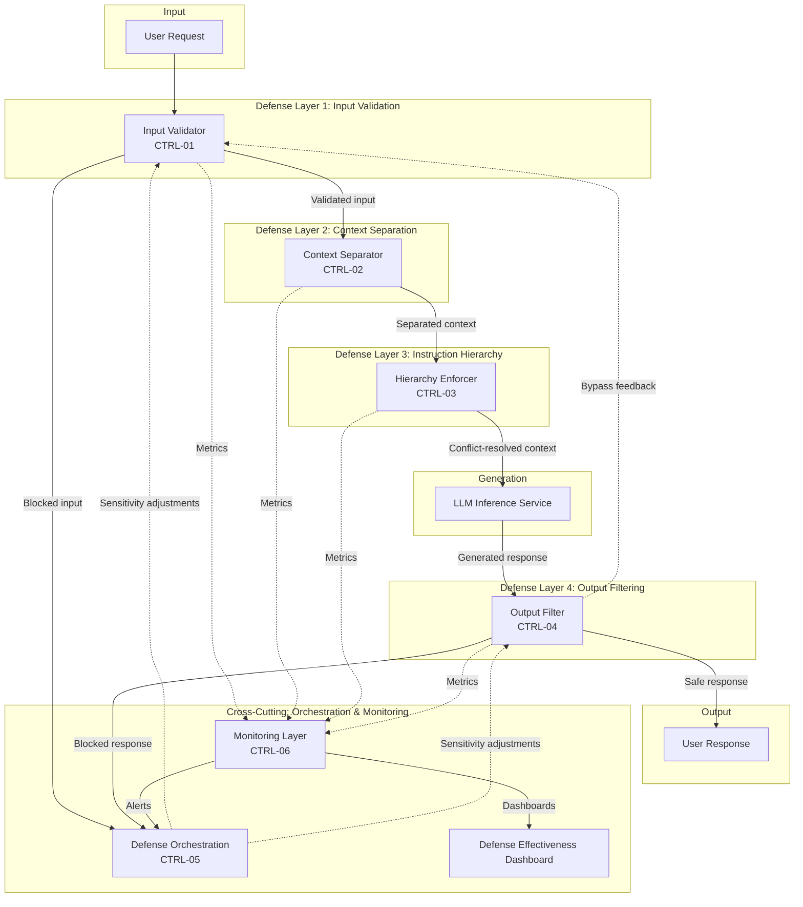

# Control-Loop Analysis: Prompt Injection Defense Patterns

> **Version:** 1.0.0 | **Date:** 2025-01-15 | **Analyst:** Curriculum Team | **System Version:** LLM Application with Defense-in-Depth

---

## System Name and Description

**System Name:** LLM Application with Defense-in-Depth Architecture

**Description:**

An LLM application protected by a composed defense architecture that routes every request through five defense patterns: input validation, context separation, instruction hierarchy, output filtering, and monitoring. The defense orchestration layer manages the interaction between patterns, adjusts sensitivity, and coordinates responses to detected attacks.

**System Boundary:**
- **In scope:** All five defense patterns, the orchestration layer, the LLM inference service, and the monitoring pipeline
- **Out of scope:** The model training pipeline, infrastructure security, and the broader organizational security program

---

## Objective Definition

The primary safety objective that the control loop must maintain:

> **Objective:** Ensure that the LLM application is defended against prompt injection through multiple independent, complementary layers, such that the failure of any single layer does not result in a complete security failure.

**Formal specification:**

```
∀ attack ∈ PromptInjectionAttacks:
  ∃ layer ∈ DefenseLayers:
    Blocks(layer, attack) ∨ Neutralizes(layer, attack)
  ∧
  ∀ legitimate ∈ LegitimateInputs:
    ∀ layer ∈ DefenseLayers:
      ¬Blocks(layer, legitimate)
```

**Objective decomposition:**

| Sub-objective | Description | Priority |
|---|---|---|
| SO-01 | Input-side defense: Known attack patterns are blocked at the observation gate | HIGH |
| SO-02 | Controller-side defense: Instruction conflicts are resolved with safety-first priority | CRITICAL |
| SO-03 | Output-side defense: Compromised outputs are caught at the actuation gate | CRITICAL |
| SO-04 | Monitoring: Attack patterns are detected and defenses are updated | HIGH |
| SO-05 | Usability: Legitimate inputs are not blocked (false positive rate < 5%) | HIGH |

---

## Controller Identification

The component(s) responsible for making decisions to maintain the objective:

| Controller ID | Name | Type | Location | Authority |
|---|---|---|---|---|
| CTRL-01 | Input Validation Layer | SOFTWARE | Request pipeline | CAN_BLOCK, CAN_SANITIZE |
| CTRL-02 | Context Separation Layer | SOFTWARE | Context composition | CAN_TAG, CAN_STRUCTURE |
| CTRL-03 | Instruction Hierarchy Layer | SOFTWARE | Context composition | CAN_RESOLVE_CONFLICTS |
| CTRL-04 | Output Filtering Layer | SOFTWARE | Response pipeline | CAN_BLOCK, CAN_REDACT, CAN_REPLACE |
| CTRL-05 | Defense Orchestration Layer | SOFTWARE | Middleware | CAN_ADJUST_SENSITIVITY, CAN_ESCALATE |
| CTRL-06 | Monitoring Layer | SOFTWARE | Observability pipeline | CAN_ALERT, CAN_TRIGGER_REVIEW |

**Controller hierarchy:**

```
[Monitoring Layer — CTRL-06]
    └── [Defense Orchestration Layer — CTRL-05]
            ├── [Input Validation Layer — CTRL-01]
            ├── [Context Separation Layer — CTRL-02]
            ├── [Instruction Hierarchy Layer — CTRL-03]
            └── [Output Filtering Layer — CTRL-04]
                    └── [LLM Inference Service]
```

---

## Observations Enumeration

What the controllers can perceive about the system state:

| Obs ID | Observation | Source | Type | Frequency | Latency |
|---|---|---|---|---|---|
| OBS-01 | Input classification result | Input validator | SYNCHRONOUS | Per request | < 100ms |
| OBS-02 | Context composition integrity | Context separator | SYNCHRONOUS | Per request | < 50ms |
| OBS-03 | Instruction conflict signals | Hierarchy enforcer | SYNCHRONOUS | Per request | < 100ms |
| OBS-04 | Output safety classification | Output filter | SYNCHRONOUS | Per response | < 200ms |
| OBS-05 | Per-layer detection metrics | Monitoring system | ASYNCHRONOUS | Per minute | < 30s |
| OBS-06 | Overall defense effectiveness score | Orchestration layer | ASYNCHRONOUS | Per 5 minutes | < 1min |

**Observation gaps (blind spots):**

| Gap ID | What Cannot Be Observed | Risk | Mitigation |
|---|---|---|---|
| GAP-01 | Model's internal processing after all defenses applied | Cannot guarantee model follows resolved instructions | Output filtering as backstop |
| GAP-02 | Effectiveness against truly novel attacks | Novel attacks may bypass all pattern-based defenses | Regular red-team testing |
| GAP-03 | Defense interaction effects | One layer may inadvertently undermine another | Integration testing |

---

## Actions Enumeration

What the controllers can do to influence the system:

| Action ID | Action | Effect | Preconditions | Reversibility | Risk |
|---|---|---|---|---|---|
| ACT-01 | Block at input layer | Request never reaches model | Input classified as adversarial | REVERSIBLE | False positives |
| ACT-02 | Sanitize at input layer | Instruction patterns stripped | Suspicious content detected | REVERSIBLE | Over-sanitization |
| ACT-03 | Tag context | Content marked as untrusted data | Any external content retrieved | REVERSIBLE | None |
| ACT-04 | Resolve conflict | Safety instruction prioritized | Instruction conflict detected | REVERSIBLE | Over-restrictive resolution |
| ACT-05 | Block at output layer | Response not delivered | Output classified as unsafe | REVERSIBLE | False positives |
| ACT-06 | Adjust sensitivity | Defense thresholds changed | Metrics indicate tuning needed | REVERSIBLE | Wrong direction |
| ACT-07 | Escalate to human | Ambiguous case reviewed | Low confidence in classification | REVERSIBLE | Increased latency |
| ACT-08 | Circuit break | Application temporarily disabled | Critical security failure | REVERSIBLE | Service disruption |

---

## Environment Description

The external context in which the system operates:

| Factor | Description | Impact on Control Loop |
|---|---|---|
| Threat landscape | Rapidly evolving injection techniques | Defense patterns must be regularly updated |
| User population | Mix of legitimate users and adversaries | Must balance security and usability |
| Performance requirements | Sub-second response times expected | Defense layers add latency |
| Regulatory requirements | Safety and privacy compliance | Must provide auditable evidence |
| Operational constraints | Limited security engineering resources | Defenses must be automatable and maintainable |

---

## Feedback Paths

How the controllers learn whether their actions achieved the objective:

| Feedback ID | From | To | Signal | Delay | Reliability |
|---|---|---|---|---|---|
| FB-01 | Output filter | Input validator | Attack pattern that bypassed input | < 1 hour | HIGH |
| FB-02 | Monitoring | Orchestration | Effectiveness metrics per layer | < 5 minutes | HIGH |
| FB-03 | User feedback | Orchestration | False positive reports | < 1 day | MEDIUM |
| FB-04 | Red-team tests | All layers | Known attack coverage gaps | Per test cycle | HIGH |

**Feedback loop dynamics:**
- **Time constant:** Real-time for per-request defense; minutes for metrics; days for pattern updates
- **Damping:** High — over-aggressive defenses create negative user feedback that reduces sensitivity
- **Stability:** Stable when properly tuned; oscillatory if sensitivity adjustments overcorrect

---

## Disturbance Sources

External factors that can push the system away from the objective:

| Dist ID | Disturbance | Source | Magnitude | Frequency | Predictability | Current Mitigation |
|---|---|---|---|---|---|---|
| D-01 | Novel injection techniques | Evolving threat landscape | High | Continuous | Unpredictable | Output filtering + monitoring as backstop |
| D-02 | Adversarial adaptation | Dedicated attackers | High | Ongoing | Unpredictable | Defense diversity + regular updates |
| D-03 | Performance pressure | Traffic spikes | Medium | Periodic | Predictable | Selective layer activation |
| D-04 | False positive feedback | Legitimate users | Medium | Ongoing | Predictable | Sensitivity tuning |
| D-05 | Defense interaction bugs | Complex layered architecture | High | Rare | Unpredictable | Integration testing |

---

## Unsafe States

States in which the system violates its safety objective:

| State ID | Unsafe State | Trigger Condition | Time to Unsafe State | Consequence | Reversibility |
|---|---|---|---|---|---|
| US-01 | All layers bypassed | Novel attack evades every defense | Seconds | Complete security failure | REVERSIBLE_WITH_EFFORT |
| US-02 | Defense disabled | Performance pressure leads to layer deactivation | Minutes | Reduced security posture | REVERSIBLE |
| US-03 | False positive spiral | Over-tuned defenses block legitimate use | Hours | System unusable | REVERSIBLE |
| US-04 | Defense interaction failure | Layer interaction creates security gap | Seconds | Targeted bypass | REVERSIBLE_WITH_EFFORT |
| US-05 | Monitoring gap | Monitoring neglected during stable period | Days/Weeks | Undetected security degradation | REVERSIBLE_WITH_EFFORT |

---

## Supervisory Controls

Higher-level controls that monitor and override the primary controllers:

| Sup ID | Supervisory Control | Monitors | Override Capability | Activation Condition |
|---|---|---|---|---|
| SUP-01 | Defense Effectiveness Dashboard | Per-layer metrics | CAN_ADJUST_SENSITIVITY | Effectiveness drops below threshold |
| SUP-02 | Red Team Testing Schedule | Full defense stack | CAN_UPDATE_PATTERNS | Scheduled + incident-triggered |
| SUP-03 | Human Review Queue | Ambiguous cases | CAN_MAKE_FINAL_DETERMINATION | Low-confidence classifications |

---

## Monitoring Points

Ongoing observability for the control loop:

| Monitor ID | Metric | Collection Method | Threshold (Warning) | Threshold (Critical) | Alert Channel |
|---|---|---|---|---|---|
| MON-01 | Overall injection bypass rate | Output classifier + manual review | > 0.5% | > 2% | PagerDuty |
| MON-02 | Input validation detection rate | Input validator logs | < 90% | < 75% | Security team |
| MON-03 | Output filter catch rate | Output filter logs | < 95% | < 85% | Security team |
| MON-04 | False positive rate per layer | User feedback + manual review | > 5% | > 10% | Product team |
| MON-05 | Defense stack latency (p99) | APM metrics | > 300ms | > 500ms | Engineering team |
| MON-06 | Layer interaction failure rate | Integration tests | > 0.1% | > 1% | Security team |

---

## Recovery Procedures

### Procedure R-01: Multi-Layer Bypass Response

**Trigger:** Attack bypasses all defense layers
**Severity:** CRITICAL
**Time objective:** < 30 minutes

| Step | Action | Responsible | Verification |
|---|---|---|---|
| 1 | Block the affected session and preserve logs | Orchestration layer | Session blocked |
| 2 | Analyze which layers failed and why | Security engineer | Failure analysis documented |
| 3 | Temporarily increase downstream layer sensitivity | Orchestration layer | Increased sensitivity active |
| 4 | Update failed layers with bypass pattern | Security engineer | Pattern added to database |
| 5 | Run full security regression test suite | CI pipeline | All tests pass |
| 6 | Return sensitivity to normal levels | Orchestration layer | Normal sensitivity confirmed |

---

## Control-Loop Diagram



---

## Analysis Summary

| Category | Finding | Severity |
|---|---|---|
| Observability | Per-layer metrics provide good visibility; novel attacks may not trigger metrics until they succeed | Medium |
| Control Authority | Multiple layers provide redundant blocking; no single point of failure | Low (well-covered) |
| Feedback | Bypass feedback from output to input layers enables continuous improvement | Low (well-covered) |
| Disturbances | Novel attacks and adversarial adaptation are ongoing challenges | High |
| Unsafe States | Multi-layer bypass is rare but high-impact; defense interaction bugs are subtle | High |
| Recovery | Bypass analysis and pattern updates are well-defined; full regression testing validates fixes | Medium |

---

*Control-Loop Analysis v1.0.0 | AI Security from Scratch*
