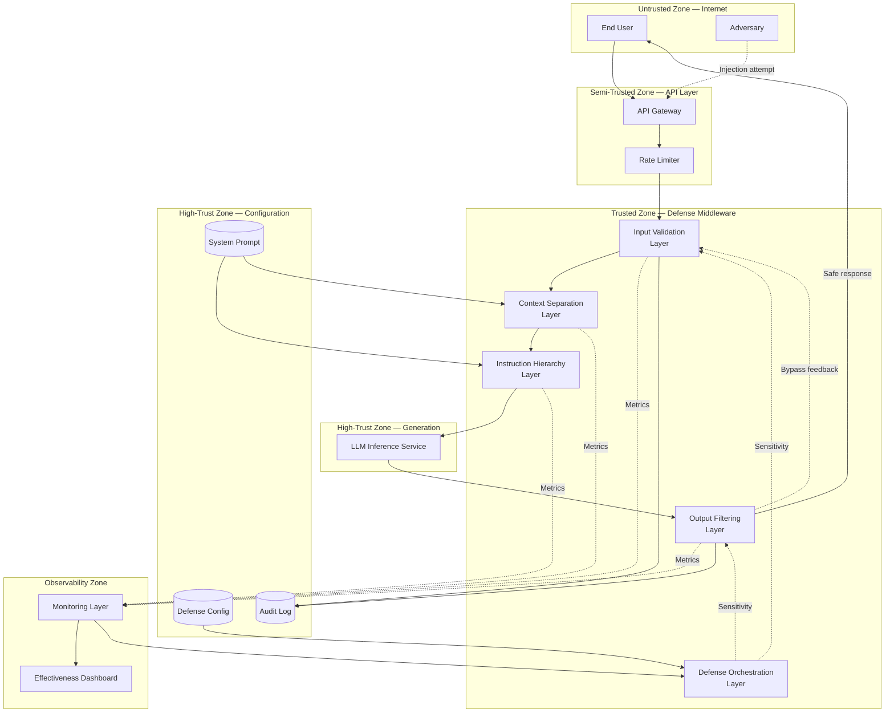

# Threat Model: Prompt Injection Defense Patterns

> **Version:** 1.0.0 | **Date:** 2025-01-15 | **Author:** Curriculum Team | **Classification:** PUBLIC

---

## System Description

An LLM application protected by a defense-in-depth architecture composed of five independent, complementary defense patterns: input validation, context separation, instruction hierarchy, output filtering, and monitoring. The defense orchestration layer coordinates these patterns, manages their interactions, adjusts sensitivity dynamically, and provides a unified view of the system's security posture. This system represents the mature, defended version of the applications built and attacked in Classes 07-10.

**System Purpose:** Provide a conversational AI service that resists prompt injection attacks through multiple layered defenses, ensuring that no single defense failure results in complete security compromise, while maintaining acceptable usability for legitimate users.

**Key Components:**
- Input Validation Layer (pattern-matching + ML classification)
- Context Separation Layer (XML tagging + structural delimiters)
- Instruction Hierarchy Layer (priority enforcement + conflict resolution)
- Output Filtering Layer (safety classification + redaction + replacement)
- Defense Orchestration Layer (sensitivity management + routing + escalation)
- Monitoring Layer (metrics collection + anomaly detection + alerting)
- LLM Inference Service (the model itself)
- Circuit Breaker (session-level protection)

**Deployment Model:** Cloud-hosted API service with defense middleware

**Users/Stakeholders:**
- End users submitting natural-language queries (benign and adversarial)
- Security team monitoring defense effectiveness and responding to incidents
- Product team balancing security and usability
- ML engineering team maintaining defense classifiers and patterns
- Compliance team requiring auditable evidence of security controls

---

## Control-Loop Decomposition

| Loop ID | Objective | Controller | Key Observation | Key Action |
|---|---|---|---|---|
| CL-01 | Block adversarial input | Input Validation Layer | Input classification result | Block, sanitize, or allow request |
| CL-02 | Separate instructions from data | Context Separation Layer | Context composition integrity | Tag and delimit content by origin |
| CL-03 | Resolve instruction conflicts | Instruction Hierarchy Layer | Conflict signal detection | Enforce safety-first priority |
| CL-04 | Prevent unsafe output delivery | Output Filtering Layer | Output safety classification | Block, redact, or replace response |
| CL-05 | Coordinate defense layers | Defense Orchestration Layer | Per-layer effectiveness metrics | Adjust sensitivity, escalate, circuit-break |
| CL-06 | Detect attack patterns | Monitoring Layer | System-wide behavioral metrics | Alert, trigger investigation, update defenses |

---

## Asset Inventory

| Asset ID | Asset Name | Type | Classification | Owner | Location |
|---|---|---|---|---|---|
| A-01 | System prompt | DATA | CONFIDENTIAL | Product team | Application config |
| A-02 | Input validation rules and patterns | DATA | CONFIDENTIAL | Security team | Defense middleware |
| A-03 | Output safety classifier model | MODEL | CONFIDENTIAL | ML team | Defense middleware |
| A-04 | Defense sensitivity configuration | DATA | INTERNAL | Security team | Orchestration layer |
| A-05 | Conversation logs | DATA | RESTRICTED | Data protection | Session store + audit log |
| A-06 | Defense effectiveness metrics | DATA | INTERNAL | Security team | Monitoring pipeline |
| A-07 | User PII (in conversation) | DATA | RESTRICTED | Data protection | Session store |
| A-08 | LLM model weights | MODEL | CONFIDENTIAL | ML team | Cloud API / local GPU |
| A-09 | Orchestration routing rules | DATA | CONFIDENTIAL | Security team | Orchestration layer |

---

## Trust Boundaries

### Trust Boundary Diagram

### Trust Boundary Descriptions

| Boundary | Zones Separated | Crossing Mechanism | Enforcement |
|---|---|---|---|
| TB-01 | Internet → API Layer | TLS + API key authentication | API gateway authentication |
| TB-02 | API Layer → Defense Middleware | Input validation classification | Input Validation Layer gate |
| TB-03 | Defense Middleware → Generation | Structured, validated context only | Context Separation + Hierarchy enforcement |
| TB-04 | Generation → Defense Middleware | Output safety classification | Output Filtering Layer gate |
| TB-05 | Defense Middleware → Configuration | Service-to-service auth + ACLs | IAM roles |
| TB-06 | Defense Middleware → Observability | Read-only metrics export | Monitoring data pipeline |

---

## Threat Identification

| Threat ID | Component | Attack Vector | Impact | Likelihood | Risk |
|---|---|---|---|---|---|
| T-01 | Input Validation Layer | Novel injection technique not in pattern database | Adversarial input reaches model | H | Critical |
| T-02 | Input Validation Layer | Adversarial encoding (Unicode, base64, homoglyphs, steganography) | Injection payload evades classifier | M | High |
| T-03 | Context Separation Layer | Model follows instructions in tagged data despite delimiters | Data-channel injection succeeds | M | High |
| T-04 | Instruction Hierarchy Layer | Subtle manipulation that doesn't create obvious conflicts | Hierarchy resolver doesn't activate | M | High |
| T-05 | Output Filtering Layer | Compromise manifests as tool calls or side effects, not visible output | Unsafe action executed without visible output violation | L | Medium |
| T-06 | Defense Orchestration | Attacker probes defenses to map layer boundaries and gaps | Targeted bypass of specific layer combinations | M | High |
| T-07 | Defense Orchestration | False positive feedback loop causes sensitivity reduction | Defenses weakened in response to adversarial complaints | L | Medium |
| T-08 | Monitoring Layer | Low-and-slow attacks stay below anomaly detection thresholds | Persistent compromise goes undetected | M | High |
| T-09 | All layers simultaneously | Zero-day prompt injection technique bypasses all pattern-based defenses | Complete defense failure | L | High |
| T-10 | Context Separation + Hierarchy | Defense interaction: sanitization at Layer 1 inadvertently removes context needed by Layer 2 | Layer interaction creates a gap | L | Medium |
| T-11 | Input Validation Layer | Adversarial examples crafted against ML classifier | Classifier misclassifies adversarial input as benign | M | High |
| T-12 | Output Filtering Layer | Paraphrased system prompt leakage not caught by string matching | System prompt disclosed through rewording | M | High |

**Risk Calculation:** Risk = Impact × Likelihood (Critical > High > Medium > Low)

---

## Unsafe States Enumeration

| State ID | Unsafe State | Condition | Consequence | Detection Method |
|---|---|---|---|---|
| US-01 | Multi-layer bypass | Novel attack evades all five defense layers | Complete security failure; attacker controls model | Output classifier + manual review of flagged responses |
| US-02 | Defense interaction failure | One layer's processing undermines another layer | Targeted bypass through interaction gap | Integration testing + layer interaction metrics |
| US-03 | Sensitivity misconfiguration | Defenses tuned too low (attacks pass) or too high (legit users blocked) | Either insecure or unusable system | False positive/negative rate monitoring |
| US-04 | Monitoring blindness | Monitoring alerts ignored or thresholds set too high | Security incidents go undetected | Alert response rate tracking + periodic red team exercises |
| US-05 | Stale defense patterns | Pattern database not updated against new attack variants | Known attacks bypass pattern matching | Defense update frequency tracking + red team coverage analysis |
| US-06 | Orchestration failure | Orchestration layer has a bug or misconfiguration | Defense layers not properly composed or sequenced | Orchestration health checks + end-to-end defense tests |
| US-07 | Performance-induced defense degradation | High traffic causes layers to be disabled or skipped | Reduced security posture during peak load | Layer activation monitoring + latency threshold alerts |

---

## Existing Controls

| Control ID | Threat(s) Mitigated | Control Type | Implementation | Effectiveness |
|---|---|---|---|---|
| C-01 | T-01, T-02, T-11 | Preventive | Input Validation with pattern matching + ML classification | MEDIUM (pattern-based gaps; ML classifier adversarial examples) |
| C-02 | T-03 | Preventive | Context Separation with XML tagging and structural delimiters | LOW-MEDIUM (model may ignore delimiters) |
| C-03 | T-04 | Preventive | Instruction Hierarchy with explicit priority enforcement | MEDIUM (catches obvious conflicts; misses subtle ones) |
| C-04 | T-05, T-12 | Detective | Output Filtering with safety classification + leakage detection | MEDIUM-HIGH (catches most compromises; may miss paraphrased leaks) |
| C-05 | T-06, T-08 | Detective | Monitoring with anomaly detection + effectiveness dashboards | MEDIUM (detects patterns; may miss low-and-slow) |
| C-06 | T-07 | Preventive | Human-in-the-loop sensitivity adjustments with approval gates | MEDIUM (prevents automated sensitivity gaming) |
| C-07 | T-09 | Detective | Regular red-team testing with novel attack techniques | MEDIUM (periodic; doesn't cover gap between tests) |
| C-08 | T-10 | Detective | Integration tests for defense layer interactions | MEDIUM (catches known interaction bugs) |
| C-09 | T-01, T-11 | Preventive | Input normalization pipeline before classification | MEDIUM (covers many encoding tricks; not all) |
| C-10 | T-08 | Detective | Circuit breaker with per-session injection tracking | MEDIUM (catches repeated attempts; not single sophisticated attacks) |

---

## Residual Risks

Risks that remain after existing controls are applied:

| Residual Risk ID | Original Threat | Why Not Fully Mitigated | Acceptance Rationale | Monitoring |
|---|---|---|---|---|
| RR-01 | T-01, T-09 | No defense can guarantee 100% coverage against novel attacks | Accept; rely on defense in depth so that one layer's gap is covered by another | Track bypass rate per layer; update patterns weekly |
| RR-02 | T-03 | Models may follow instructions in tagged data despite structural cues | Accept; context separation is a hint, not a hard enforcement mechanism | Monitor model compliance with context boundaries |
| RR-03 | T-05 | Tool call side effects may not be visible in output text | Accept; add tool call validation as a separate control | Monitor tool call patterns for anomalies |
| RR-04 | T-08 | Low-and-slow attacks below per-request thresholds | Accept; implement cross-session analysis for long-term patterns | Monthly behavioral analysis across sessions |
| RR-05 | T-10 | Defense interaction bugs are difficult to enumerate completely | Accept; rely on systematic integration testing + defense regression suite | Run interaction tests on every deployment |
| RR-06 | T-07 | False positive feedback may be weaponized | Accept; require human approval for sensitivity reductions | Track sensitivity change requests and approvals |

---

## Recommendations

| Priority | Recommendation | Threats Addressed | Estimated Effort | Control Type |
|---|---|---|---|---|
| P1 (Critical) | Deploy all five defense patterns in coordinated architecture | T-01 through T-12 | 3-4 sprints | Preventive + Detective |
| P1 (Critical) | Implement bypass feedback from output filter to input validator | T-01, T-09 | 1 sprint | Corrective |
| P1 (Critical) | Establish defense effectiveness metrics and dashboards | T-08 | 1-2 sprints | Detective |
| P2 (High) | Add ML-based semantic input classification alongside pattern matching | T-01, T-02, T-11 | 2-3 sprints | Preventive |
| P2 (High) | Implement tool call validation layer | T-05 | 2 sprints | Preventive |
| P2 (High) | Add defense integration test suite covering layer interactions | T-10 | 1-2 sprints | Detective |
| P3 (Medium) | Implement cross-session behavioral analysis | T-08 | 2-3 sprints | Detective |
| P3 (Medium) | Add human approval gate for sensitivity adjustments | T-07 | 1 sprint | Preventive |
| P4 (Low) | Implement adversarial training for input/output classifiers | T-11 | 3-4 sprints | Preventive |

---

## Review History

| Date | Reviewer | Changes | Approved |
|---|---|---|---|
| 2025-01-15 | Curriculum Team | Initial threat model for Class 11 | YES |

---

*Threat Model v1.0.0 | AI Security from Scratch*
