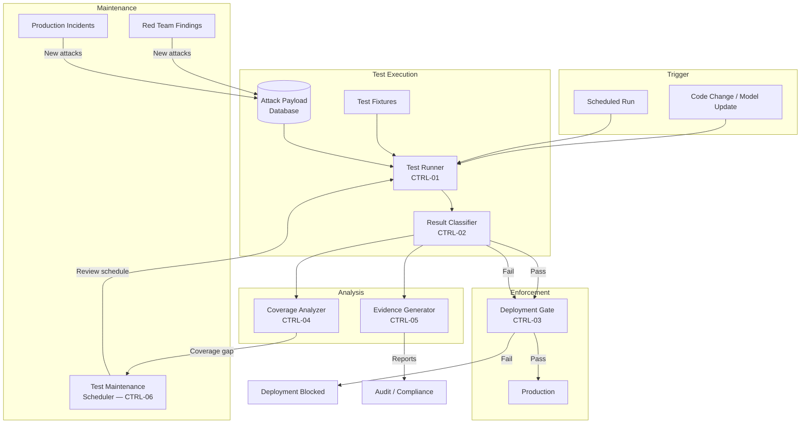

# Control-Loop Analysis: Prompt Security Regression Testing

> **Version:** 1.0.0 | **Date:** 2025-01-15 | **Analyst:** Curriculum Team | **System Version:** Security Regression Test Harness

---

## System Name and Description

**System Name:** Security Regression Test Harness for LLM Applications

**Description:**

An automated testing framework that validates the security posture of an LLM application's defense-in-depth architecture on every code change. The harness executes a comprehensive suite of attack simulations and legitimate-use verifications, compares results against expected security outcomes, and blocks deployments that introduce security regressions. It serves as the meta-control loop — a control loop that validates the correctness of other control loops.

**System Boundary:**
- **In scope:** The test harness, test fixtures, attack payload database, result classification logic, CI integration, evidence generation pipeline, and deployment gate
- **Out of scope:** The defense layers themselves (tested by the harness, not part of it), the LLM inference service, and the production monitoring pipeline

---

## Objective Definition

The primary safety objective that the control loop must maintain:

> **Objective:** Ensure that every known prompt injection attack is continuously validated against the defense stack, and that any regression in defense effectiveness is detected immediately and prevented from reaching production.

**Formal specification:**

```
∀ attack ∈ KnownAttacks:
  ∀ deployment ∈ Deployments:
    Blocks(DefenseStack, attack) ⟺ Expected(attack)
  ∧
  ∀ legitimate ∈ LegitimateInputs:
    Allows(DefenseStack, legitimate) ⟺ Expected(legitimate)
  ∧
  ∀ regression ∈ SecurityRegressions:
    Detects(TestHarness, regression) ∧ Blocks(DeploymentGate, regression)
```

**Objective decomposition:**

| Sub-objective | Description | Priority |
|---|---|---|
| SO-01 | Attack coverage: Every known attack category has at least one regression test | CRITICAL |
| SO-02 | Regression detection: Any defense degradation is caught before production deployment | CRITICAL |
| SO-03 | False positive monitoring: Legitimate use is not blocked by defense changes | HIGH |
| SO-04 | Evidence generation: Test results are available in compliance-ready formats | HIGH |
| SO-05 | Test reliability: Tests produce consistent results (low flakiness) | MEDIUM |
| SO-06 | Test efficiency: Test suite runs within acceptable time bounds | MEDIUM |

---

## Controller Identification

The component(s) responsible for making decisions to maintain the objective:

| Controller ID | Name | Type | Location | Authority |
|---|---|---|---|---|
| CTRL-01 | Test Runner | SOFTWARE | CI pipeline | CAN_EXECUTE, CAN_REPORT |
| CTRL-02 | Result Classifier | SOFTWARE | Test harness | CAN_CLASSIFY, CAN_FLAG |
| CTRL-03 | Deployment Gate | SOFTWARE | CI/CD pipeline | CAN_BLOCK_DEPLOYMENT |
| CTRL-04 | Coverage Analyzer | SOFTWARE | Test harness | CAN_IDENTIFY_GAPS |
| CTRL-05 | Evidence Generator | SOFTWARE | Post-test pipeline | CAN_GENERATE_REPORTS |
| CTRL-06 | Test Maintenance Scheduler | SOFTWARE + HUMAN | CI pipeline + calendar | CAN_TRIGGER_REVIEWS |

**Controller hierarchy:**

```
[Deployment Gate — CTRL-03]
    └── [Test Runner — CTRL-01]
            ├── [Result Classifier — CTRL-02]
            ├── [Coverage Analyzer — CTRL-04]
            └── [Evidence Generator — CTRL-05]
    └── [Test Maintenance Scheduler — CTRL-06]
```

---

## Observations Enumeration

What the controllers can perceive about the system state:

| Obs ID | Observation | Source | Type | Frequency | Latency |
|---|---|---|---|---|---|
| OBS-01 | Test pass/fail results | Test runner | SYNCHRONOUS | Per CI run | < 10 min |
| OBS-02 | Per-attack defense effectiveness | Result classifier | SYNCHRONOUS | Per CI run | < 10 min |
| OBS-03 | False positive count | Negative test results | SYNCHRONOUS | Per CI run | < 10 min |
| OBS-04 | Test coverage percentage | Coverage analyzer | SYNCHRONOUS | Per CI run | < 5 min |
| OBS-05 | Test suite execution time | CI pipeline metrics | SYNCHRONOUS | Per CI run | < 1 min |
| OBS-06 | Test flakiness rate | Historical test results | ASYNCHRONOUS | Per day | < 1 hour |
| OBS-07 | Time since last test suite update | Git history | ASYNCHRONOUS | Per day | < 5 min |

**Observation gaps (blind spots):**

| Gap ID | What Cannot Be Observed | Risk | Mitigation |
|---|---|---|---|
| GAP-01 | Effectiveness against attacks not in the test suite | Novel attacks pass undetected | Regular red-team input + threat landscape monitoring |
| GAP-02 | Real-world attack sophistication (test payloads may be simpler) | False confidence in test results | Periodic production attack simulation |
| GAP-03 | Defense behavior under load (tests typically run in isolation) | Performance-induced defense degradation not caught | Load testing with security validation |
| GAP-04 | Cross-session attack patterns (tests typically test single sessions) | Multi-session attacks not validated | Add multi-session test scenarios |

---

## Actions Enumeration

What the controllers can do to influence the system:

| Action ID | Action | Effect | Preconditions | Reversibility | Risk |
|---|---|---|---|---|---|
| ACT-01 | Block deployment | Prevents code from reaching production | Security test failure detected | REVERSIBLE | False positives block legitimate deploys |
| ACT-02 | Alert security team | Notifies team of regression | Test failure classified as security regression | REVERSIBLE | Alert fatigue from flaky tests |
| ACT-03 | Generate evidence report | Produces compliance documentation | Test run completes | IRREVERSIBLE | None |
| ACT-04 | Flag coverage gap | Identifies untested attack categories | Coverage analysis reveals gap | REVERSIBLE | Gaps may be impractical to fill |
| ACT-05 | Update test baseline | Adjusts expected results for defense changes | Defense tuning verified by security team | REVERSIBLE | Incorrect baseline creates false confidence |
| ACT-06 | Quarantine flaky test | Removes unreliable test from critical path | Test flakiness exceeds threshold | REVERSIBLE | Real failures hidden by quarantine |

---

## Environment Description

The external context in which the system operates:

| Factor | Description | Impact on Control Loop |
|---|---|---|
| CI/CD pipeline speed | Development teams expect fast feedback | Test suite must balance thoroughness with speed |
| LLM output non-determinism | Model responses vary between runs | Tests must use classification-based assertions, not exact matching |
| API rate limits | LLM API has request rate caps | Test suite must manage API call volume |
| Attack landscape evolution | New attack techniques emerge regularly | Test suite must be updated on a regular cadence |
| Model version changes | LLM provider updates models without notice | Test baselines may shift unexpectedly |
| Team expertise | Security testing requires specialized knowledge | Test maintenance requires security-trained engineers |

---

## Feedback Paths

How the controllers learn whether their actions achieved the objective:

| Feedback ID | From | To | Signal | Delay | Reliability |
|---|---|---|---|---|---|
| FB-01 | Production incidents | Test suite | New attack that succeeded in production | < 1 day | HIGH |
| FB-02 | Red team findings | Test suite | New attack techniques not in test suite | < 1 week | HIGH |
| FB-03 | Test flakiness metrics | Test maintenance | Unreliable tests to fix or quarantine | < 1 day | MEDIUM |
| FB-04 | Coverage analysis | Test development | Attack categories without test coverage | Per analysis | HIGH |
| FB-05 | Deployment gate results | Engineering team | Security regressions caught before production | Per deployment | HIGH |

**Feedback loop dynamics:**
- **Time constant:** Minutes for CI feedback; days for red-team feedback; weeks for threat landscape updates
- **Damping:** High — false positive test failures create negative developer experience that leads to test disabling
- **Stability:** Stable when tests are reliable and well-maintained; unstable when flaky tests erode trust

---

## Disturbance Sources

External factors that can push the system away from the objective:

| Dist ID | Disturbance | Source | Magnitude | Frequency | Predictability | Current Mitigation |
|---|---|---|---|---|---|---|
| D-01 | LLM output non-determinism | Model sampling variability | High | Every run | Predictable | Classification-based assertions + retry logic |
| D-02 | Model version updates | LLM provider | Very High | Monthly | Partially predictable | Baseline recalibration on model change |
| D-03 | API rate limiting | LLM API provider | Medium | During peak | Predictable | Test throttling + request budgeting |
| D-04 | Novel attack techniques | Threat landscape | High | Ongoing | Unpredictable | Regular red team + test suite updates |
| D-05 | Defense code changes | Development team | High | Per sprint | Predictable | CI runs on every change |
| D-06 | Test flakiness | Non-deterministic LLM behavior | Medium | Ongoing | Predictable | Flakiness tracking + quarantine |

---

## Unsafe States

States in which the system violates its safety objective:

| State ID | Unsafe State | Trigger Condition | Time to Unsafe State | Consequence | Reversibility |
|---|---|---|---|---|---|
| US-01 | Regression in production | Security test not run or failure ignored | Minutes | Known attack succeeds against production system | REVERSIBLE_WITH_EFFORT |
| US-02 | False confidence | Test suite passes but doesn't cover real attack vectors | Days/Weeks | Security theater instead of real security | REVERSIBLE_WITH_EFFORT |
| US-03 | Test suite rot | Tests not updated as defenses/attacks evolve | Weeks/Months | Tests validate obsolete behavior | REVERSIBLE_WITH_EFFORT |
| US-04 | Coverage gap | Attack categories missing from test suite | Days | Unknown vulnerabilities in production | REVERSIBLE |
| US-05 | Flaky test distrust | Non-deterministic tests cause intermittent failures | Days | Tests ignored or disabled, real failures missed | REVERSIBLE |
| US-06 | Deployment gate bypass | Team circumvents security test requirement | Minutes | Unvalidated code reaches production | REVERSIBLE_WITH_EFFORT |

---

## Supervisory Controls

Higher-level controls that monitor and override the primary controllers:

| Sup ID | Supervisory Control | Monitors | Override Capability | Activation Condition |
|---|---|---|---|---|
| SUP-01 | Deployment gate policy | All deployments | CAN_BLOCK_DEPLOYMENT | No passing security test run |
| SUP-02 | Coverage dashboard | Test coverage metrics | CAN_FLAG_GAPS | Coverage drops below 90% |
| SUP-03 | Quarterly red team review | Full test suite vs. current threat landscape | CAN_ADD_TESTS, CAN_UPDATE_BASELINE | Scheduled quarterly + incident-triggered |
| SUP-04 | Test health monitor | Flakiness rate, execution time, pass rate trends | CAN_QUARANTINE, CAN_ALERT | Flakiness > 5% or execution time > 30 min |

---

## Monitoring Points

Ongoing observability for the control loop:

| Monitor ID | Metric | Collection Method | Threshold (Warning) | Threshold (Critical) | Alert Channel |
|---|---|---|---|---|---|
| MON-01 | Security test pass rate | CI pipeline | < 100% on known attacks | < 95% | Deployment gate + Slack |
| MON-02 | Test coverage (attack categories) | Coverage analyzer | < 95% | < 80% | Security team |
| MON-03 | Test flakiness rate | Historical test data | > 3% | > 5% | Engineering team |
| MON-04 | Mean time to fix (security test failures) | Issue tracker | > 24 hours | > 72 hours | Engineering manager |
| MON-05 | Time since last test suite update | Git history | > 30 days | > 60 days | Security team |
| MON-06 | Test execution time | CI metrics | > 20 minutes | > 45 minutes | Engineering team |
| MON-07 | Deployment gate bypass rate | Deployment logs | > 0% | > 0% | Security team + management |

---

## Recovery Procedures

### Procedure R-01: Security Test Failure Response

**Trigger:** Security regression test fails on a known attack
**Severity:** HIGH
**Time objective:** < 4 hours (block deploy), < 24 hours (root cause and fix)

| Step | Action | Responsible | Verification |
|---|---|---|---|
| 1 | Block the deployment that introduced the regression | Deployment gate | Deployment not in production |
| 2 | Identify the specific test failure and affected defense layer | Security engineer | Failure root cause documented |
| 3 | Determine if regression is from code change, model update, or test issue | Security engineer | Root cause identified |
| 4 | Fix the defense or update the test baseline | Security engineer | Fix deployed to staging |
| 5 | Run full security regression suite | CI pipeline | All tests pass |
| 6 | Deploy the fix to production | DevOps | Deployment confirmed |
| 7 | Add a variant test to prevent similar regressions | Security engineer | Variant test added to suite |

### Procedure R-02: Coverage Gap Response

**Trigger:** Coverage analysis reveals attack category with no test coverage
**Severity:** MEDIUM
**Time objective:** < 1 week

| Step | Action | Responsible | Verification |
|---|---|---|---|
| 1 | Document the uncovered attack category | Security engineer | Category documented in test backlog |
| 2 | Develop test cases for the uncovered category | Security engineer | Test cases reviewed |
| 3 | Add test cases to the regression suite | Security engineer | Tests running in CI |
| 4 | Verify coverage improvement | Coverage analyzer | Coverage metric improved |
| 5 | Update threat model if necessary | Security engineer | Threat model updated |

---

## Control-Loop Diagram



---

## Analysis Summary

| Category | Finding | Severity |
|---|---|---|
| Observability | Test results provide strong feedback; gaps in coverage for novel attacks | Medium |
| Control Authority | Deployment gate provides strong enforcement; risk of gate bypass | Low (if gate is enforced) |
| Feedback | Production incidents and red team findings feed back to test suite | Medium (delay in feedback) |
| Disturbances | LLM non-determinism and model updates are ongoing challenges | High |
| Unsafe States | False confidence from incomplete coverage is the highest risk | High |
| Recovery | Test failure response and coverage gap procedures are well-defined | Low |

---

*Control-Loop Analysis v1.0.0 | AI Security from Scratch*
