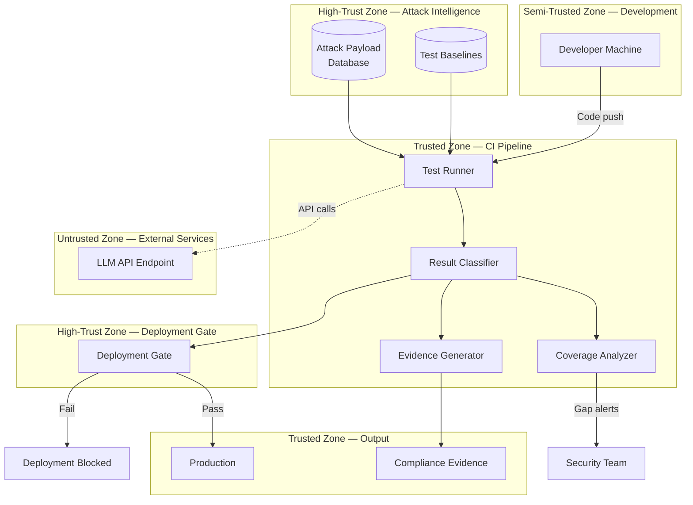

# Threat Model: Prompt Security Regression Testing

> **Version:** 1.0.0 | **Date:** 2025-01-15 | **Author:** Curriculum Team | **Classification:** PUBLIC

---

## System Description

A security regression test harness that validates the defense-in-depth architecture of an LLM application by executing automated attack simulations and legitimate-use verifications on every code change. The harness integrates with the CI/CD pipeline, blocks deployments that introduce security regressions, and generates compliance-ready evidence. It serves as the meta-control loop that ensures the security control loops remain effective over time.

**System Purpose:** Provide continuous, automated validation that the LLM application's defense stack resists all known prompt injection attacks and preserves legitimate use, blocking any deployment that degrades security effectiveness.

**Key Components:**
- Test runner (pytest-based execution engine)
- Attack payload database (curated attack scenarios from Classes 07-10)
- Test fixtures (defense stack setup, mock LLM, test data generators)
- Result classifier (categorizes test outcomes: blocked, mitigated, bypassed, false positive)
- Coverage analyzer (maps test cases to attack categories, identifies gaps)
- Deployment gate (CI/CD integration that blocks failing deployments)
- Evidence generator (JUnit XML, compliance reports, trend analysis)

**Deployment Model:** CI/CD pipeline (GitHub Actions) + local development environment

**Users/Stakeholders:**
- Developers running tests locally during development
- Security team maintaining the attack payload database and test suite
- DevOps team managing the CI pipeline and deployment gate
- Compliance team consuming evidence reports for audits
- Engineering managers tracking security posture trends

---

## Control-Loop Decomposition

| Loop ID | Objective | Controller | Key Observation | Key Action |
|---|---|---|---|---|
| CL-01 | Execute all security tests | Test Runner | Code change trigger | Run full test suite |
| CL-02 | Classify test results | Result Classifier | Test output | Categorize outcome (blocked/mitigated/bypassed/FP) |
| CL-03 | Enforce deployment gate | Deployment Gate | Test pass/fail | Block or allow deployment |
| CL-04 | Identify coverage gaps | Coverage Analyzer | Test-to-attack-category mapping | Flag uncovered attack categories |
| CL-05 | Generate evidence | Evidence Generator | Classified test results | Produce compliance reports |
| CL-06 | Maintain test suite | Test Maintenance Scheduler | Coverage gaps, new attacks, staleness | Trigger test development and review |

---

## Asset Inventory

| Asset ID | Asset Name | Type | Classification | Owner | Location |
|---|---|---|---|---|---|
| A-01 | Attack payload database | DATA | CONFIDENTIAL | Security team | Test fixtures directory |
| A-02 | Test fixtures and configuration | DATA | INTERNAL | Security team | Test harness codebase |
| A-03 | Expected test results (baselines) | DATA | CONFIDENTIAL | Security team | Test assertions |
| A-04 | Defense stack configuration for testing | DATA | CONFIDENTIAL | Security team | Test fixtures |
| A-05 | Historical test results | DATA | INTERNAL | Security team | CI artifact storage |
| A-06 | Evidence reports | DATA | INTERNAL | Compliance team | Report repository |
| A-07 | Deployment gate policy | DATA | CONFIDENTIAL | Security team | CI pipeline configuration |
| A-08 | CI pipeline credentials | SECRET | RESTRICTED | DevOps team | CI secret store |

---

## Trust Boundaries

### Trust Boundary Diagram

### Trust Boundary Descriptions

| Boundary | Zones Separated | Crossing Mechanism | Enforcement |
|---|---|---|---|
| TB-01 | Development → CI Pipeline | Git push + CI trigger | Branch protection rules |
| TB-02 | CI Pipeline → Attack Intelligence | Read-only access to test fixtures | IAM roles + file permissions |
| TB-03 | CI Pipeline → External LLM API | API key authentication + rate limiting | API key management + request budgeting |
| TB-04 | CI Pipeline → Deployment Gate | Test result API | Gate policy enforcement |
| TB-05 | Deployment Gate → Production | Deployment pipeline | Gate check + manual approval for bypass |

---

## Threat Identification

| Threat ID | Component | Attack Vector | Impact | Likelihood | Risk |
|---|---|---|---|---|---|
| T-01 | Attack Payload Database | Malicious or incorrect test payloads added, creating false baselines | False confidence in defenses that don't actually work | L | High |
| T-02 | Test Baselines | Baselines updated to pass failing tests without fixing the underlying defense | Security regression hidden by lowered expectations | M | Critical |
| T-03 | Deployment Gate | Gate bypassed via emergency override or policy exception | Unvalidated code reaches production | M | Critical |
| T-04 | Result Classifier | Non-deterministic LLM output causes intermittent misclassification | False positives (tests fail on working defenses) or false negatives (tests pass on broken defenses) | H | High |
| T-05 | Test Fixtures | Defense stack in test environment differs from production | Tests pass but production is still vulnerable | M | High |
| T-06 | Coverage Analyzer | Attack taxonomy incomplete, so coverage metric is misleading | Coverage appears high but major attack categories are untested | M | High |
| T-07 | CI Pipeline | Test execution skipped due to time pressure or CI failures | Security validation gap | M | High |
| T-08 | Attack Payload Database | Payloads are too simple compared to real-world attacks | Tests pass against trivial payloads but fail against sophisticated attacks | H | High |
| T-09 | Evidence Generator | Reports generated from incomplete or inaccurate test results | Compliance evidence is unreliable | L | Medium |
| T-10 | Test Suite | Tests disabled or quarantined without being fixed | Real security failures hidden by disabled tests | M | High |
| T-11 | LLM API | API key leaked in test logs or CI artifacts | Unauthorized access to LLM API | L | Medium |
| T-12 | Test Maintenance | Test suite not updated after defense changes | Tests validate obsolete defense behavior | M | High |

**Risk Calculation:** Risk = Impact × Likelihood (Critical > High > Medium > Low)

---

## Unsafe States Enumeration

| State ID | Unsafe State | Condition | Consequence | Detection Method |
|---|---|---|---|---|
| US-01 | Regression in production | Test failure ignored or gate bypassed | Known attack succeeds against production system | Production monitoring + incident reports |
| US-02 | False baseline | Test expectations lowered to match broken behavior | Security regression normalized and undetected | Baseline change review + historical comparison |
| US-03 | Coverage mirage | Coverage metric high but taxonomy incomplete | Major attack categories untested | External red team validation of test coverage |
| US-04 | Test-production divergence | Test environment doesn't match production | Tests give false confidence | Production parity testing + configuration audit |
| US-05 | Test distrust | Flaky tests cause teams to ignore or disable security tests | Real failures hidden among noise | Flakiness tracking + test reliability metrics |
| US-06 | Stale test suite | Test suite not updated for new attacks or defense changes | Tests validate obsolete behavior | Time-since-last-update metric + red team review |

---

## Existing Controls

| Control ID | Threat(s) Mitigated | Control Type | Implementation | Effectiveness |
|---|---|---|---|---|
| C-01 | T-02 | Preventive | Baseline change requires security team approval + documented justification | HIGH (with enforcement) |
| C-02 | T-03 | Preventive | Deployment gate bypass requires management approval + incident ticket | MEDIUM (social engineering of approval process) |
| C-03 | T-04 | Preventive | Classification-based assertions instead of exact string matching; retry logic for flaky tests | MEDIUM (reduces but doesn't eliminate flakiness) |
| C-04 | T-05 | Detective | Periodic parity test comparing test fixture defense config to production config | MEDIUM (delays detection) |
| C-05 | T-06 | Detective | Attack taxonomy reviewed quarterly by security team + red team | MEDIUM (depends on review quality) |
| C-06 | T-07 | Preventive | Branch protection rules require passing security tests before merge | HIGH (if enforced) |
| C-07 | T-08 | Preventive | Attack payloads reviewed for realism; include sophisticated variants alongside basic ones | MEDIUM (sophistication is subjective) |
| C-08 | T-10 | Detective | Quarantined tests tracked; quarantine requires ticket and fix deadline | MEDIUM (tickets may be deprioritized) |
| C-09 | T-11 | Preventive | API keys stored in CI secrets; logs redacted; artifacts access-controlled | HIGH (standard practice) |
| C-10 | T-12 | Detective | Automated alert when test suite not updated within 30 days | MEDIUM (alert may be ignored) |

---

## Residual Risks

Risks that remain after existing controls are applied:

| Residual Risk ID | Original Threat | Why Not Fully Mitigated | Acceptance Rationale | Monitoring |
|---|---|---|---|---|
| RR-01 | T-04 | LLM non-determinism cannot be fully eliminated | Accept; use classification-based assertions and retry logic to minimize impact | Track flakiness rate; maintain below 3% |
| RR-02 | T-05 | Perfect test-production parity is impractical | Accept; verify parity on a regular cadence (weekly config audit) | Compare test and production configs weekly |
| RR-03 | T-08 | Real attacks will always be more sophisticated than test payloads | Accept; complement automated tests with regular red-team exercises | Red team findings fed back into test suite |
| RR-04 | T-03 | Emergency overrides are sometimes legitimate | Accept; require incident ticket + post-incident review for every override | Track override frequency and justification |
| RR-05 | T-06 | Attack taxonomy completeness is an ongoing effort | Accept; prioritize by risk and update regularly | Quarterly taxonomy review + red team input |

---

## Recommendations

| Priority | Recommendation | Threats Addressed | Estimated Effort | Control Type |
|---|---|---|---|---|
| P1 (Critical) | Implement deployment gate with no-override policy for security test failures | T-03, T-07 | 1 sprint | Preventive |
| P1 (Critical) | Require security team review for all baseline changes | T-02 | 0.5 sprint | Preventive |
| P1 (Critical) | Implement classification-based test assertions with retry logic | T-04 | 1 sprint | Preventive |
| P2 (High) | Add test-production parity validation to CI pipeline | T-05 | 1-2 sprints | Detective |
| P2 (High) | Build coverage dashboard with attack category taxonomy | T-06, T-08 | 2 sprints | Detective |
| P2 (High) | Implement quarantine tracking with fix SLAs | T-10 | 1 sprint | Detective |
| P3 (Medium) | Add sophisticated attack variant generation | T-08 | 2-3 sprints | Preventive |
| P3 (Medium) | Automate test staleness detection and alerting | T-12 | 1 sprint | Detective |
| P4 (Low) | Add load-condition security testing | T-05 (extended) | 2-3 sprints | Detective |

---

## Review History

| Date | Reviewer | Changes | Approved |
|---|---|---|---|
| 2025-01-15 | Curriculum Team | Initial threat model for Class 12 | YES |

---

*Threat Model v1.0.0 | AI Security from Scratch*
