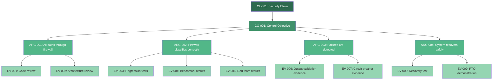

# Assurance Case: [CLAIM_TITLE]

> **Case ID:** [CASE_ID] | **Version:** [VERSION] | **Status:** [DRAFT|REVIEW|APPROVED|REVOKED] | **Last Review:** [DATE]

---

## Security Claim

The top-level security claim being argued:

> **Claim:** [SECURITY_CLAIM — e.g., "The AI system prevents user-supplied input from influencing system-level instructions, ensuring that prompt injection attacks cannot alter system behavior or access unauthorized resources."]

**Claim ID:** CL-001

**Claim type:** [PREVENTION|DETECTION|RESPONSE|RESILIENCE]

**Confidence level:** [HIGH|MEDIUM|LOW|UNVERIFIED]

---

## Threat

The threat this assurance case addresses:

| Attribute | Value |
|---|---|
| **Threat ID** | [THREAT_ID — e.g., T-01] |
| **Threat Name** | [THREAT_NAME — e.g., "Cross-context prompt injection"] |
| **Threat Category** | [CATEGORY — e.g., Prompt Injection] |
| **Threat Description** | [DETAILED_DESCRIPTION] |
| **Attack Vector** | [ATTACK_VECTOR] |
| **Impact if Realized** | [IMPACT_DESCRIPTION] |
| **Likelihood** | [HIGH|MEDIUM|LOW] |

---

## Control Objective

The measurable security objective that, if satisfied, mitigates the threat:

> **Control Objective:** [CONTROL_OBJECTIVE — e.g., "All user-supplied input is classified and isolated from system instructions before being incorporated into the model context window, with a false-negative rate below 0.1% on known attack benchmarks."]

**Objective ID:** CO-001

**Measurable criteria:**
- [CRITERION_1 — e.g., "Zero successful prompt injection attacks in security regression test suite (50+ test cases)"]
- [CRITERION_2 — e.g., "False-negative rate < 0.1% on the AI Security from Scratch prompt injection benchmark"]
- [CRITERION_3 — e.g., "False-positive rate < 5% on legitimate user input corpus"]
- [CRITERION_4 — e.g., "All blocked attacks logged in control ledger within 100ms"]

---

## Argument

The structured argument that the control objective is satisfied:

### Argument Strategy

[Describe the argument strategy — e.g., "We argue by enumerating all input paths and demonstrating that each path passes through the Context Firewall controller, which classifies and isolates user input before it can influence system instructions."]

### Argument Structure

```
CL-001: [SECURITY_CLAIM]
├── CO-001: [CONTROL_OBJECTIVE]
│   ├── ARG-001: [SUB_ARGUMENT_1 — e.g., "All input paths pass through the Context Firewall"]
│   │   ├── EV-001: [EVIDENCE — e.g., "Code review confirms single entry point for user input"]
│   │   └── EV-002: [EVIDENCE — e.g., "Architecture diagram verified by security architect"]
│   ├── ARG-002: [SUB_ARGUMENT_2 — e.g., "The Context Firewall correctly classifies adversarial inputs"]
│   │   ├── EV-003: [EVIDENCE — e.g., "Security regression test suite: 52/52 attacks blocked"]
│   │   ├── EV-004: [EVIDENCE — e.g., "Benchmark evaluation: 99.92% detection rate"]
│   │   └── EV-005: [EVIDENCE — e.g., "Red team assessment: No successful prompt injection"]
│   ├── ARG-003: [SUB_ARGUMENT_3 — e.g., "Classification failures are detected and escalated"]
│   │   ├── EV-006: [EVIDENCE — e.g., "Output validation layer catches post-hoc failures"]
│   │   └── EV-007: [EVIDENCE — e.g., "Circuit breaker activates on anomaly threshold"]
│   └── ARG-004: [SUB_ARGUMENT_4 — e.g., "The system recovers safely from violations"]
│       ├── EV-008: [EVIDENCE — e.g., "Recovery procedure tested and documented"]
│       └── EV-009: [EVIDENCE — e.g., "RTO < 5 minutes demonstrated in drill"]
```

### GSN Diagram (Goal Structuring Notation)



---

## Evidence Artifacts

| Evidence ID | Artifact | Type | Generated By | Date | Status |
|---|---|---|---|---|---|
| EV-001 | [ARTIFACT_PATH_1] | [CODE_REVIEW|ARCHITECTURE_REVIEW|TEST_RESULT|BENCHMARK|RED_TEAM_REPORT|AUDIT_LOG|CONFIGURATION] | [GENERATOR] | [DATE] | [VERIFIED|PENDING|EXPIRED] |
| EV-002 | [ARTIFACT_PATH_2] | [TYPE] | [GENERATOR] | [DATE] | [STATUS] |
| EV-003 | [ARTIFACT_PATH_3] | [TYPE] | [GENERATOR] | [DATE] | [STATUS] |
| EV-004 | [ARTIFACT_PATH_4] | [TYPE] | [GENERATOR] | [DATE] | [STATUS] |
| EV-005 | [ARTIFACT_PATH_5] | [TYPE] | [GENERATOR] | [DATE] | [STATUS] |
| EV-006 | [ARTIFACT_PATH_6] | [TYPE] | [GENERATOR] | [DATE] | [STATUS] |
| EV-007 | [ARTIFACT_PATH_7] | [TYPE] | [GENERATOR] | [DATE] | [STATUS] |
| EV-008 | [ARTIFACT_PATH_8] | [TYPE] | [GENERATOR] | [DATE] | [STATUS] |
| EV-009 | [ARTIFACT_PATH_9] | [TYPE] | [GENERATOR] | [DATE] | [STATUS] |

**Evidence integrity:**

| Artifact | SHA-256 Hash | Signed |
|---|---|---|
| [ARTIFACT_1] | [HASH] | [YES|NO] |
| [ARTIFACT_2] | [HASH] | [YES|NO] |
| [ARTIFACT_3] | [HASH] | [YES|NO] |

---

## Test Results

### Security Regression Tests

| Test Suite | Total | Pass | Fail | Skip | Coverage |
|---|---|---|---|---|---|
| [SUITE_NAME_1] | [TOTAL] | [PASS] | [FAIL] | [SKIP] | [COVERAGE]% |
| [SUITE_NAME_2] | [TOTAL] | [PASS] | [FAIL] | [SKIP] | [COVERAGE]% |
| **Aggregate** | **[TOTAL]** | **[PASS]** | **[FAIL]** | **[SKIP]** | **[COVERAGE]%** |

### Red Team Results

| Engagement | Date | Findings (Critical/High) | Status |
|---|---|---|---|
| [ENGAGEMENT_1] | [DATE] | [N] Critical, [N] High | [ALL_REMEDIATED|PARTIAL|OPEN] |
| [ENGAGEMENT_2] | [DATE] | [N] Critical, [N] High | [ALL_REMEDIATED|PARTIAL|OPEN] |

### Benchmark Results

| Benchmark | Metric | Result | Threshold | Pass |
|---|---|---|---|---|
| [BENCHMARK_1] | [METRIC] | [RESULT] | [THRESHOLD] | [✅|❌] |
| [BENCHMARK_2] | [METRIC] | [RESULT] | [THRESHOLD] | [✅|❌] |
| [BENCHMARK_3] | [METRIC] | [RESULT] | [THRESHOLD] | [✅|❌] |

---

## Residual Risk

Risks that remain despite the controls argued in this assurance case:

| Risk ID | Description | Likelihood | Impact | Mitigation Strategy | Monitoring |
|---|---|---|---|---|---|
| RR-001 | [RESIDUAL_RISK_1 — e.g., "Novel prompt injection techniques not covered by current test suite"] | [LOW|MEDIUM|HIGH] | [LOW|MEDIUM|HIGH] | [MITIGATION — e.g., "Quarterly red-team exercises with updated attack catalog"] | [MONITORING — e.g., "Track new prompt injection research; update tests monthly"] |
| RR-002 | [RESIDUAL_RISK_2 — e.g., "Model update changes classification behavior"] | [LOW|MEDIUM|HIGH] | [LOW|MEDIUM|HIGH] | [MITIGATION — e.g., "Regression test on every model version change"] | [MONITORING — e.g., "Automated benchmark on model swap"] |
| RR-003 | [RESIDUAL_RISK_3] | [LOW|MEDIUM|HIGH] | [LOW|MEDIUM|HIGH] | [MITIGATION] | [MONITORING] |

**Residual risk acceptance:**

> [STATEMENT_OF_ACCEPTANCE — e.g., "The residual risks are accepted based on the current threat landscape, available mitigations, and cost-benefit analysis. This acceptance will be reviewed quarterly or upon significant threat landscape changes."]

**Accepted by:** [NAME], [ROLE], [DATE]

---

## Monitoring

Ongoing activities to maintain assurance over time:

| Activity | Frequency | Responsible | Trigger for Re-assessment |
|---|---|---|---|
| Security regression test suite | Every commit | CI/CD pipeline | Any test failure |
| Red team engagement | Quarterly | Security team | Any critical finding |
| Benchmark evaluation | Monthly | ML engineering | Model version change |
| Control-ledger audit | Weekly | Compliance team | Anomaly detected |
| Threat model review | Quarterly | Security architect | New attack technique published |
| Assurance case review | Semi-annually | Security lead | Any residual risk materializes |

---

## Review Status

| Review | Reviewer | Date | Decision | Comments |
|---|---|---|---|---|
| Initial creation | [AUTHOR] | [DATE] | [DRAFT] | [COMMENTS] |
| Peer review | [REVIEWER_1] | [DATE] | [APPROVED|CHANGES_REQUESTED|REJECTED] | [COMMENTS] |
| Security architect review | [REVIEWER_2] | [DATE] | [APPROVED|CHANGES_REQUESTED|REJECTED] | [COMMENTS] |
| Management sign-off | [REVIEWER_3] | [DATE] | [APPROVED|CHANGES_REQUESTED|REJECTED] | [COMMENTS] |

**Next scheduled review:** [DATE]

---

## Framework Mapping

### ISO 27001:2022

| Control | Mapping | Evidence |
|---|---|---|
| A.8.9 — Configuration management | [HOW_THIS_CASE_ADDRESSES] | [EVIDENCE_ID] |
| A.8.10 — Information deletion | [HOW_THIS_CASE_ADDRESSES] | [EVIDENCE_ID] |
| A.8.23 — Web filtering | [HOW_THIS_CASE_ADDRESSES] | [EVIDENCE_ID] |
| A.8.28 — Secure coding | [HOW_THIS_CASE_ADDRESSES] | [EVIDENCE_ID] |

### NIST AI Risk Management Framework (AI RMF 1.0)

| Function | Category | Subcategory | Mapping | Evidence |
|---|---|---|---|---|
| GOVERN | GOV 1 | GOV 1.1 | [HOW_THIS_CASE_ADDRESSES] | [EVIDENCE_ID] |
| MAP | MAP 2 | MAP 2.3 | [HOW_THIS_CASE_ADDRESSES] | [EVIDENCE_ID] |
| MEASURE | MEASURE 2 | MEASURE 2.6 | [HOW_THIS_CASE_ADDRESSES] | [EVIDENCE_ID] |
| MANAGE | MANAGE 1 | MANAGE 1.1 | [HOW_THIS_CASE_ADDRESSES] | [EVIDENCE_ID] |

### OWASP Top 10 for LLM Applications (2025)

| Risk | Mapping | Evidence |
|---|---|---|
| LLM01 — Prompt Injection | [HOW_THIS_CASE_ADDRESSES] | [EVIDENCE_ID] |
| LLM02 — Sensitive Information Disclosure | [HOW_THIS_CASE_ADDRESSES] | [EVIDENCE_ID] |
| LLM06 — Sensitive Data Disclosure | [HOW_THIS_CASE_ADDRESSES] | [EVIDENCE_ID] |
| LLM09 — Misinformation | [HOW_THIS_CASE_ADDRESSES] | [EVIDENCE_ID] |

---

*Template version: 1.0.0 | AI Security from Scratch*
