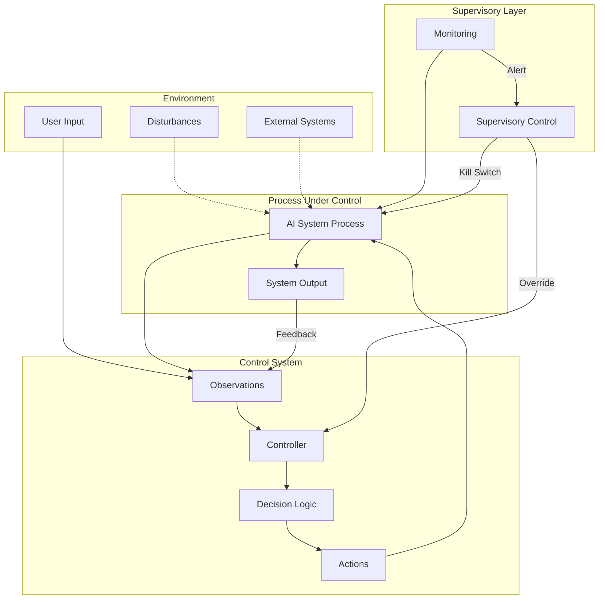

# Control-Loop Analysis: [SYSTEM_NAME]

> **Version:** [VERSION] | **Date:** [DATE] | **Analyst:** [ANALYST_NAME] | **System Version:** [SYSTEM_VERSION]

---

## System Name and Description

**System Name:** [SYSTEM_NAME]

**Description:**

[Provide a detailed description of the system being analyzed. Include its purpose, how it operates, its boundaries, and its interactions with external systems. This description should be sufficient for someone unfamiliar with the system to understand the control-loop analysis that follows.]

**System Boundary:**
- **In scope:** [WHAT_IS_INCLUDED]
- **Out of scope:** [WHAT_IS_EXCLUDED]

---

## Objective Definition

The primary safety objective that the control loop must maintain:

> **Objective:** [OBJECTIVE_STATEMENT — e.g., "Ensure that AI-generated outputs comply with safety policies, are factually grounded in retrieved context, and never execute unauthorized actions on behalf of users."]

**Formal specification (if applicable):**

```
∀ input ∈ UserInput:
  ∀ output ∈ SystemOutput(input):
    Safe(output) ∧ Authorized(output) ∧ Grounded(output, Context)
```

**Objective decomposition:**

| Sub-objective | Description | Priority |
|---|---|---|
| SO-01 | [SUB_OBJECTIVE_1] | [CRITICAL|HIGH|MEDIUM] |
| SO-02 | [SUB_OBJECTIVE_2] | [CRITICAL|HIGH|MEDIUM] |
| SO-03 | [SUB_OBJECTIVE_3] | [CRITICAL|HIGH|MEDIUM] |

---

## Controller Identification

The component(s) responsible for making decisions to maintain the objective:

| Controller ID | Name | Type | Location | Authority |
|---|---|---|---|---|
| CTRL-01 | [CONTROLLER_NAME_1] | [SOFTWARE|HUMAN|HYBRID] | [DEPLOYMENT_LOCATION] | [CAN_BLOCK|CAN_MODIFY|CAN_ESCALATE|CAN_SHUTDOWN] |
| CTRL-02 | [CONTROLLER_NAME_2] | [SOFTWARE|HUMAN|HYBRID] | [DEPLOYMENT_LOCATION] | [CAN_BLOCK|CAN_MODIFY|CAN_ESCALATE|CAN_SHUTDOWN] |
| CTRL-03 | [CONTROLLER_NAME_3] | [SOFTWARE|HUMAN|HYBRID] | [DEPLOYMENT_LOCATION] | [CAN_BLOCK|CAN_MODIFY|CAN_ESCALATE|CAN_SHUTDOWN] |

**Controller hierarchy:**

```
[Supervisory Controller]
    └── [Primary Controller]
            ├── [Sub-Controller 1]
            └── [Sub-Controller 2]
```

---

## Observations Enumeration

What the controllers can perceive about the system state:

| Obs ID | Observation | Source | Type | Frequency | Latency |
|---|---|---|---|---|---|
| OBS-01 | [OBSERVATION_1 — e.g., "Input token classification result"] | [SOURCE] | [SYNCHRONOUS|ASYNCHRONOUS] | [PER_REQUEST|PERIODIC|EVENT_DRIVEN] | [LATENCY] |
| OBS-02 | [OBSERVATION_2] | [SOURCE] | [SYNCHRONOUS|ASYNCHRONOUS] | [PER_REQUEST|PERIODIC|EVENT_DRIVEN] | [LATENCY] |
| OBS-03 | [OBSERVATION_3] | [SOURCE] | [SYNCHRONOUS|ASYNCHRONOUS] | [PER_REQUEST|PERIODIC|EVENT_DRIVEN] | [LATENCY] |
| OBS-04 | [OBSERVATION_4] | [SOURCE] | [SYNCHRONOUS|ASYNCHRONOUS] | [PER_REQUEST|PERIODIC|EVENT_DRIVEN] | [LATENCY] |
| OBS-05 | [OBSERVATION_5] | [SOURCE] | [SYNCHRONOUS|ASYNCHRONOUS] | [PER_REQUEST|PERIODIC|EVENT_DRIVEN] | [LATENCY] |

**Observation gaps (blind spots):**

| Gap ID | What Cannot Be Observed | Risk | Mitigation |
|---|---|---|---|
| GAP-01 | [BLIND_SPOT_1] | [RISK_1] | [MITIGATION_1] |
| GAP-02 | [BLIND_SPOT_2] | [RISK_2] | [MITIGATION_2] |

---

## Actions Enumeration

What the controllers can do to influence the system:

| Action ID | Action | Effect | Preconditions | Reversibility | Risk |
|---|---|---|---|---|---|
| ACT-01 | [ACTION_1 — e.g., "Block request"] | [EFFECT_1] | [PRECONDITION_1] | [REVERSIBLE|IRREVERSIBLE] | [RISK_OF_ACTION] |
| ACT-02 | [ACTION_2 — e.g., "Sanitize input"] | [EFFECT_2] | [PRECONDITION_2] | [REVERSIBLE|IRREVERSIBLE] | [RISK_OF_ACTION] |
| ACT-03 | [ACTION_3 — e.g., "Escalate to human"] | [EFFECT_3] | [PRECONDITION_3] | [REVERSIBLE|IRREVERSIBLE] | [RISK_OF_ACTION] |
| ACT-04 | [ACTION_4 — e.g., "Activate circuit breaker"] | [EFFECT_4] | [PRECONDITION_4] | [REVERSIBLE|IRREVERSIBLE] | [RISK_OF_ACTION] |
| ACT-05 | [ACTION_5 — e.g., "Log and allow"] | [EFFECT_5] | [PRECONDITION_5] | [REVERSIBLE|IRREVERSIBLE] | [RISK_OF_ACTION] |

---

## Environment Description

The external context in which the system operates:

| Factor | Description | Impact on Control Loop |
|---|---|---|
| User population | [USER_DESCRIPTION] | [IMPACT] |
| Network environment | [NETWORK_DESCRIPTION] | [IMPACT] |
| Threat landscape | [THREAT_DESCRIPTION] | [IMPACT] |
| Regulatory context | [REGULATORY_DESCRIPTION] | [IMPACT] |
| Operational tempo | [TEMPO_DESCRIPTION] | [IMPACT] |
| Data sensitivity | [DATA_DESCRIPTION] | [IMPACT] |

---

## Feedback Paths

How the controllers learn whether their actions achieved the objective:

| Feedback ID | From | To | Signal | Delay | Reliability |
|---|---|---|---|---|---|
| FB-01 | [SOURCE_COMPONENT] | [TARGET_CONTROLLER] | [SIGNAL_DESCRIPTION] | [DELAY] | [HIGH|MEDIUM|LOW] |
| FB-02 | [SOURCE_COMPONENT] | [TARGET_CONTROLLER] | [SIGNAL_DESCRIPTION] | [DELAY] | [HIGH|MEDIUM|LOW] |
| FB-03 | [SOURCE_COMPONENT] | [TARGET_CONTROLLER] | [SIGNAL_DESCRIPTION] | [DELAY] | [HIGH|MEDIUM|LOW] |

**Feedback loop dynamics:**
- **Time constant:** [TIME_CONSTANT — how quickly the loop responds]
- **Damping:** [DAMPING — whether oscillations are possible]
- **Stability:** [STABLE|MARGINALLY_STABLE|UNSTABLE]

---

## Disturbance Sources

External factors that can push the system away from the objective:

| Dist ID | Disturbance | Source | Magnitude | Frequency | Predictability | Current Mitigation |
|---|---|---|---|---|---|---|
| D-01 | [DISTURBANCE_1 — e.g., "Adversarial prompt injection"] | External attacker | [MAGNITUDE] | [FREQUENCY] | [PREDICTABLE|UNPREDICTABLE] | [MITIGATION] |
| D-02 | [DISTURBANCE_2 — e.g., "Data drift in RAG corpus"] | Data pipeline | [MAGNITUDE] | [FREQUENCY] | [PREDICTABLE|UNPREDICTABLE] | [MITIGATION] |
| D-03 | [DISTURBANCE_3 — e.g., "Model hallucination"] | LLM inference | [MAGNITUDE] | [FREQUENCY] | [PREDICTABLE|UNPREDICTABLE] | [MITIGATION] |
| D-04 | [DISTURBANCE_4 — e.g., "Load spike degrading latency"] | Traffic pattern | [MAGNITUDE] | [FREQUENCY] | [PREDICTABLE|UNPREDICTABLE] | [MITIGATION] |
| D-05 | [DISTURBANCE_5 — e.g., "Compromised tool endpoint"] | Supply chain | [MAGNITUDE] | [FREQUENCY] | [PREDICTABLE|UNPREDICTABLE] | [MITIGATION] |

---

## Unsafe States

States in which the system violates its safety objective:

| State ID | Unsafe State | Trigger Condition | Time to Unsafe State | Consequence | Reversibility |
|---|---|---|---|---|---|
| US-01 | [UNSAFE_STATE_1] | [TRIGGER_1] | [TIME_TO_REACH] | [CONSEQUENCE_1] | [REVERSIBLE_WITH_EFFORT|IRREVERSIBLE] |
| US-02 | [UNSAFE_STATE_2] | [TRIGGER_2] | [TIME_TO_REACH] | [CONSEQUENCE_2] | [REVERSIBLE_WITH_EFFORT|IRREVERSIBLE] |
| US-03 | [UNSAFE_STATE_3] | [TRIGGER_3] | [TIME_TO_REACH] | [CONSEQUENCE_3] | [REVERSIBLE_WITH_EFFORT|IRREVERSIBLE] |
| US-04 | [UNSAFE_STATE_4] | [TRIGGER_4] | [TIME_TO_REACH] | [CONSEQUENCE_4] | [REVERSIBLE_WITH_EFFORT|IRREVERSIBLE] |
| US-05 | [UNSAFE_STATE_5] | [TRIGGER_5] | [TIME_TO_REACH] | [CONSEQUENCE_5] | [REVERSIBLE_WITH_EFFORT|IRREVERSIBLE] |

---

## Supervisory Controls

Higher-level controls that monitor and override the primary controllers:

| Sup ID | Supervisory Control | Monitors | Override Capability | Activation Condition |
|---|---|---|---|---|
| SUP-01 | [SUPERVISORY_CONTROL_1] | [WHAT_IT_MONITORS] | [OVERRIDE_CAPABILITY] | [ACTIVATION_CONDITION] |
| SUP-02 | [SUPERVISORY_CONTROL_2] | [WHAT_IT_MONITORS] | [OVERRIDE_CAPABILITY] | [ACTIVATION_CONDITION] |
| SUP-03 | [SUPERVISORY_CONTROL_3] | [WHAT_IT_MONITORS] | [OVERRIDE_CAPABILITY] | [ACTIVATION_CONDITION] |

---

## Monitoring Points

Ongoing observability for the control loop:

| Monitor ID | Metric | Collection Method | Threshold (Warning) | Threshold (Critical) | Alert Channel |
|---|---|---|---|---|---|
| MON-01 | [METRIC_1] | [METHOD] | [WARN_THRESHOLD] | [CRIT_THRESHOLD] | [CHANNEL] |
| MON-02 | [METRIC_2] | [METHOD] | [WARN_THRESHOLD] | [CRIT_THRESHOLD] | [CHANNEL] |
| MON-03 | [METRIC_3] | [METHOD] | [WARN_THRESHOLD] | [CRIT_THRESHOLD] | [CHANNEL] |
| MON-04 | [METRIC_4] | [METHOD] | [WARN_THRESHOLD] | [CRIT_THRESHOLD] | [CHANNEL] |
| MON-05 | [METRIC_5] | [METHOD] | [WARN_THRESHOLD] | [CRIT_THRESHOLD] | [CHANNEL] |

---

## Recovery Procedures

Steps to restore the system to a safe state after an objective violation:

### Procedure R-01: [RECOVERY_PROCEDURE_NAME]

**Trigger:** [WHAT_DETECTION_TRIGGERS_THIS_PROCEDURE]
**Severity:** [CRITICAL|HIGH|MEDIUM]
**Time objective:** [RTO — Recovery Time Objective]

| Step | Action | Responsible | Verification |
|---|---|---|---|
| 1 | [RECOVERY_STEP_1] | [ROLE] | [HOW_TO_VERIFY] |
| 2 | [RECOVERY_STEP_2] | [ROLE] | [HOW_TO_VERIFY] |
| 3 | [RECOVERY_STEP_3] | [ROLE] | [HOW_TO_VERIFY] |
| 4 | [RECOVERY_STEP_4] | [ROLE] | [HOW_TO_VERIFY] |
| 5 | [RECOVERY_STEP_5] | [ROLE] | [HOW_TO_VERIFY] |

### Procedure R-02: [RECOVERY_PROCEDURE_NAME]

**Trigger:** [WHAT_DETECTION_TRIGGERS_THIS_PROCEDURE]
**Severity:** [CRITICAL|HIGH|MEDIUM]
**Time objective:** [RTO]

| Step | Action | Responsible | Verification |
|---|---|---|---|
| 1 | [RECOVERY_STEP_1] | [ROLE] | [HOW_TO_VERIFY] |
| 2 | [RECOVERY_STEP_2] | [ROLE] | [HOW_TO_VERIFY] |
| 3 | [RECOVERY_STEP_3] | [ROLE] | [HOW_TO_VERIFY] |

---

## Control-Loop Diagram



---

## Analysis Summary

| Category | Finding | Severity |
|---|---|---|
| Observability | [KEY_FINDING_ABOUT_OBSERVATIONS] | [SEVERITY] |
| Control Authority | [KEY_FINDING_ABOUT_ACTIONS] | [SEVERITY] |
| Feedback | [KEY_FINDING_ABOUT_FEEDBACK] | [SEVERITY] |
| Disturbances | [KEY_FINDING_ABOUT_DISTURBANCES] | [SEVERITY] |
| Unsafe States | [KEY_FINDING_ABOUT_UNSAFE_STATES] | [SEVERITY] |
| Recovery | [KEY_FINDING_ABOUT_RECOVERY] | [SEVERITY] |

---

*Template version: 1.0.0 | AI Security from Scratch*
