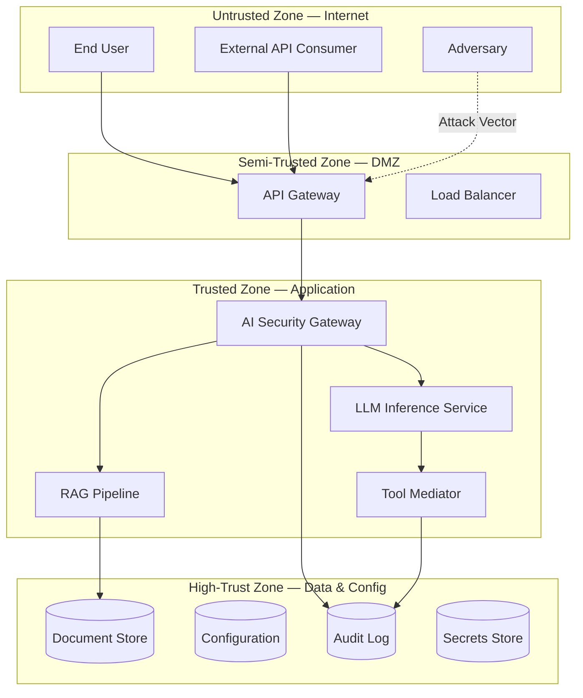

# Threat Model: [SYSTEM_NAME]

> **Version:** [VERSION] | **Date:** [DATE] | **Author:** [AUTHOR] | **Classification:** [INTERNAL|CONFIDENTIAL|PUBLIC]

---

## System Description

[Provide a concise description of the AI system being modeled. Include its purpose, key components, data flows, and deployment context.]

**System Purpose:** [SYSTEM_PURPOSE]

**Key Components:**
- [COMPONENT_1 — e.g., "LLM inference service (GPT-4 / open-source model)"]
- [COMPONENT_2 — e.g., "RAG retrieval pipeline with document store"]
- [COMPONENT_3 — e.g., "Tool execution gateway with 5 external integrations"]
- [COMPONENT_4 — e.g., "User-facing API gateway"]
- [COMPONENT_5 — e.g., "Memory/conversation state manager"]

**Deployment Model:** [CLOUD|ON-PREMISES|HYBRID|EDGE]

**Users/Stakeholders:**
- [USER_TYPE_1 — e.g., "End users submitting natural-language queries"]
- [USER_TYPE_2 — e.g., "Administrators managing system configuration"]
- [USER_TYPE_3 — e.g., "Data engineers managing document ingestion"]

---

## Control-Loop Decomposition

Identify the primary control loops governing the system's safety:

| Loop ID | Objective | Controller | Key Observation | Key Action |
|---|---|---|---|---|
| CL-01 | [OBJECTIVE_1] | [CONTROLLER_1] | [OBSERVATION_1] | [ACTION_1] |
| CL-02 | [OBJECTIVE_2] | [CONTROLLER_2] | [OBSERVATION_2] | [ACTION_2] |
| CL-03 | [OBJECTIVE_3] | [CONTROLLER_3] | [OBSERVATION_3] | [ACTION_3] |

---

## Asset Inventory

| Asset ID | Asset Name | Type | Classification | Owner | Location |
|---|---|---|---|---|---|
| A-01 | [ASSET_1] | [DATA|MODEL|SERVICE|CREDENTIAL] | [PUBLIC|INTERNAL|CONFIDENTIAL|RESTRICTED] | [OWNER_1] | [LOCATION_1] |
| A-02 | [ASSET_2] | [DATA|MODEL|SERVICE|CREDENTIAL] | [PUBLIC|INTERNAL|CONFIDENTIAL|RESTRICTED] | [OWNER_2] | [LOCATION_2] |
| A-03 | [ASSET_3] | [DATA|MODEL|SERVICE|CREDENTIAL] | [PUBLIC|INTERNAL|CONFIDENTIAL|RESTRICTED] | [OWNER_3] | [LOCATION_3] |
| A-04 | [ASSET_4] | [DATA|MODEL|SERVICE|CREDENTIAL] | [PUBLIC|INTERNAL|CONFIDENTIAL|RESTRICTED] | [OWNER_4] | [LOCATION_4] |
| A-05 | [ASSET_5] | [DATA|MODEL|SERVICE|CREDENTIAL] | [PUBLIC|INTERNAL|CONFIDENTIAL|RESTRICTED] | [OWNER_5] | [LOCATION_5] |

---

## Trust Boundaries

### Trust Boundary Diagram

### Trust Boundary Descriptions

| Boundary | Zones Separated | Crossing Mechanism | Enforcement |
|---|---|---|---|
| TB-01 | Internet → DMZ | TLS + Authentication | API key / OAuth2 |
| TB-02 | DMZ → Application | Input validation + Rate limiting | AI Security Gateway |
| TB-03 | Application → Data | Service-to-service auth + ACLs | Service mesh / IAM |
| TB-04 | Application → External Tools | Allowlist + Parameter validation | Tool Mediator |
| TB-05 | [BOUNDARY_5] | [MECHANISM_5] | [ENFORCEMENT_5] |

---

## Threat Identification

| Threat ID | Component | Attack Vector | Impact | Likelihood | Risk |
|---|---|---|---|---|---|
| T-01 | [COMPONENT_1] | [ATTACK_VECTOR_1 — e.g., "Prompt injection via user input"] | [IMPACT_1 — e.g., "System instruction leakage, unauthorized actions"] | [LIKELIHOOD_1 — H/M/L] | [RISK_1 — Critical/High/Medium/Low] |
| T-02 | [COMPONENT_2] | [ATTACK_VECTOR_2] | [IMPACT_2] | [LIKELIHOOD_2] | [RISK_2] |
| T-03 | [COMPONENT_3] | [ATTACK_VECTOR_3] | [IMPACT_3] | [LIKELIHOOD_3] | [RISK_3] |
| T-04 | [COMPONENT_4] | [ATTACK_VECTOR_4] | [IMPACT_4] | [LIKELIHOOD_4] | [RISK_4] |
| T-05 | [COMPONENT_5] | [ATTACK_VECTOR_5] | [IMPACT_5] | [LIKELIHOOD_5] | [RISK_5] |
| T-06 | [COMPONENT_6] | [ATTACK_VECTOR_6] | [IMPACT_6] | [LIKELIHOOD_6] | [RISK_6] |
| T-07 | [COMPONENT_7] | [ATTACK_VECTOR_7] | [IMPACT_7] | [LIKELIHOOD_7] | [RISK_7] |
| T-08 | [COMPONENT_8] | [ATTACK_VECTOR_8] | [IMPACT_8] | [LIKELIHOOD_8] | [RISK_8] |

**Risk Calculation:** Risk = Impact × Likelihood (Critical > High > Medium > Low)

---

## Unsafe States Enumeration

| State ID | Unsafe State | Condition | Consequence | Detection Method |
|---|---|---|---|---|
| US-01 | [UNSAFE_STATE_1] | [CONDITION_1] | [CONSEQUENCE_1] | [DETECTION_1] |
| US-02 | [UNSAFE_STATE_2] | [CONDITION_2] | [CONSEQUENCE_2] | [DETECTION_2] |
| US-03 | [UNSAFE_STATE_3] | [CONDITION_3] | [CONSEQUENCE_3] | [DETECTION_3] |
| US-04 | [UNSAFE_STATE_4] | [CONDITION_4] | [CONSEQUENCE_4] | [DETECTION_4] |
| US-05 | [UNSAFE_STATE_5] | [CONDITION_5] | [CONSEQUENCE_5] | [DETECTION_5] |

---

## Existing Controls

| Control ID | Threat(s) Mitigated | Control Type | Implementation | Effectiveness |
|---|---|---|---|---|
| C-01 | T-01, T-02 | Preventive | [IMPLEMENTATION_1] | [HIGH|MEDIUM|LOW] |
| C-02 | T-03 | Detective | [IMPLEMENTATION_2] | [HIGH|MEDIUM|LOW] |
| C-03 | T-04, T-05 | Preventive | [IMPLEMENTATION_3] | [HIGH|MEDIUM|LOW] |
| C-04 | T-06 | Corrective | [IMPLEMENTATION_4] | [HIGH|MEDIUM|LOW] |
| C-05 | T-07, T-08 | Directive | [IMPLEMENTATION_5] | [HIGH|MEDIUM|LOW] |

---

## Residual Risks

Risks that remain after existing controls are applied:

| Residual Risk ID | Original Threat | Why Not Fully Mitigated | Acceptance Rationale | Monitoring |
|---|---|---|---|---|
| RR-01 | T-01 | [REASON_1] | [RATIONALE_1] | [MONITORING_1] |
| RR-02 | T-03 | [REASON_2] | [RATIONALE_2] | [MONITORING_2] |
| RR-03 | T-05 | [REASON_3] | [RATIONALE_3] | [MONITORING_3] |

---

## Recommendations

| Priority | Recommendation | Threats Addressed | Estimated Effort | Control Type |
|---|---|---|---|---|
| P1 (Critical) | [RECOMMENDATION_1] | T-01, T-02 | [EFFORT_1] | Preventive |
| P1 (Critical) | [RECOMMENDATION_2] | T-04 | [EFFORT_2] | Preventive |
| P2 (High) | [RECOMMENDATION_3] | T-03, T-05 | [EFFORT_3] | Detective |
| P3 (Medium) | [RECOMMENDATION_4] | T-06, T-07 | [EFFORT_4] | Corrective |
| P4 (Low) | [RECOMMENDATION_5] | T-08 | [EFFORT_5] | Directive |

---

## Review History

| Date | Reviewer | Changes | Approved |
|---|---|---|---|
| [DATE_1] | [REVIEWER_1] | Initial threat model | [YES|NO] |
| [DATE_2] | [REVIEWER_2] | [CHANGES_2] | [YES|NO] |

---

*Template version: 1.0.0 | AI Security from Scratch*
