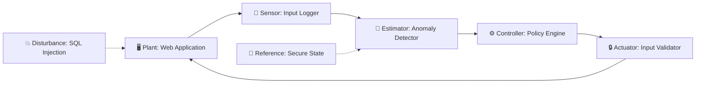

# Diagram Generator

A tool that creates **Mermaid diagrams** from control-loop analysis files. It reads the control-loop mapping from a class's analysis document and generates a visual representation of the control loop, including sensor, estimator, controller, actuator, plant, and disturbance elements.

## What It Does

The diagram generator:

1. **Reads a control-loop-analysis.md file** — Parses the structured control-loop mapping
2. **Extracts control-loop elements** — Identifies sensor, estimator, controller, actuator, plant, disturbance, and reference
3. **Generates a Mermaid diagram** — Creates a flowchart showing the control loop with labeled connections
4. **Outputs the diagram** — Writes a markdown file with the embedded Mermaid diagram

## Usage

```bash
# Generate diagram from a control-loop analysis file
python tools/diagram_generator/generate_control_loop.py labs/phase-2/class-07/lesson.md

# Specify output file
python tools/diagram_generator/generate_control_loop.py labs/phase-2/class-07/lesson.md -o diagram.md

# Output raw Mermaid string (no markdown wrapper)
python tools/diagram_generator/generate_control_loop.py labs/phase-2/class-07/lesson.md --raw

# Read from a YAML class spec instead of markdown
python tools/diagram_generator/generate_control_loop.py labs/phase-2/class-07/class-spec.yaml --format yaml
```

## Output

The tool generates a markdown file containing a Mermaid flowchart:



## Exit Codes

| Code | Meaning |
|------|---------|
| 0 | Diagram generated successfully |
| 1 | Parsing error or incomplete data |
| 2 | Invalid arguments or file not found |
